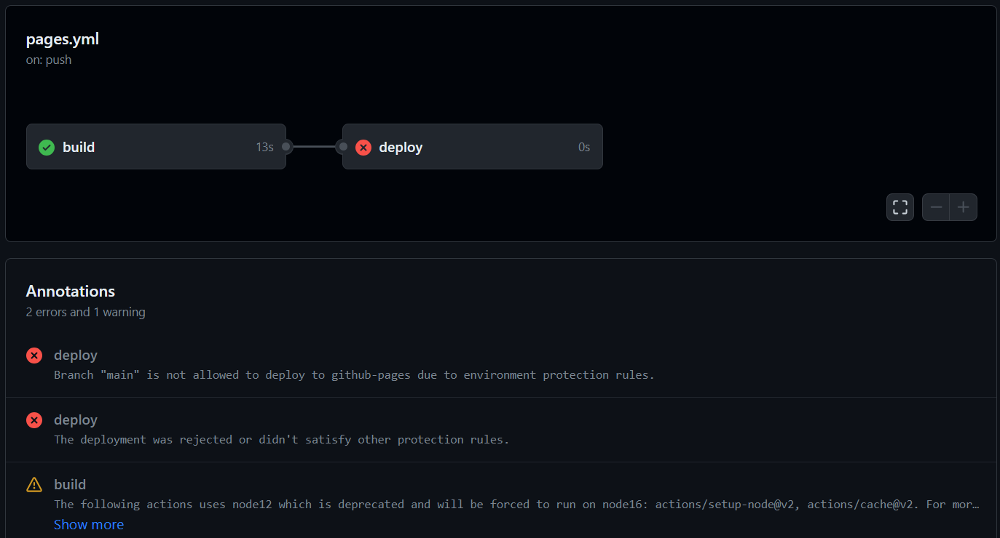
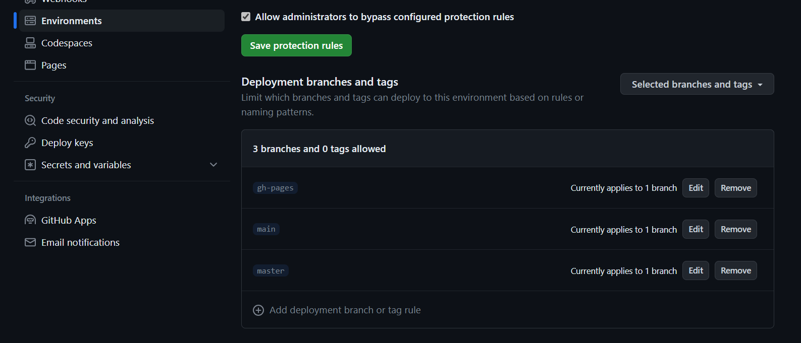
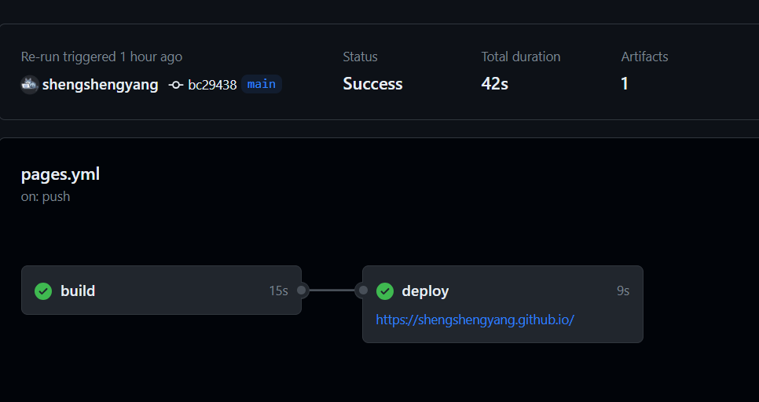

原先是按照網路上各種方去做hexo 的部屬

推薦以下

[標籤 - 2021 iThome 鐵人賽：30 天利用 Hexo 打造技術部落格](https://guiblogs.com/tags/2021-iThome-鐵人賽：30-天利用-Hexo-打造技術部落格/page/3/#board)

但會有幾個點在更新的現在需要去做修正

### Hexo  theme的使用

1. 在網路上最常見的用法, 將next 載入 theme中，然後更改_config.yml

<!--more-->

 ```shell
 git clone https://github.com/theme-next/hexo-theme-next themes/next
 ```

 ```yaml
 # Extensions
 ## Plugins: https://hexo.io/plugins/
 ## Themes: https://hexo.io/themes/
 theme: next
 ```

   但此方法會有幾個問題，其一是在本地端修改thems/next/_config.yml, 針對theme做的課制修正只會留在本機，而由於我希望的做法是在做git push 時 透過Github Action去做自動化部屬，無法推上去的config 就會造成問題
2. 網路上看到的第二種方式是透過fork，再將其作為submodule來當作基底

   [在 hexo 中使用 git submodules 管理主题 - 掘金](https://juejin.cn/post/6844903751908605965)

   要注意這邊要先將project fork 成自己的repo，再透過sumodule 指向自己的專案，不然會造成在push時會嘗試推到作者的repo…….<沒錯我差點就試推了，好險有跳警告>

3. **透過npm 及自訂config 來做整理**

   目前已可透過npm 來安裝 next theme

    ```shell
    npm install hexo-theme-next
    ```

   如果打開theme/next 裡面的_config.yml 會發現他開頭寫

    ```yaml
    # If false, merge configs from `_data/next.yml` into default configuration (rewrite).
    # If true, will fully override default configuration by options from `_data/next.yml` (override). Only for NexT settings.
    # And if true, all config from default NexT `_config.yml` have to be copied into `next.yml`. Use if you know what you are doing.
    # Useful if you want to comment some options from NexT `_config.yml` by `next.yml` without editing default config.
    override: false
    ```

   代表我們可以在最外層的source 建立 /_data/next.yml的檔案去複寫default 的yml，並且裡面只需填入想要的變更即可

    ```yaml
    scheme: Pisces
    back2top:
      enable: true
      # Back to top in sidebar.
      sidebar: false
      # Scroll percent label in b2t button.
      scrollpercent: true
    ```

   以上的設定就會蓋掉default 中相同的設定，且這個設定檔也可以上傳至git，以利後續再github action 做的時候樣式不會跑回default


### GitHub Action 配置

1. 官方文檔有相關配置，建立.github/workflows/pages.yml後輸入內容，理論上推到main這個branch時他就會自動啟動了，node ver.記得設定與你本機相同，另外/public 要加入.gitignore中，此資料夾不應被上傳

    ```yaml
    name: Pages
    
    on:
      push:
        branches:
          - main  # default branch
    
    jobs:
      pages:
        runs-on: ubuntu-latest
        permissions:
          contents: write
        steps:
          - uses: actions/checkout@v3
            with:
              token: ${{ secrets.GITHUB_TOKEN }}
              # If your repository depends on submodule, please see: https://github.com/actions/checkout
              submodules: recursive
          - name: Use Node.js 16.x
            uses: actions/setup-node@v2
            with:
              node-version: '16'
          - name: Cache NPM dependencies
            uses: actions/cache@v2
            with:
              path: node_modules
              key: ${{ runner.OS }}-npm-cache
              restore-keys: |
                ${{ runner.OS }}-npm-cache
          - name: Install Dependencies
            run: npm install
          - name: Build
            run: npm run build
          - name: Deploy
            uses: peaceiris/actions-gh-pages@v3
            with:
              github_token: ${{ secrets.GITHUB_TOKEN }}
              publish_dir: ./public
    ```

   [在 GitHub Pages 上部署 Hexo](https://hexo.io/zh-tw/docs/github-pages.html)

2. 配置完之後就會發現會失敗，此時會需要黏貼公鑰及私鑰，此篇有詳細步驟，我這邊是採用官方文檔 +　黏貼公司鑰

   [Hexo + GitHub Actions 部屬網站遷移全紀錄](https://blog.yangjerry.tw/2022/04/19/hexo-github-actions-deploy/)

   此步驟中在deploy時我有出現一個小錯誤
   

   可以發現gh-page 被保護住了，此時需去setting→environment點及gh-pages的protect rule變更或新增你自己想要的branch


### 部屬成功，可喜可樂

最後進到github action 可以看過程，最後制網址就可以看到自已的靜態網頁已佈署上去

[Dean Yang Coding Blog (shengshengyang.github.io)](https://shengshengyang.github.io/)
