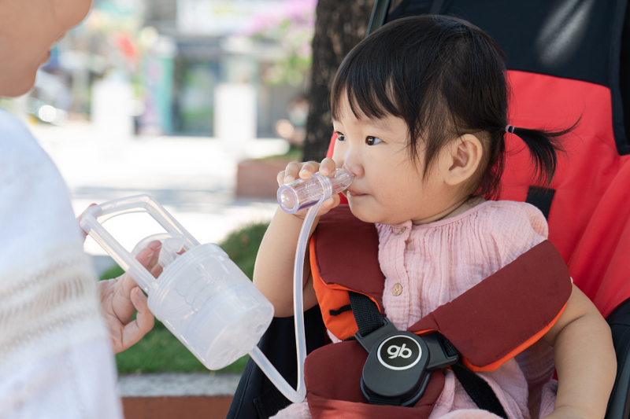
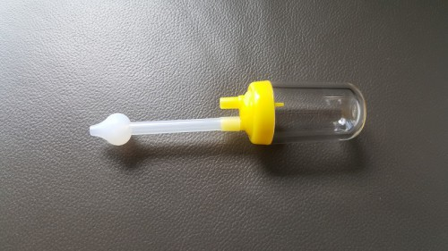
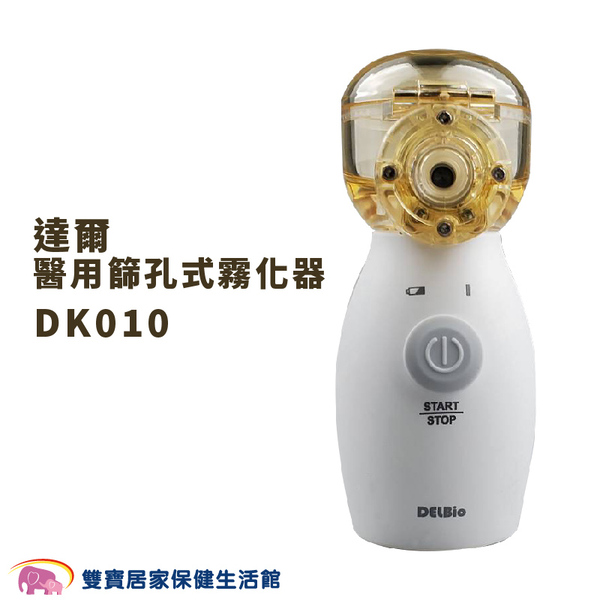

紀錄一下兒子第一次感冒的有用小招

### 哺乳枕
因為嬰兒不會擤鼻涕，也不會咳痰，又喜歡趴睡，基本上所有的鼻涕全部積在鼻子裡，這時候用哺乳枕稍微將身體成微斜躺姿，睡得會比較好

### 知母時
就是這玩意，直接搜尋名字就可以找到了，可隨處攜帶不須插電，吸力又強又好清洗，便宜大推神器

使用上還是有幾個可以優化的地方
1. #### 鼻涕杯
   蝦皮上搜尋很多，由於原本附的在嫩嬰期間孔洞太大，很難對準，這個鼻涕杯可以讓頭整個蓋住鼻孔，吸力up
    
2. #### 上油保養
   使用幾次之後會發現在拉推的時候會卡，這時可以轉開知母時本體，清潔乾淨後晾乾，拿廚房紙巾吸一些油(我是用橄欖油)後擦在杯子內側，再裝上去的時候就會發現比剛出廠回彈得更快了!

### 蒸鼻器
小朋友有時鼻涕過黏會吸不出來，可以使用蒸鼻器來將鼻涕軟化，其實在蒸的過程中就會霧化出來，然後這款大家上網去查就會發現
`好貴`， 主要是這種不是單純的把他變成霧狀，而是透過網眼篩孔篩成更細的蒸氣分子，像急性支氣管炎，氣喘等要達到化痰的功效，就要選擇蒸氣粒子比較小的機器，能夠深入支氣管。

實際使用上確實小朋友原本吸不出來的鼻涕有時候蒸一蒸甚至自己就流出來了，雖然是真的很貴但有經過醫療認證還是多一份安心

### 感冒是必經過程
孩子感冒時還是覺得很自責，尤其這次是我傳染給他的，但小孩子感冒是變健康的必經之路，只要有看醫生請教專業，好好做好照顧，好起來之後又是一尾活龍!
