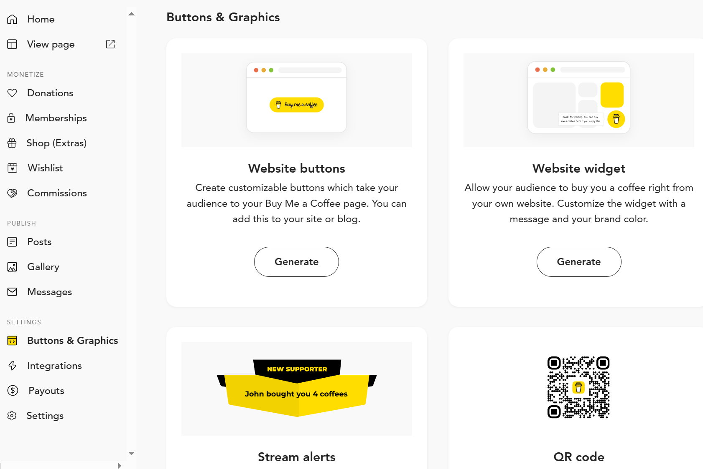
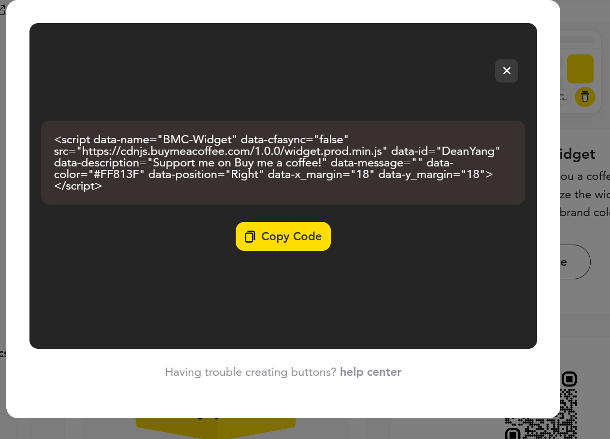

## 開啟財富密碼
### buy me a coffee
看到不少blog 下方都有有趣的鈕，想要自己也來一個，可以前往連結: [buy me a coffee](https://www.buymeacoffee.com/)

註冊完成後前往dashboard 選擇你想要的模式並按下Generate

<!--more-->
選擇完樣式按下按鈕後就會出現code


### footer 設定
前往建立好的_config.fluid.yml 檔，新增上
```yaml
footer:
  content: '{剛剛複製的code}'
```
就會看到donate 出現在footer 了喔，如果想要做更多客制的也可以自己塞html進去