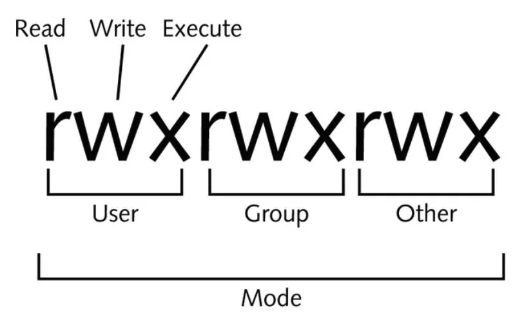
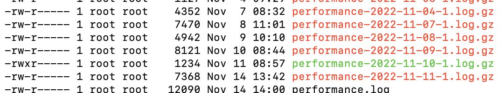

### 查看linux 中的權限
``` shell
ls -al
```


- `r`代表可讀(read)
- `w`代表可寫(write)
- `x`代表可執行(execute)

這三個權限的位置不會改變，如果沒有權限，就會出現減號[ – ]而已。

- 第一組為『**檔案擁有者可具備的權限**』
- 第二組為『**加入此群組之帳號的權限**』
- 第三組為『**非本人且沒有加入本群組之其他帳號的權限**』

### 範例
此performance-2022-09-16-1.log.gz目前權限為621，user有rw group 有r other 無權限

``` text
-rw-r----- 1 root root   11507  9月 19 08:32 performance-2022-09-16-1.log.gz
```

### rwx其數字及意義

| read(r) | 4 |
| --- | --- |
| write(w) | 2 |
| execute(x) | 1 |

| user | u |
| --- | --- |
| group | g |
| other | p |

假設要設定只能看跟執行 →4+1=5 ，設定可以使用兩種方式數字或文字

### 進行遞迴(recursive)的持續變更
亦即連同次目錄下的所有檔案
``` shell
-R (recursive)
```

若個人權限無法更改可將權限變更為root

``` shell
sudo su -
```

變更過後再ls -al 一次會發現變更後的檔案變成綠色 並新增了權限權限

此為示範
``` shell
chmod u+x performance-2022-11-10-1.log.gz
```


### 數字範例

---

將 README.txt 權限設定成 使用者,群組, 其它使用者都能RWX

```shell
chmod 777 README.txt
```

將 /var/logs/* 底下所有權限設定成 使用者,群組 都能RWX, 其它使用者RW
``` shell
chmod -R 775 /var/logs/
```

### 文字範例

---

將 README.txt 權限設定成 使用者,群組 都能RWX, 其它使用者RW

``` shell
chmod ug=rwx,o=rw  README.txt
```

將 README.txt 權限設定成 使用者,群組, 其它使用者都能RWX

``` shell
chmod a=rwx README.txt
```
#### 新增權限
如果不請楚原先的權限為何，可透過＋－來新增權限 ， 此為README.txt 加上，所有使用者皆能夠執行的權限

``` shell
chomod a+x README.txt
```
#### 移除權限
將 README.txt 移除，其它使用能夠執行的權限

``` shell
chmod o-x README.txt
```
#### 設定全資料夾
將 /var/logs/* 底下所有權限設定成 使用者,群組 都能RWX, 其它使用者RW

```
chomd -R ug=rwx,o=rw /var/logs
```
### 來源

[chmod 是什麼 ? 5分鐘學會 Linux 檔案權限設定 - Li-Edward](https://liedward.com/chmod/)