## google Cloud Resource hierachy

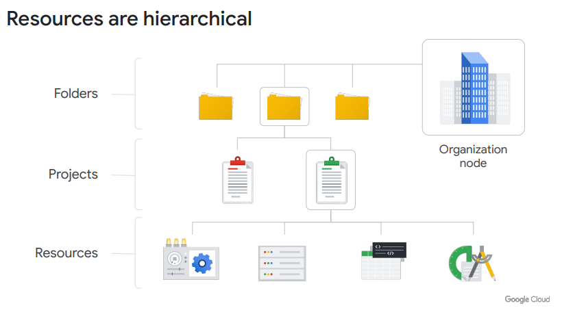

### 權限繼承

#### 政策可以在專案、文件夾和組織節點層次定義

某些Google Cloud服務也允許將政策應用於單個資源。

#### 政策還向下繼承

這意味著如果你對一個文件夾應用了一個政策，它也將應用於該文件夾內的所有專案。

### project

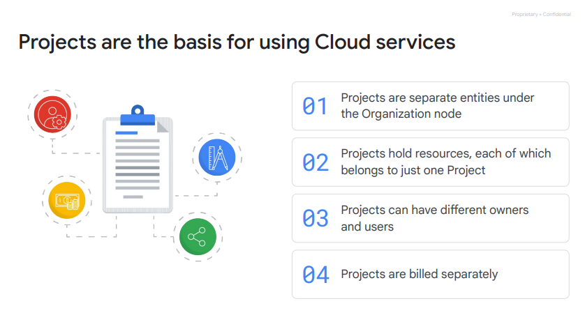

- 專案是啟用和使用Google Cloud服務的基礎，例如管理API、啟用計費、添加和移除協作者，以及啟用其他Google服務。
- 每個專案都是一個獨立的隔離單元，每個資源都屬於確切的一個專案。專案可以有不同的擁有者和使用者，因為它們是獨立計費和管理的。

#### project ID：

由Google分配的全球唯一標識符，一經創建後無法更改（即不可變）。專案ID在不同的情境下用於告知Google Cloud要處理的確切專案。

#### project name：

是由用戶創建的，不需要是唯一的，並且可以隨時更改，因此不是不可變的。

#### project number：

Google Cloud還為每個專案分配一個唯一的專案編號。了解這些由Google生成的編號很有幫助，但在本課程中我們不會深入探討它們。它們主要在Google
Cloud內部使用，用於跟蹤資源。

### folder
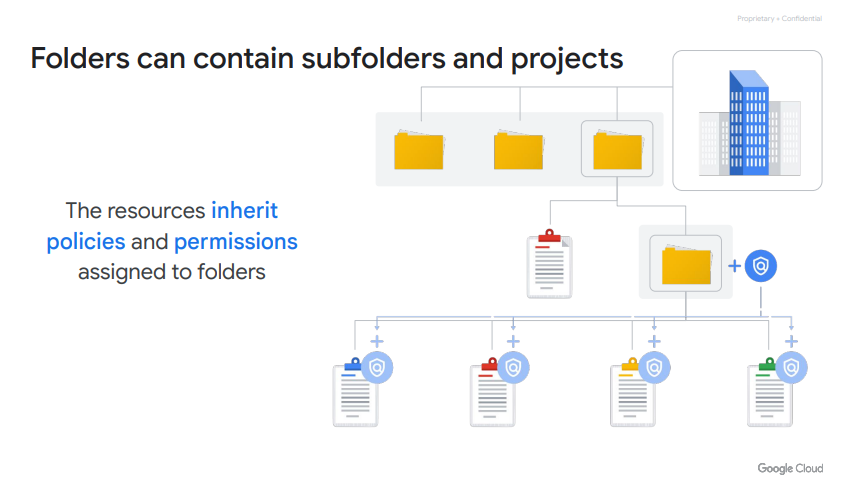
- 文件夾中的專案和子文件夾包含繼承自該文件夾分配的政策和權限的資源。
- 文件夾可以包含專案、其他文件夾，或兩者組合
- 可以使用文件夾在組織中建立層次結構，將專案分組。例如，您的組織可能包含多個部門，每個部門都擁有自己的一套Google Cloud資源。文件夾讓您以每個部門為基礎分組這些資源。
- 文件夾使團隊有能力委派管理權限，以便他們可以獨立工作。

### 介面
實際介面可在此選擇三種不同的階層及其可控管的資源
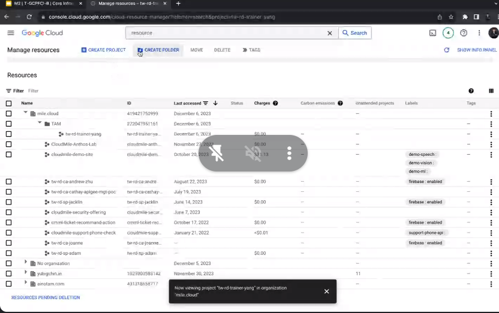
## Identity and Access Management (IAM)

### IAM roles
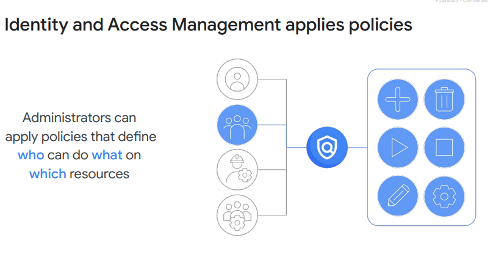
### 層級
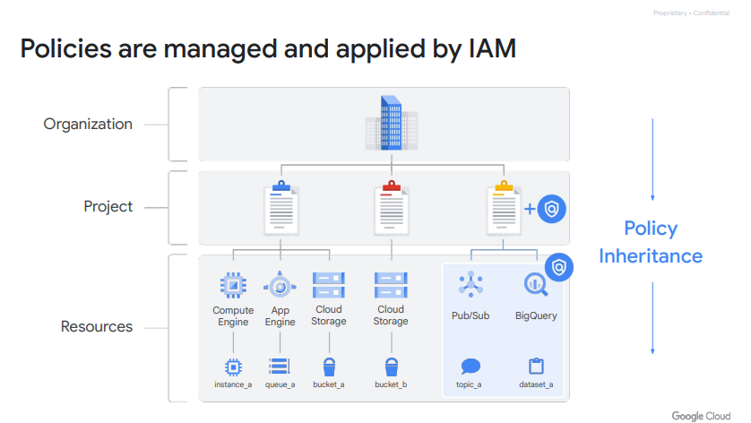

### 不能往上影響

- IAM政策的"誰"部分可以是Google帳戶、Google群組、服務帳戶或Cloud Identity域。"誰"也被稱為"主體"。每個主體都有自己的標識符，通常是電子郵件地址。
- IAM政策的"能做什麼"
  部分由角色（Role）定義。IAM角色是權限的集合。當您將角色授予主體時，您授予該角色包含的所有權限。例如，要管理項目中的虛擬機實例，您必須能夠創建、刪除、啟動、停止和更改虛擬機。因此，這些權限被組合成一個角色，使其更容易理解和管理。

### 三種不同的role

#### basic IAM

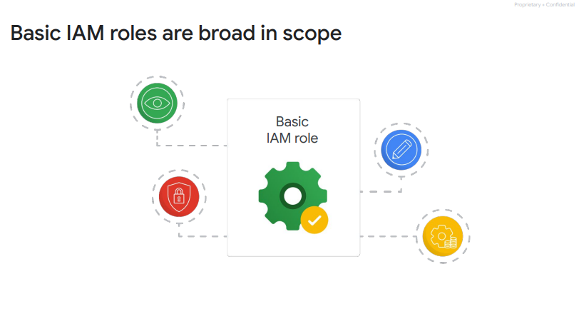
基本角色的範圍相當廣泛。當應用於Google Cloud專案時，它們影響該專案中的所有資源。基本角色包括擁有者、編輯者、查看者和計費管理員。

- #### 專案查看者（Project Viewer）：

可以檢查資源，但無法進行更改。

- #### 專案編輯者（Project Editor）： 可以檢查並對資源進行更改。
- #### 專案擁有者（Project Owner）： 除了能夠檢查和對資源進行更改外，還可以管理相關的角色和權限，以及設定計費。通常，公司希望某人能夠控制專案的計費，但無權更改專案中的資源。這通過計費管理員角色是可能的。

注意事項： 如果有多人共同在包含敏感數據的專案上工作，基本角色可能太過廣泛。幸運的是，IAM提供了其他分配權限的方式，更具體地滿足典型工作角色的需求。

#### Predefined roles

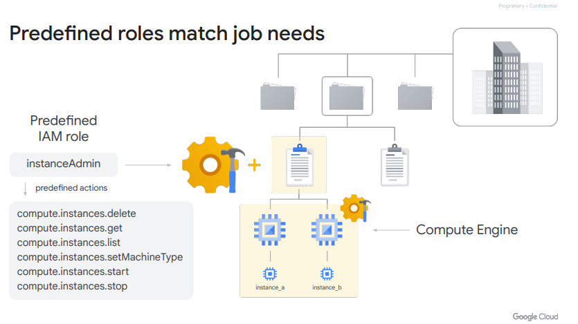

#### 預定義角色

特定的Google Cloud服務提供了一組預定義角色，甚至定義了這些角色可以應用在哪裡。
以Compute Engine為例，這是一個提供虛擬機器作為服務的Google Cloud產品。使用Compute
Engine，您可以將特定的預定義角色（例如“instanceAdmin”）應用於特定專案、特定文件夾或整個組織的Compute
Engine資源。這樣一來，擁有這些角色的人就可以執行一組特定的預定義操作。

#### Custom roles

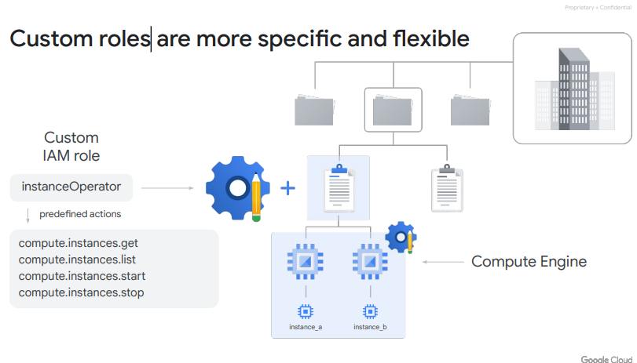

#### 自訂角色

很多公司採用“最小權限”模型，即組織中的每個人都被賦予執行工作所需的最少權限。因此，例如，您可能希望定義一個“instanceOperator”角色，以允許某些用戶停止和啟動Compute
Engine虛擬機器，但不能重新配置它們。自訂角色可以實現這一點

### 介面

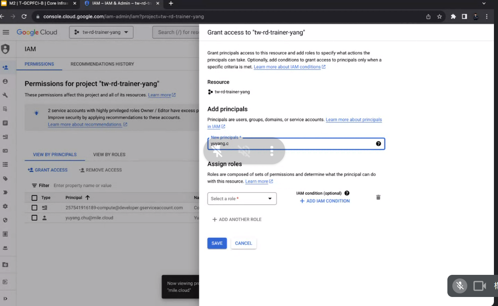

## Service accounts

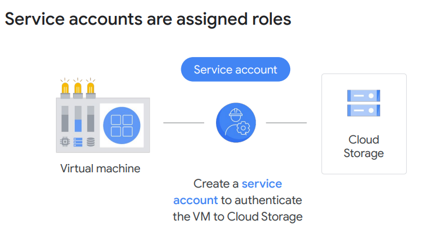

### 給服務用的IAM

### 服務帳戶以電子郵件地址命名，但它們使用加密金鑰而不是密碼來訪問資源。

如果一個服務帳戶被授予Compute Engine的Instance Admin角色，這將允許使用該服務帳戶在虛擬機中運行的應用程序創建、修改和刪除其他虛擬機。

## Cloud Identity

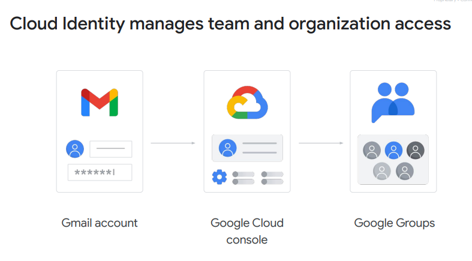
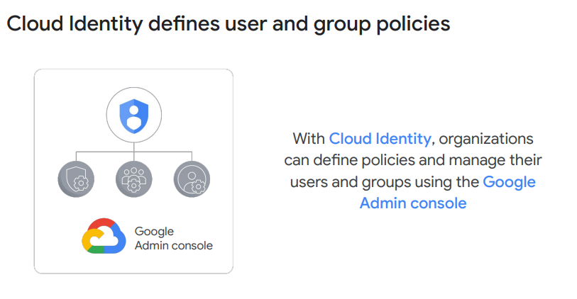

### identity 中控

- 避免各種登入資源的雜亂，identity 給一個統一的平台去做管理
- 管理員可以使用他們在現有的Active Directory或LDAP系統中已經使用的相同用戶名和密碼登錄並管理Google Cloud資源
- 使用Cloud Identity還意味著當有人離開組織時，管理員可以使用Google管理控制台禁用他們的帳戶並將其從組中移除
- Cloud Identity提供免費版本，還有一個高級版本，提供管理移動設備的功能。如果您是Google Cloud客戶，同時也是Google
  Workspace客戶，這個功能已經在Google管理控制台中為您提供。

## Interacting with Google Cloud

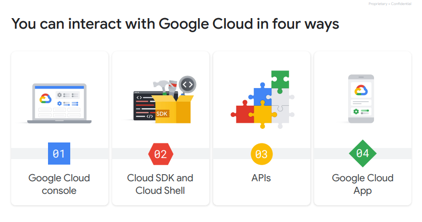