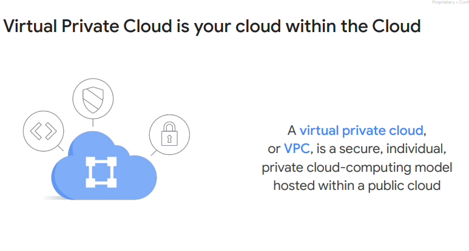
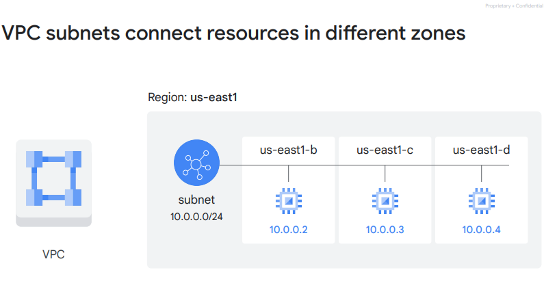
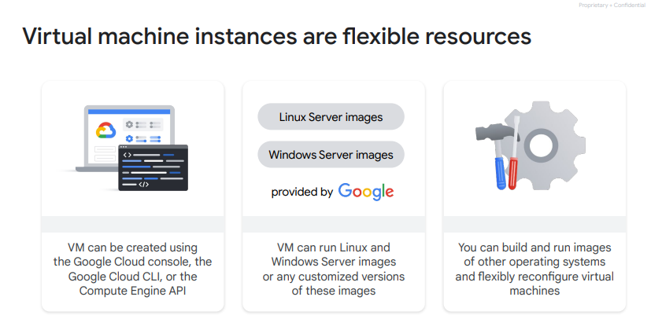
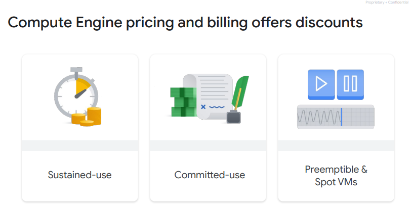
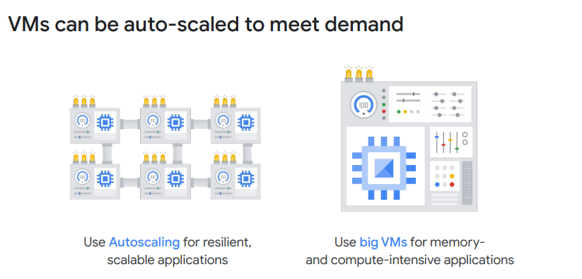
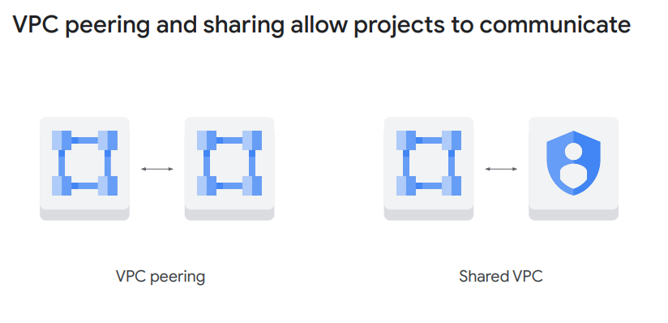
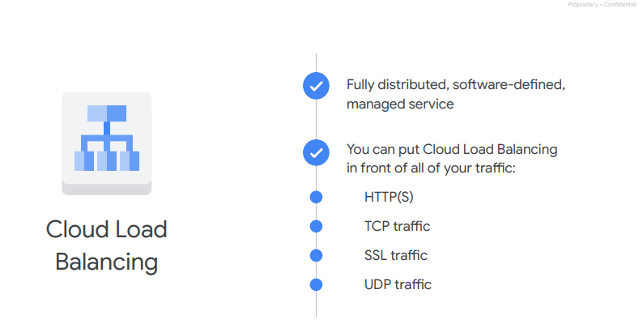
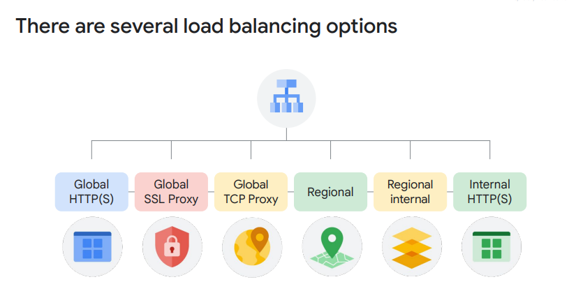
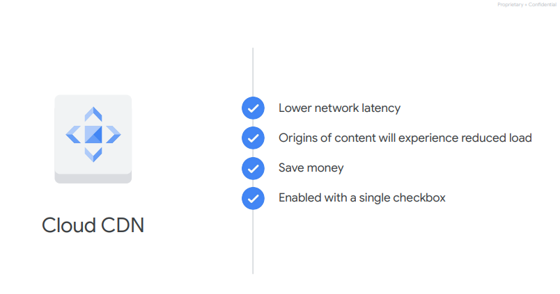
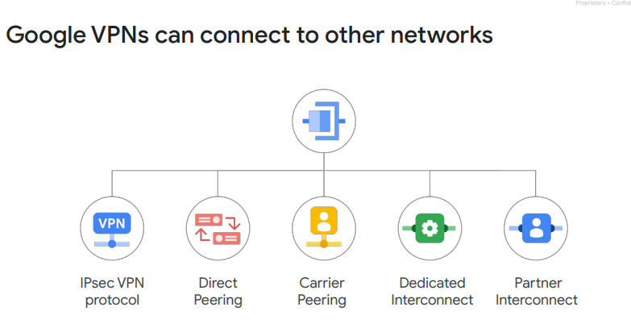

## Virtual Private Cloud networking 

- Google Cloud 的 VPC（Virtual Private Cloud）網路連接了Google Cloud的各種資源，使它們能夠彼此通信，也能夠連接到互聯網。這包括對網路進行分割、使用防火牆規則限制對實例的訪問，以及創建靜態路由來將流量轉發到特定目的地。
- 預設為global subnet
- ### 網段

- ### 防火牆

- ### Routes

- ### subnet
  

## Compute Engine

### Virtual machine instances
- 通過使用Google Cloud控制台、Google Cloud命令行界面（CLI）或Compute Engine API，可以創建虛擬機器實例或創建一組托管實例。
- Google Cloud控制台是一個基於Web的工具，用於管理Google Cloud項目和資源。
- 虛擬機器實例可以運行由Google提供的Linux和Windows Server映像，或者是這些映像的任何定制版本。
- 可以構建和運行其他操作系統的映像，並靈活重新配置虛擬機器。
### Cloud Marketplace
- 開始使用Google Cloud的快速途徑是透過Cloud Marketplace，該市場提供了來自Google和第三方供應商的解決方案。

- 這些解決方案使得無需手動配置軟件、虛擬機器實例、存儲或網路設置，盡管在啟動之前，很多可以進行修改以滿足需要。

- 大多數Cloud Marketplace中的軟件套件在Google Cloud資源的正常使用費用之外是免費提供的。有些Cloud Marketplace映像收費，特別是由第三方發布、帶有商業授權軟件的映像，但它們在啟動之前都會顯示其月度費用的估算。
### Pricing

#### 計價方式：
Compute Engine對虛擬機器的使用按秒計費，最低計費為一分鐘，而持續使用折扣會在虛擬機器運行時間越長時自動應用。對於每個在一個月內運行超過25%的VM，Compute Engine會自動為每增加的每一分鐘應用折扣。
#### 承諾使用折扣：

Compute Engine還提供了承諾使用折扣，對於穩定和可預測的工作負載，可以購買特定數量的vCPUs和內存，以最多57%的折扣價格購買，以換取一年或三年的使用期限。
#### Preemptible和Spot VMs：

Preemptible VMs適用於不需要人等待完成的工作負載，例如分析大數據集的批處理作業。透過選擇Preemptible VMs，有時可以節省高達90%的費用。Preemptible或Spot VM與普通的Compute Engine VM唯一的區別是，Compute Engine有權在需要其資源的情況下終止作業。
#### Spot VM的特點：

Spot VM與Preemptible VM的區別在於提供更多功能。例如，Preemptible VM每次最多僅能運行24小時，而Spot VM沒有最大運行時間限制。然而，目前兩者的價格是相同的。

## Scaling virtual machines

### 選擇機器屬性：

使用Compute Engine，您可以根據預定義的機器類型或創建自定義機器類型，為您的實例選擇最適合的機器屬性，例如虛擬CPU的數量和內存的大小。

### 自動擴展：

Compute Engine具有名為Autoscaling的功能，該功能可以根據負載指標向應用程序添加或刪除VM。實現這一點的另一部分是在VM之間平衡流入的流量。

### 負載平衡：

Google的虛擬私有雲（VPC）支持多種不同類型的負載平衡，我們將很快進行探討。
### 配置大型VM：

使用Compute Engine，您實際上可以配置非常大的VM，非常適合諸如內存數據庫和CPU密集型分析等工作負載。但大多數Google
Cloud用戶首先進行水平擴展，而不是垂直擴展。每個VM的最大CPU數量與其"機器家族"相關，還受用戶可用的配額限制，這是區域相關的。

[Specs for currently available VM machine types](https://cloud.google.com/compute/docs/machine-types)

## Important VPC compatibilities
### VPC不需要配置路由器：
與物理網路類似，VPC具有路由表。VPC的路由表是內建的，因此您無需配置或管理路由器。這些路由表用於在同一網路中從一個實例轉發流量到另一個實例，跨子網，甚至在Google Cloud區域之間，而無需外部IP地址。
### VPC不需要配置防火牆：
- 就像不需要配置路由器一樣，使用Google Cloud時也無需配置或管理防火牆。VPC提供全球分佈的防火牆，可以通過控制限制對實例的進出流量。
#### 全球分佈的防火牆：
這種防火牆可以在全球範圍內控制，限制對實例的進入和外出流量。

#### 使用網路標籤定義防火牆規則：
可以透過在Compute Engine實例上使用網路標籤來定義防火牆規則，這非常方便。

#### 範例：
例如，可以使用標籤“WEB”標記所有的Web伺服器，然後編寫防火牆規則，允許80或443端口的流量進入所有具有“WEB”標籤的VM，而不管它們的IP地址是什麼。

### VPC 間的連接

#### 使用VPC Peering建立VPC之間的關係：

通過使用VPC Peering，可以建立兩個VPC之間的關係，以進行流量交換。
#### Shared VPC配置：

或者，如果要充分利用身份訪問管理（IAM）的權限，以控制一個項目中的誰和什麼可以與另一個項目中的VPC互動，則可以配置共享VPC。

## Cloud Load Balancing

### 負載均衡器的功能：

負載均衡器的作用是將用戶流量分發到應用程序的多個實例上。通過分散負載，負載均衡器降低了應用程序性能問題的風險。

### Cloud Load Balancing特點：

Cloud Load Balancing是一個完全分佈式、軟件定義的、管理型的服務，適用於所有流量。由於負載均衡器不運行在需要管理的虛擬機器上，您無需擔心其擴展或管理。您可以將Cloud
Load Balancing應用於所有流量：HTTP(S)、其他TCP和SSL流量，以及UDP流量。

### 跨區域負載平衡：

Cloud Load Balancing提供跨區域負載平衡，包括自動多區域故障轉移，當後端變得不健康時，它會逐漸移動流量的部分。Cloud Load
Balancing迅速響應使用者、流量、網路、後端健康狀態和其他相關條件的變化。

### 應對需求激增：

如果預測到需求將大幅增加，無需提交支援票告知Google即將到來的負載，不需要所謂的“預熱”。

### loading balance option

## Cloud Domain Name Service

### CDN 特點

- 如果您需要跨區域的Web應用程式負載平衡，請使用全球HTTP(S)負載平衡。
- 對於非HTTP的安全套接字層流量，請使用全球SSL代理負載平衡器。
- 如果是不使用安全套接字層的其他TCP流量，請使用全球TCP代理負載平衡器。
- 這兩種代理服務僅適用於特定的埠號，且只適用於TCP。如果您想要負載平衡UDP流量，或者任何埠號的流量，您仍然可以使用區域負載平衡器在Google雲端區域中進行負載平衡。
-
所有這些服務的共同點是，它們都是為了從互聯網進入Google網路的流量而設計的。但是，如果您想要在您的專案內部負載平衡流量，例如，介於您的應用程式的表示層和業務層之間，該怎麼辦？對於這種情況，請使用區域內部負載平衡器。它接受在Google雲端內部IP地址上的流量，並將其負載平衡到Compute
Engine VMs。
- 最後，Google Cloud內部HTTP(S)
  負載平衡是一種基於代理的、區域性的第7層負載平衡器，它還使您能夠在內部負載平衡IP地址後面運行和擴展您的服務。內部HTTP(S)
  負載平衡是一種基於開源Envoy代理的管理服務。這使得基於HTTP(S)參數的豐富流量控制能力成為可能。配置負載平衡器後，它會自動分配Envoy代理以滿足您的流量需求。

### public DNS services

- 它是一種在Google相同基礎設施上運行的管理DNS服務。
- 它具有低延遲和高可用性，並且是一種經濟有效的方式，可以讓您的應用程式和服務對您的用戶可用。您發布的DNS信息將從世界各地的冗餘位置提供。
- Cloud DNS也是可編程的。您可以使用Google Cloud控制台、命令行界面或API發布和管理數百萬個DNS區域和記錄。

## Cloud Content Delivery Network

### 內容傳遞網路

主要用來加速應用程式內容

- 這意味著您的客戶將體驗到更低的網路延遲，您的內容源將體驗到減少的負載，您甚至可以節省金錢。
- 一旦設置了HTTP(S)負載平衡，就可以通過單一的複選框啟用Cloud CDN。
- 當然，還有許多其他的CDN可供選擇。如果您已經在使用一個，那麼很可能，它是Google Cloud的CDN互聯合作夥伴計劃的一部分，您可以繼續使用它。

## Connecting Networks to Google VPC

### 其他網路的連接

### IPsec VPN creates dynamic connections

#### 建立虛擬私有網路連接的方法：

一種選擇是從互聯網開始，使用IPsec VPN協議建立“隧道”連接。為了使連接具有動態性，可以使用Google Cloud的一個名為Cloud
Router的功能。Cloud Router允許其他網路和Google VPC使用邊界網關協議在VPN上交換路由信息。使用這種方法，如果在Google
VPC中新增子網，您的本地網路將自動獲得到它的路由。

### Direct peering routes traffic through a Google PoP

#### 使用互聯網連接網路的考慮：

使用互聯網連接網路並非對所有人都是最佳選擇，這可能是因為安全問題或頻寬可靠性的原因。

#### Direct Peering的選項：

第二個選擇是考慮使用Direct
Peering與Google建立“peering”關係。Peering意味著將路由器放置在與Google點對點存在的相同的公共數據中心，並使用它在網路之間交換流量。Google在全球擁有100多個點對點存在（PoPs）。

### Carrier peering allows access to Google Workspace

#### 進入點對點存在的客戶：

對於那些尚未在點對點存在的客戶，可以與Carrier Peering計畫中的合作夥伴簽約以建立連接。Carrier
peering讓您可以通過服務提供商的網路，直接從您的本地網路連接到Google Workspace和可以透過一個或多個公共IP地址公開的Google
Cloud產品。

#### peering的缺點：

不過，peering的一個缺點是它並不受Google服務水平協議的覆蓋。

### Dedicated Interconnect is a direct connection to Google

#### 使用Dedicated Interconnect的優勢：

如果對於連接的最高正常運行時間至關重要，那麼使用Dedicated Interconnect將是一個良好的解決方案。

#### Dedicated Interconnect的功能：

這個選項允許建立一個或多個直接的、私有的與Google的連接。如果這些連接的拓撲滿足Google的規格，它們可以達到高達99.99%的服務水平協議（SLA）。

#### 增強可靠性的選項：

這些連接還可以通過VPN進行備份，以實現更高的可靠性。

### Partner Interconnect links your on-prem with your VPC

#### Partner Interconnect的選項：

最後一個我們將探討的選項是Partner Interconnect，它通過一個受支持的服務提供商提供了本地網路和VPC網路之間的連接。Partner
Interconnect連接在以下情況下非常有用：如果數據中心位於無法達到Dedicated Interconnect合作設施的物理位置，或者數據的需求不需要整個10
Gbps的連接。

#### 可用性需求的配置：

根據可用性需求，可以配置Partner Interconnect以支持對一些可容忍停機時間的關鍵服務或應用程序。與Dedicated
Interconnect一樣，如果這些連接的拓撲滿足Google的規格，它們可以達到高達99.99%的服務水平協議（SLA），但需注意Google對於由第三方服務提供商提供的Partner
Interconnect的任何方面以及Google網路之外的任何問題都不負責。
