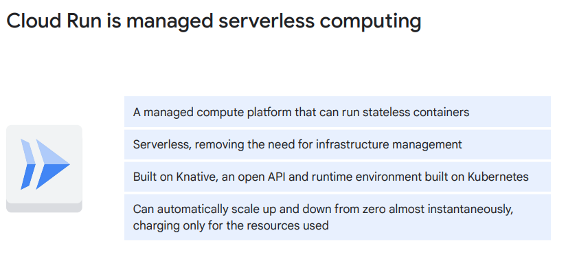
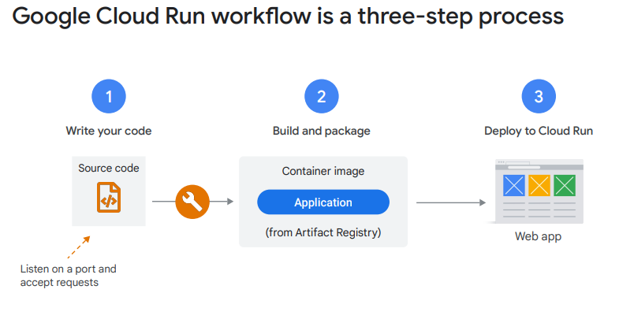
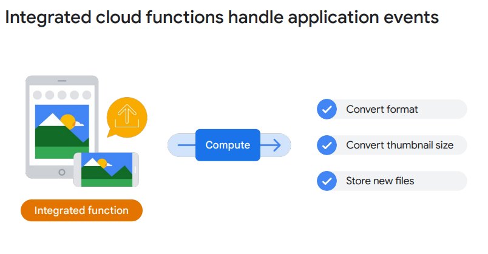
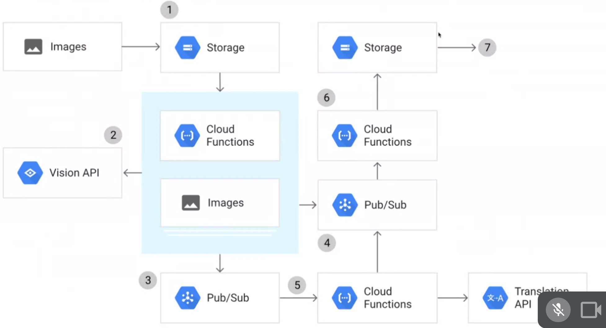

## Cloud Run
### 全託管的運算

### 特點
- #### 托管的計算平台：
  Cloud Run是一個托管的計算平台，可以通過Web請求或Pub/Sub事件運行無狀態容器。
- #### 無伺服器：
  它是無伺服器的，這意味著它消除了所有基礎架構管理任務，讓您可以專注於應用程序開發。
- #### 建立在Knative之上：
  Cloud Run建立在Knative之上，Knative是建立在Kubernetes上的開放API和運行時環境。它可以在Google Cloud上完全托管，在Google Kubernetes Engine上，或者在任何運行Knative的地方。
- #### 快速且自動擴展：
  Cloud Run非常快速，可以幾乎即時地自動擴展和縮小到零。僅根據使用的資源收費，計算到最接近的100毫秒，因此您永遠不會為過度配置的資源付費。
- #### 成本效益：
  它按照使用的資源計費，計算到最接近的100毫秒，因此您永遠不會為過度配置的資源付費。
### 流程

### 可用性
- #### 支援的主流語言：
  Cloud Run可以運行任何編譯為Linux 64位的二進制文件。這意味著您可以使用Cloud Run運行使用流行語言編寫的Web應用程序，如Java、Python、Node.js、PHP、Go和C++。
- #### 支援的次流行語言：
  Cloud Run還可以運行使用較不流行的語言編寫的代碼，例如Cobol、Haskell和Perl。
- #### 應用處理Web請求：
  只要您的應用程序處理Web請求，就可以在Cloud Run上運行。

## cloud function
### event trigger

Cloud Functions是一種輕量級、基於事件、異步計算解決方案，允許您創建小型、單一用途的函數，以回應雲事件，而無需管理伺服器或運行環境。您可以使用這些函數構建由小型業務邏輯構成的應用程序，並連接和擴展雲服務
#### 主要特點：
- #### 事件觸發：
  Cloud Functions可以通過Cloud Storage和Pub/Sub等事件源異步觸發，或者使用HTTP調用進行同步執行。
- #### 無伺服器和運行時環境管理：
  不需要管理伺服器或運行時環境，函數是輕量級的並且可以快速響應事件。
- #### 計費方式：
  根據代碼運行的時間計費，並且僅在代碼運行時收費，計費到最接近的100毫秒。
- #### 多語言支持：
  支持使用多種編程語言編寫源代碼，包括Node.js、Python、Go、Java、.Net Core、Ruby和PHP。
### 使用圖
