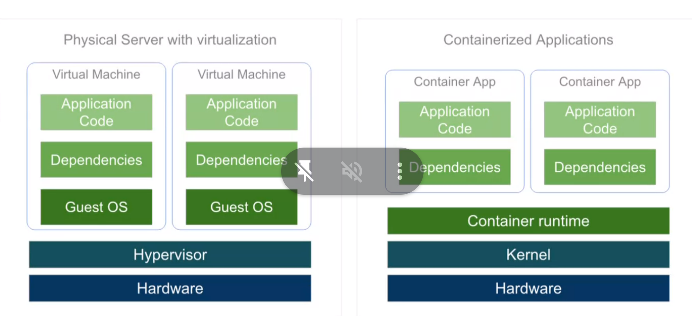
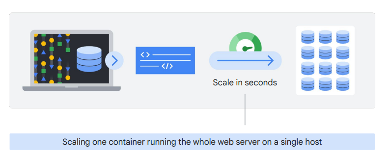
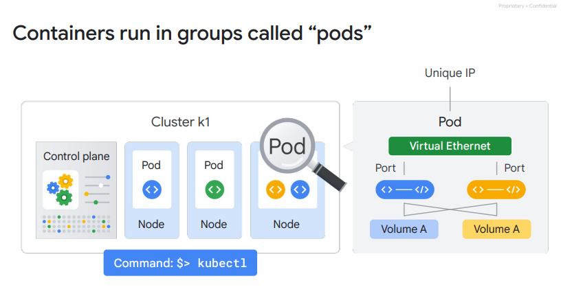
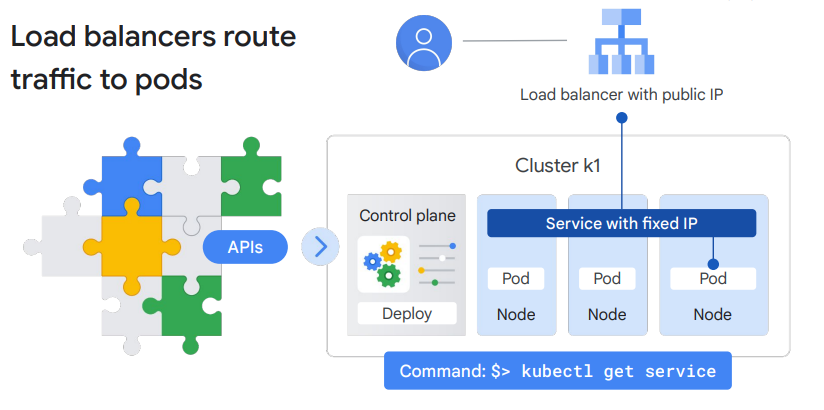
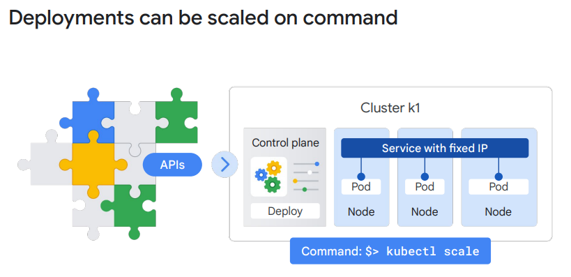
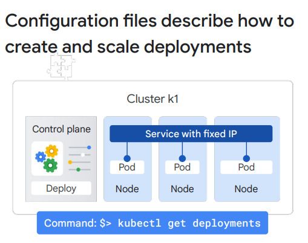

## Container
### VM

### scale 
scale an application with multiple containers



## Kubernetes
### 定義：
Kubernetes是一個用於管理容器化工作負載和服務的開源平台。它使得在許多主機上編排許多容器、按微服務方式擴展它們以及輕鬆部署升級和回滾成為可能。
- #### 最高層級描述：
  在最高層級，Kubernetes是一組API，您可以使用這些API在一組被稱為集群的節點上部署容器。
- #### 組件分類：
  系統分為一組作為控制平面運行的主要組件和一組運行容器的節點。在Kubernetes中，節點代表一個計算實例，比如一台機器。
- #### 與Google Cloud節點的區別：
  這與Google Cloud上運行在Compute Engine中的虛擬機器（VM）的節點不同。
- #### 應用描述和互動：
  可以描述一組應用程序及其應該如何互動，而Kubernetes則確定如何實現這一點。
### pods

- #### 定義：
  在Kubernetes中，使用包裝一個或多個容器的外殼部署容器的行為被稱為Pod。Pod是Kubernetes中您創建或部署的最小單位。它表示集群中正在運行的進程，可以是應用程序的一個組件或整個應用程序。
- #### Pod典型特點：
  每個Pod只有一個容器，但如果有多個容器存在硬依賴關係，則可以將它們打包到單個Pod中，並在它們之間共享網絡和存儲資源。
- #### 網絡和端口：
  Pod為您的容器提供唯一的網絡IP和一組端口，以及配置選項，控制容器的運行方式。
- #### 運行容器的方式：
  在Kubernetes中運行Pod中的容器的一種方式是使用`kubectl run`，該命令啟動一個包含在Pod中運行的容器的Deployment。

### Deployments
  ```shell
  kubectl get pods
  ```
- #### 定義：
  在Kubernetes中，Deployment表示相同Pod的一組副本，即使它們所在的節點失敗，也可以保持Pod的運行。Deployment可以代表應用程序的一個組件甚至整個應用程序。
- #### 保持Pod運行：
  Deployment確保Pod的指定數量的副本一直運行，即使其中一些副本因節點故障而停止運行。
- #### 對應應用程序部署：
  Deployment通常對應應用程序中的一個模塊或一個完整的應用程序。
- #### 查看運行中的Pods：

### Loadbalancer
```shell
kubectl expose deployments 
nginx --port=80 --type=LoadBalancer
```
- #### Service：
  Kubernetes為您的Pod創建一個具有固定IP地址的Service。Service允許Pod之間進行通信。
- #### Controller和Load Balancer：
  當需要允許集群外的其他人訪問這個Service時，控制器會說：“我需要將一個帶有公共IP地址的外部負載均衡器附加到該Service”。
- #### GKE中的Load Balancer：
  在Google Kubernetes Engine（GKE）中，這個外部負載均衡器通常作為一個網絡負載均衡器（network load balancer）創建。

### route traffic

```shell
kubectl get service
```
- #### Service抽象：
  Service是一種抽象，定義了一個邏輯上的Pod集合，以及一種訪問它們的策略。
- #### 路由到Pod：
  任何到達Service IP地址的客戶端將被路由到該Service背後的一個Pod。
- #### Pod IP地址的不穩定性：
  由於Deployments會創建和摧毀Pods，Pods將被分配它們自己的IP地址，但這些地址隨著時間的推移不保持穩定。
- #### Service組：
  Service組是一組Pods，為它們提供了一個穩定的端點（或固定的IP地址）。
- #### 例子：
  例如，如果創建兩個名為frontend和backend的Pod集合，並將它們放在它們自己的Services後面，則backend Pods可能會更改，但frontend Pods對此並不知曉。它們只是簡單地參考backend Service。

### Scaled

```shell
kubectl scale
```
- #### pod創建：
  在這個例子中，您的Deployment創建了三個Pods，它們被放在Service後面，共享一個固定的IP地址。
- #### Pod共享IP地址：
  這三個Pods共享Service提供的一個固定的IP地址。
- #### 自動擴展：
  您還可以使用其他類型的參數進行自動擴展；例如，您可以指定當CPU利用率達到一定限制時，Pod的數量應該增加。
### describe

- #### 文件描述
  ```text
  apiVersion: v1
  kind: Deployment
  metadata:
   name: nginx
   labels:
   app: nginx
  spec:
   replicas: 3
   selector:
   matchLabels:
   app: nginx
   template:
   metadata:
   labels:
   app: nginx
   spec:
   containers:
   - name: nginx
   image: nginx:1.15.7
   ports:
   - containerPort: 80
  ```
  ```shell
  kubectl get deployments
  ```
- #### 更改config file 後執行變更
  ```shell
  kubectl apply -f 
  nginx-deployment.yaml
  ```
## GKE
Google’s managed Kubernetes service
### 優點
- #### Google Cloud的Compute Engine實例負載平衡：
  GKE集群可以利用Google Cloud的實例負載平衡功能，以實現對Compute Engine實例的負載平衡。
- #### 節點池（Node Pools）：
  可以使用節點池在集群內指定節點的子集，以提供額外的靈活性。
- #### 集群節點實例數的自動擴展：
  集群的節點實例數可以進行自動擴展，以根據工作負載需求動態調整節點數量。
- #### 集群節點軟體的自動升級：
  GKE集群支持對節點軟體進行自動升級，確保使用最新的安全和性能優化。
- #### 節點自動修復：
  GKE提供節點自動修復功能，以維護節點的健康狀態和可用性。
- #### 使用Google Cloud運營套件的日誌記錄和監控：
  GKE集群可以利用Google Cloud的操作套件進行日誌記錄和監控，提供對集群的可視性。
