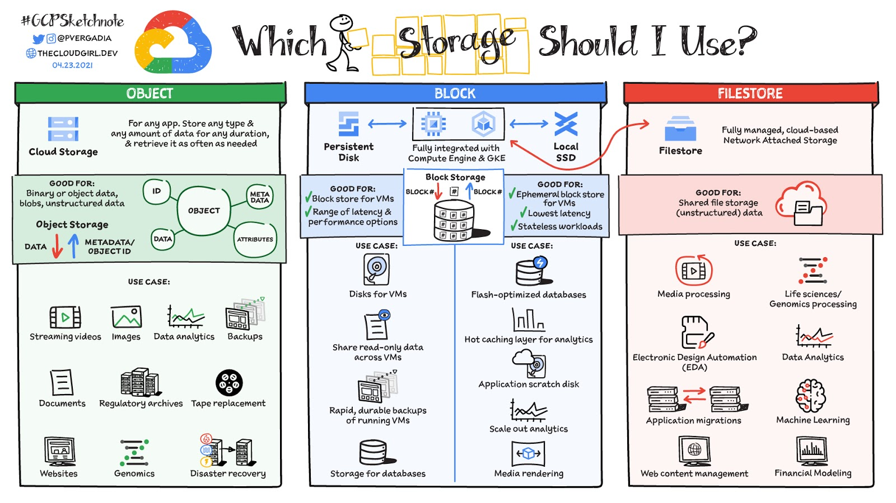
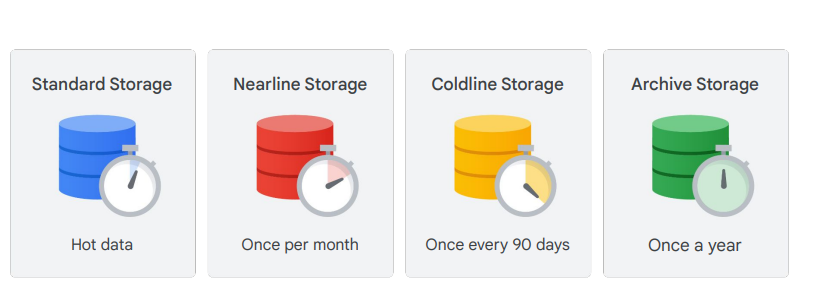
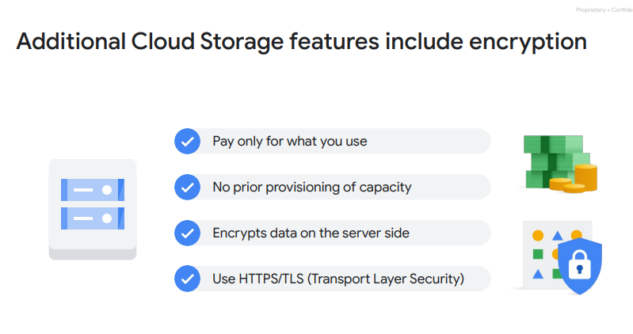
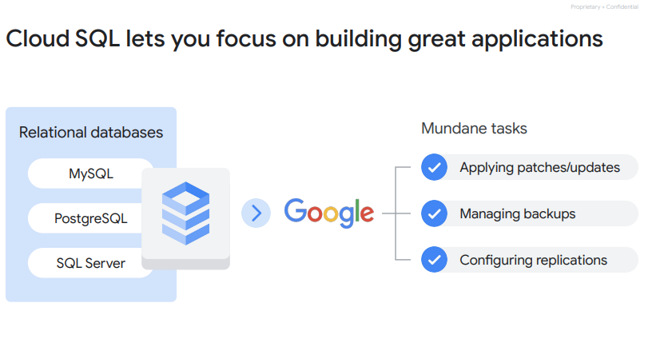
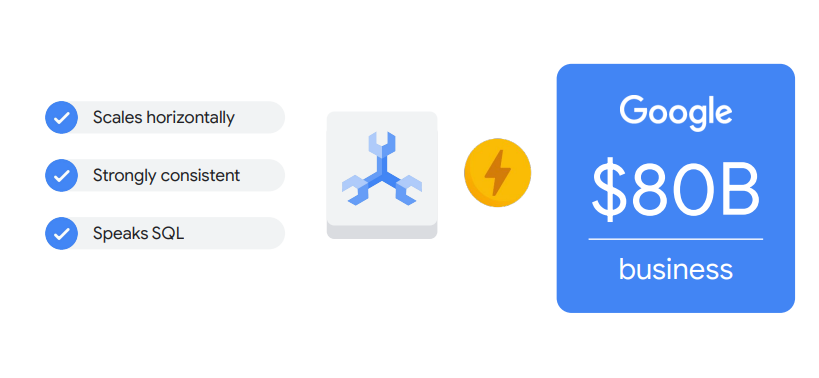
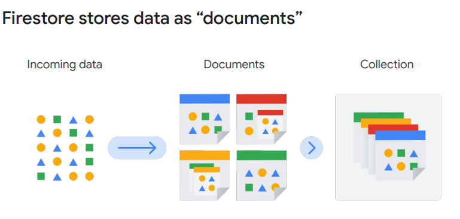
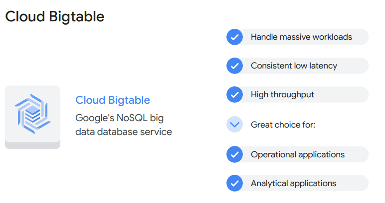
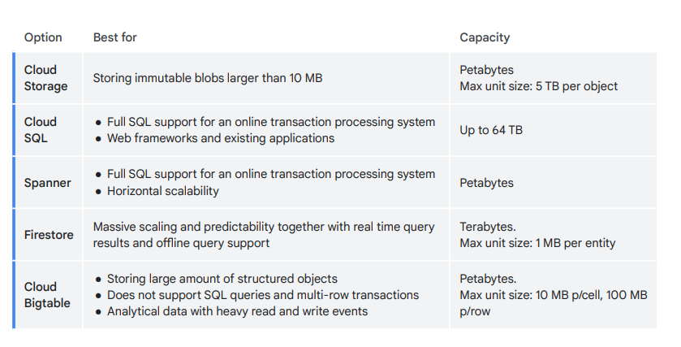

## data type

### Structured data

結構化數據是指那些在預定義的數據模型中有組織的數據，例如關聯數據庫中的數據。它們通常由欄位和記錄組成，並可以輕鬆地在電子表格或數據庫中進行搜索和排序。

### Unstructured data

非結構化數據是指不遵循預定義數據模型的數據，並且不容易被數據庫管理系統（DBMS）組織和分析。這些數據類型可能包括電子郵件、Word文件、PDF文件、音頻、視頻等。

### Transactional data

交易數據是指與單個交易相關的所有數據，例如購買產品或服務的日期、時間、客戶詳情、金額等。這種數據通常存儲在數據庫或交易處理系統中。

### Relational data

關聯數據是指在關聯數據庫中存儲的數據，這些數據按照特定模式（如表、行和列）進行組織。每個表都有一個唯一的鍵，可以用來與其他表中的數據相關聯。

## Cloud Storage
[推薦文章](https://cloud.google.com/blog/u/1/topics/developers-practitioners/map-storage-options-google-cloud)

### 版本
有其不可刪除性使其可以透過版本號來做控制

### fully managed
完全託管的可擴增服務
### 全球唯一ID
不可重複
### storage class

- #### 標準存儲（Standard Storage）：
  適用於頻繁訪問或“熱”數據，也適用於僅存儲短時間的數據。
- #### 近線存儲（Nearline Storage）：
  適用於存儲不經常訪問的數據，例如平均每月讀取或修改一次的數據。例如，數據備份、長尾多媒體內容或數據歸檔。
- #### 冷線存儲（Coldline Storage）：
  低成本選項，用於存儲不經常訪問的數據，但相對於近線存儲，冷線存儲最多每90天讀取或修改一次數據。
- #### 存檔存儲（Archive Storage）：
  最低成本選項，理想用於數據歸檔、在線備份和災難恢復。適用於計劃每年不到一次訪問的數據，因為存取和操作數據的成本較高，最短存儲期為365天。
- #### Autoclass
  - Autoclass功能：
  Cloud Storage還提供了一個名為Autoclass的功能，它根據每個對象的訪問模式自動將對象轉移到適當的存儲類別。
  - Autoclass的作用：
  這一功能將不被訪問的數據移動到更冷的存儲類別，以降低存儲成本，並將被訪問的數據移動到標準存儲，以優化未來的訪問。
  - Autoclass的好處：
  Autoclass簡化並自動化了對Cloud Storage數據的成本節省。
- #### 加密
  
## Cloud SQL

### Cloud SQL 特點
- #### 無需軟件安裝或維護：
  無需安裝或維護任何軟體。
- #### 擴展性：
  目前可擴展到64個處理器核心、400+ GB的RAM和64 TB的存儲。
- #### 支持自動複製場景：
  支持從Cloud SQL主實例、外部主實例和外部MySQL實例等自動複製場景。
- #### 支持管理型備份：
  支持管理型備份，因此備份的數據在需要時可以安全地存儲和訪問。實例的費用包括七個備份。
- #### 數據加密：
  在Google的內部網絡上以及存儲在數據庫表格、臨時文件和備份中時，加密客戶數據。
- #### 網路防火牆：
  包含一個網絡防火牆，用於控制對每個數據庫實例的網絡訪問。
## Cloud Spanner
### fully managed relational database

[影片簡介](https://www.youtube.com/watch?v=bUSU1e9j8wc)
### 特點
- #### 具有連接和次要索引的SQL關聯型數據庫管理系統：
  支持SQL操作，包括表聯接（joins）和次要索引。
- #### 內建高可用性：
  具有內建的高可用性，確保數據庫系統能夠持續可靠運行。
- #### 強大的全球一致性：
  具有強大的全球一致性，確保全球範圍內的數據同步和一致性。
- #### 高吞吐量：
  具有高吞吐量，支持每秒數萬次的讀寫操作或更多。

## firestore
### noSQL

### 特點
- #### 數據同步：
  Firestore使用數據同步來在任何連接的設備上更新數據。
- #### 一次性查詢：
  同時設計為高效執行簡單、一次性的查詢。
- #### 數據緩存：
  緩存應用程序主動使用的數據，使應用程序即使在設備離線時也能進行寫入、讀取、監聽和查詢數據。
- #### 離線操作：
  即使設備處於離線狀態，應用程序也可以執行寫入、讀取、監聽和查詢數據。
- #### 數據同步：
  當設備重新連線到互聯網時，Firestore將本地的任何更改同步回Firestore。
### 費用
- #### 讀取、寫入和刪除操作費用：
  您使用Cloud Firestore執行的每次文檔讀取、寫入和刪除都會產生費用。
- #### 查詢費用：
  查詢的費用以每次“文檔讀取”計算，無論查詢是否返回數據。
- #### 數據存儲費用：
  您的數據佔用的存儲空間也會產生費用。
- #### 網絡帶寬費用：
  用於訪問數據的某些類型的網絡帶寬使用也會產生費用。入站目前是免費的，而出站在許多情況下也是免費的。
- #### 免費額度：
  Firestore提供每月在美國區域之間的免費10GiB的網絡出站，以及每天的免費額度：
  - 50,000次文檔讀取
  - 20,000次文檔寫入
  - 20,000次文檔刪除
  - 1 GB的存儲數據
- #### 計費起點：
  費用僅在超過每天的免費額度後開始計算，這使您可以以非常低的成本，甚至免費地開始使用Firestore進行開發。
## Cloud Bigtable

### 特點
- #### 數據量大：
  操作1TB以上的半結構化或結構化數據。
- #### 數據速度快、吞吐量高，或者數據迅速變化：
  數據需要高吞吐量，或者數據具有快速變化的特點。
- #### NoSQL數據：
  操作NoSQL數據，通常意味著不需要強大的關聯語義的事務。
- #### 時間序列數據或自然語義排序：
  數據具有時間序列特性或自然語義排序。
- #### 處理大數據：
  操作大數據，對數據進行異步批處理或同步實時處理。
- #### 應用機器學習算法：
  運行機器學習算法對數據進行分析。
## Comparing storage options
### 各處存方式之比較
