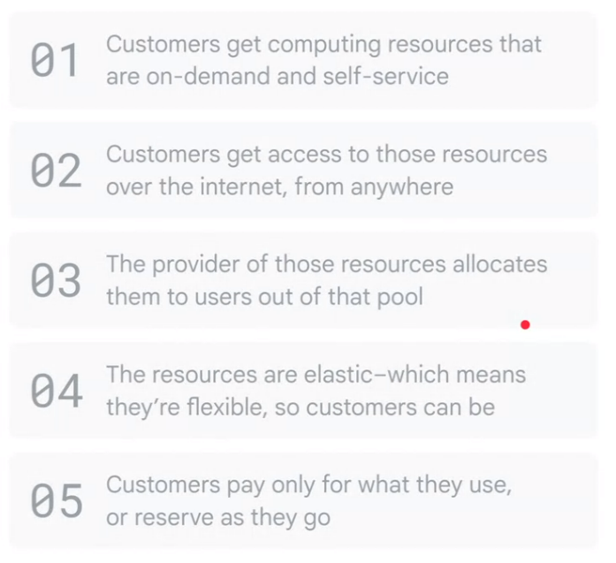
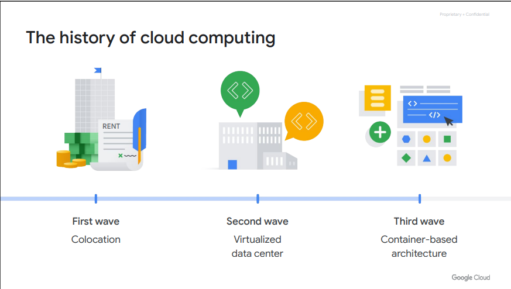
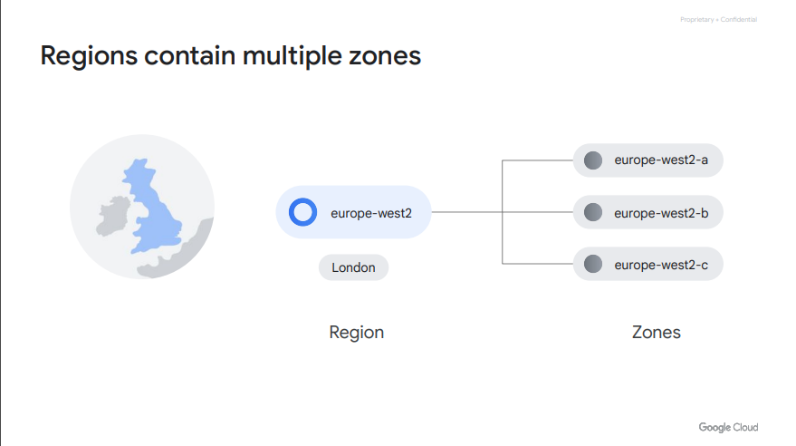
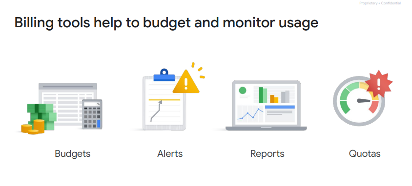

## Google Cloud 核心基礎架構課程

參加萬里雲舉辦的 Google Cloud 線上核心基礎架構課程，紀錄上課筆記

### What is Cloud Computing

### history of cloud

最後的重點在容器化，因為容器化才能達到快速部屬

### Iaas

#Raw compute #Storage #Network capabilities

#### 定義：

IAAS是一種雲計算服務模型，它提供基本的計算、儲存和網路資源，讓用戶能夠在這些基礎設施上運行應用程式。

#### 特點：

- 虛擬化： 提供虛擬化的計算資源，包括虛擬機、儲存和網路。
- 可擴展性： 允許根據需要動態擴展或縮減資源。
- 自我服務： 使用者可以根據需求自助式地管理和配置基礎設施。
- 使用案例： 適合需要更大程度掌控基礎架構細節的應用，如需要特定作業系統或配置的應用程式。

### Paas

#managed services

#### 定義：

PAAS是一種雲計算服務模型，它提供一個完整的開發和執行環境，包括開發工具、資料庫、中間件和運行時環境。

#### 特點：

- 抽象程度高： 提供更高層次的抽象，開發者可以專注於應用程式的開發而無需擔心底層基礎設施。
- 自動管理： 自動處理大部分的基礎架構管理工作，如擴展性、負載平衡等。
- 快速開發： 通過提供開發工具和環境，加速應用程式的開發週期。
- 使用案例： 適合開發人員和團隊，尤其是那些希望專注於應用程式邏輯而不是基礎架構管理的情況。

## 使用區域

### Location:　

#### Regions:

- 38個區域
- 提供多種地理區域選擇
- 多區域部署以實現異地備援

#### Zones:

- 118個區域分區
- 每個區域分區提供獨立的基礎設施
- 用於實現高可用性和可擴展性

#### 總結

這些地理區域和區域分區的組合提供了彈性和可靠性，以滿足不同應用程式和服務的需求。多區域設計支援異地備援，而區域內的分區則有助於實現高度可用和可擴展的基礎設施。

## security

### hardware

#### 硬體設計與來源：

- Google自家設計伺服器主機板和網路設備。
- 包括硬體安全晶片在內的自家設計晶片被部署在伺服器和外設上。
- 來源控制確保硬體元件的原始性和真實性。

#### 安全啟動堆疊：

- Google伺服器機器使用多種技術確保啟動正確的軟體堆疊，包括對BIOS、引導程式、核心和基礎作業系統映像的加密簽名。
- 確保只有正確且授權的軟體堆疊能夠啟動。

#### 場地安全性：

- Google自家設計和建造數據中心，具有多層次的實體安全保護。
- 進入數據中心的權限僅限於極少數的Google員工，提高安全性。
- 一些伺服器託管在第三方數據中心，Google會確保在該中心營運商提供的安全層次之上，加入Google控制的實體安全措施。

### Service deployment

#### 跨服務通信加密：

- Google的基礎架構為網路上的遠程過程調用（RPC）數據提供加密的隱私和完整性。
- Google的服務使用RPC呼叫相互通信。
- 基礎架構自動對所有在數據中心之間傳輸的基礎架構RPC流量進行加密。
- Google已經開始部署硬體加密加速器，使其能夠將這種默認加密擴展到Google數據中心內的所有基礎架構RPC流量。

### User identity level

#### 使用者身分識別：

- Google的中央身分服務通常呈現給終端使用者的形式是Google登入頁面，不僅僅要求簡單的使用者名稱和密碼。
- 該服務還會根據風險因素挑戰使用者，例如他們是否以前曾經從相同設備或相似位置登入。這顯示該服務具有智能化的安全措施。
- 使用者還可以在登入時選擇使用次要驗證因素，包括基於通用第二因子（U2F）開放標準的設備。

### Storage services

#### 靜態加密：

- Google的大多數應用程式通過存儲服務間接訪問實體存儲（換句話說，"文件存儲"），加密（使用中央管理的金鑰）應用在這些存儲服務的層次。
- Google還在硬碟和固態硬碟中啟用硬體加密支援。

## Internet communication

### Google前端（"GFE"）：

想要在互聯網上提供服務的Google服務會在稱為Google前端的基礎架構服務中註冊自己。
Google前端確保所有的TLS連接都使用公共-私有金鑰對和來自已認證機構（CA）的X.509證書結束，同時遵循最佳實踐，如支持完美前向保密。
GFE另外應用保護措施，防範拒絕服務（DoS）攻擊。

### 拒絕服務（DoS）保護：

Google基礎架構的規模使其能夠輕鬆吸收許多DoS攻擊。
Google還擁有多層次、多層次的DoS保護，進一步減少對在GFE後運行的服務產生任何DoS影響的風險。

### 運營安全水平
通常指的是在組織或系統的日常運作中實施的安全程度。這涉及到在場所、資料和整體運作中採取的各種實踐、措施和協議，以確保資產的安全。以下是通常與運營安全相關的重點方面：

### 存取控制：
實施嚴格的存取控制，確保只有授權的人員能夠訪問敏感信息或關鍵系統。

### 身份驗證和授權：
使用強大的身份驗證方法來驗證用戶的身份。授權機制定義了用戶被允許訪問的操作或資源。

### 監控和日誌：
實施監控系統和全面的日誌記錄，跟蹤活動，檢測異常，並提供調查的審計軌跡。

### 事件應對：
建立應對安全事件的協議。這包括對應對和減輕任何安全漏洞影響的預定計劃。****

### 物理安全：
確保設施、數據中心和硬件的物理安全，以防止未經授權的訪問或篡改。

### 加密：
實施加密協議，保護傳輸中和靜態的資料。這有助於確保敏感信息的機密性和完整性。

### 安全培訓和意識：
定期向人員提供安全培訓，提高對潛在威脅的認識，教育他們採用最佳實踐。

### 供應商和第三方安全：
評估和確保供應商和第三方的安全措施，這些供應商和第三方能夠訪問組織的系統或資料。

### 定期安全審計：
定期進行安全審計，以識別漏洞，評估安全控制的有效性，並進行必要的改進。

### 符合標準：
遵守行業標準和法規要求，確保安全實踐符合已確立的指南和法律。

運營安全水平是組織整體安全狀態的重要組成部分，因為它涉及到保持安全環境的實際日常方面。這涉及技術、政策和持續的警惕，以適應不斷變化的安全威脅。

## plan & billing

### calculation
[成本計算器點我](https://cloud.google.com/products/calculator)
