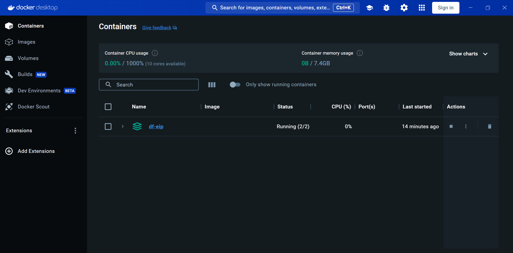
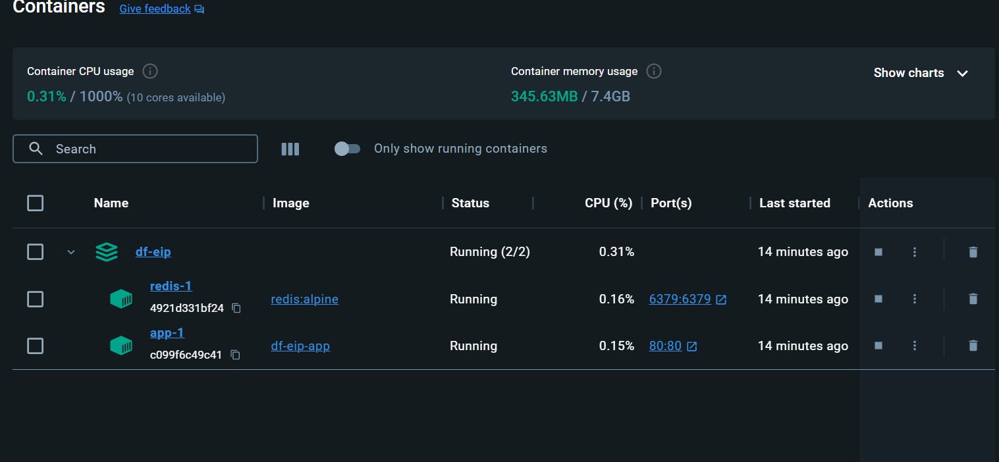
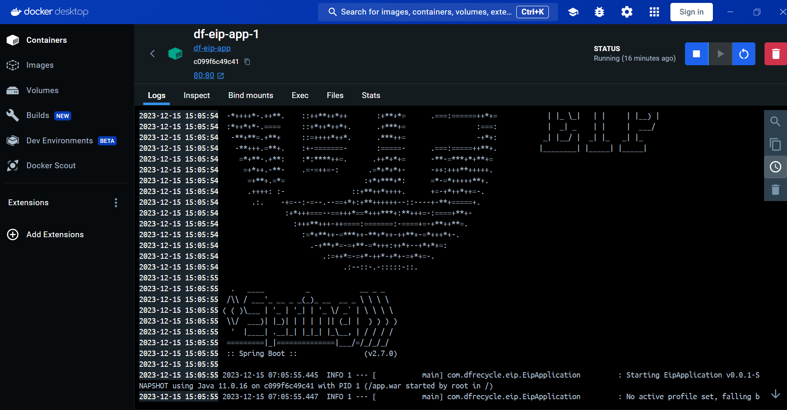
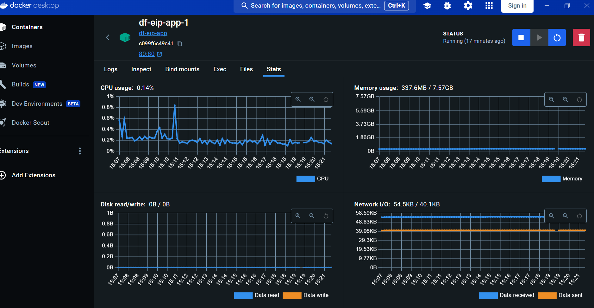

### 安裝docker desktop

[https://www.docker.com/products/docker-desktop/](https://www.docker.com/products/docker-desktop/)
安裝後進入可以看到畫面，如果有正在跑的container 會顯示在這邊，沒有的話會顯示教學讓你跑一個測試的docker 起來
圖上是我這次建的專案，會用到springboot 及 redis，因為有兩個需要同時起，所以需要寫dockerfile 及 docker-compose.yml


### dockerfile

這邊是將maven build 好的war檔，丟入docker 中使用 java 11,最後expose 80 port
要注意war檔在entrypoint也是用 -jar 來跑

```dockerfile
# Start with a base image containing Java runtime (Java 11)
FROM openjdk:11-jdk-slim

# Make port 8080 available to the world outside this container
EXPOSE 80

# The application's war file
ARG WAR_FILE=target/eip-0.0.1-SNAPSHOT.war

# Add the application's war to the container
ADD ${WAR_FILE} app.war

# Run the war file
ENTRYPOINT ["java","-jar","/app.war"]

```

### 撰寫docker-compose.yml

這邊java 採用剛剛寫好的dockerfile，redis 採用線上的image，並做好對外port 對應

```yaml
version: '3'
services:
  app:
    build:
      context: .
      dockerfile: Dockerfile
    ports:
      - "80:80"
    depends_on:
      - redis
  redis:
    image: "redis:alpine"
    ports:
      - "6379:6379"
```

### run docker

```yaml
docker-compose up --build
```

### 頁面

成功起來後container 會以圖形化介面的方式顯示在docker desktop


### log

點入container 可以查看log, 這邊可以看到跑起來的 springboot


### 監控

也可以點入旁邊查看監控


**`有方便的圖形化介面真是太好了`**