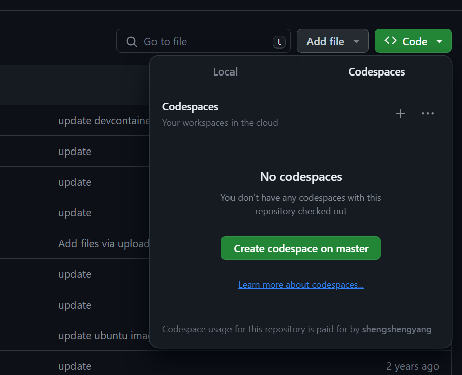
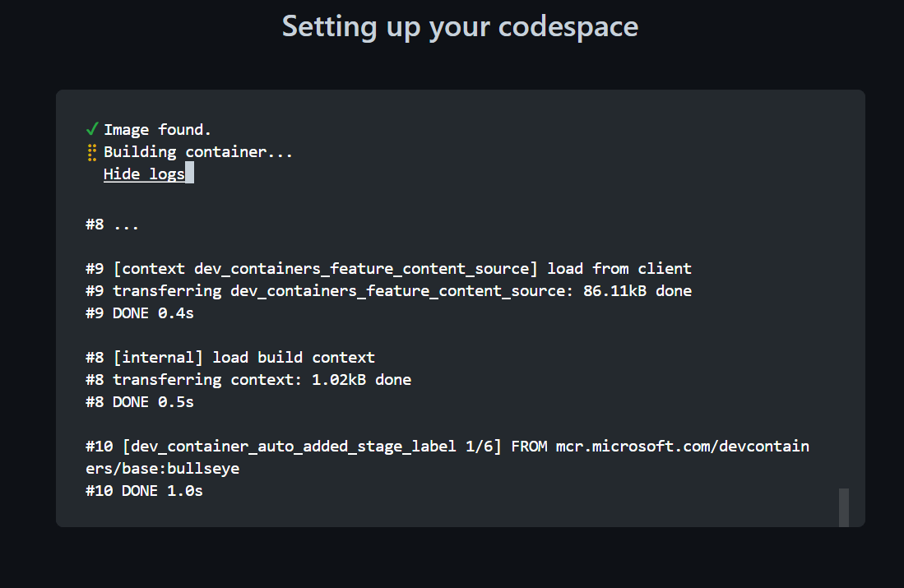
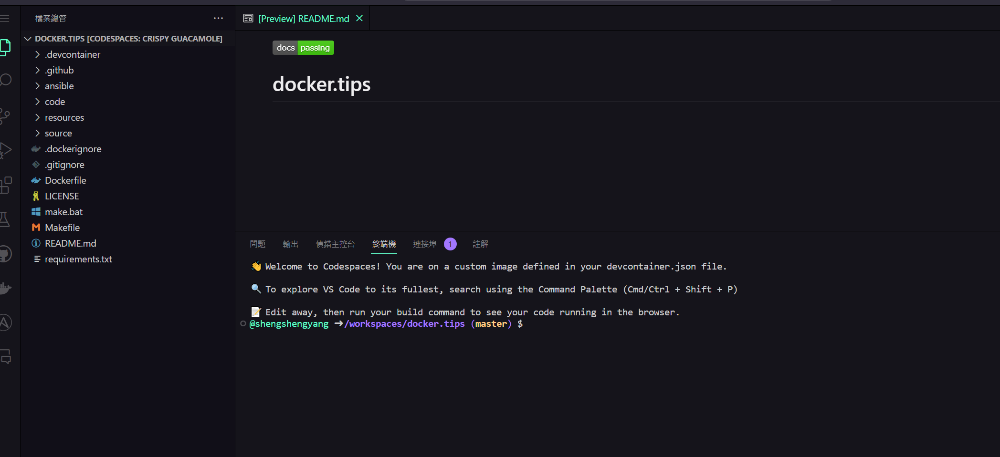
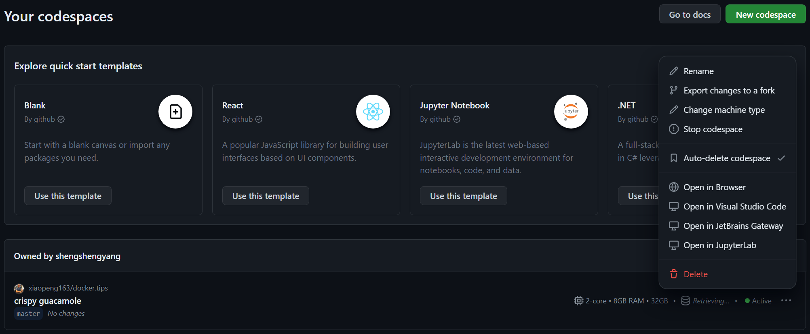

## Github Codespaces
### 介紹
github codespaces 提供一個線上可模擬練習的地方讓大家可以玩docker
使用的話可以按下github repo 的 code -> codespaces

點下去之後他就會開始自己建置環境

建置好之後就會看到一個類似vscode 的空間可以做練習了

如果要查看自己現在的啟動個數可以參考:[https://github.com/codespaces](https://github.com/codespaces), 我這邊剛剛起了一個就會看到Active 中

### 收費
是有免費額度的:
| 帳戶計劃                   | 每月存儲空間 | 每月核心小時數 |
| ------------------------- | ------------ | -------------- |
| 面向個人帳戶的 GitHub Free | 15 GB/月      | 120            |
| GitHub Pro                | 20 GB/月      | 180            |

超過額度的部分可以去參考github 官方文檔: [https://docs.github.com/en/billing/managing-billing-for-github-codespaces/about-billing-for-github-codespaces](https://docs.github.com/en/billing/managing-billing-for-github-codespaces/about-billing-for-github-codespaces)
**沒有用到後記得刪除**

### 來源
上課的udemy 連結:[https://www.udemy.com/course/docker-china](https://www.udemy.com/course/docker-china)
作者的Github: [https://github.com/xiaopeng163/docker.tips](https://github.com/xiaopeng163/docker.tips)
作者整理的docker筆記: [https://dockertips.readthedocs.io/en/latest/](https://dockertips.readthedocs.io/en/latest/)

我覺得非常佛心也很清楚，後續會慢慢補上上課筆記及實操心得

#### docker, 啟動!!!