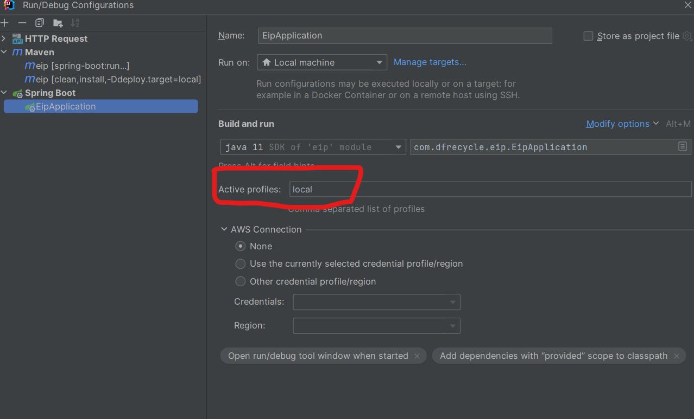

## application.properties
### 用途
放入spring 的配置，但時常本地開發 / 測試 / 正式的環境都會相差很多，因此在springboot可以設定不同的properties來做deploy 的區隔

### 配置檔
可以建立兩個properties 取名範例，properties 內容就自己放
#### application-local.properties
```text
server.port=8080
.....
```
#### application-prod.properties
```text
server.port=9090
.....
```

### maven 指令
只要切換target 就可以指向不同的properties
#### install
```shell
mvn clean install -Ddeploy.target=local
```
#### run
```shell
spring-boot:run -Dspring-boot.run.arguments=--spring.profiles.active=local
```

### ide 開發
若要在本地開起來，可以在configuration中的`Active profiles` 加入變數，就可以透過ide debug 並可以隨時切換環境
