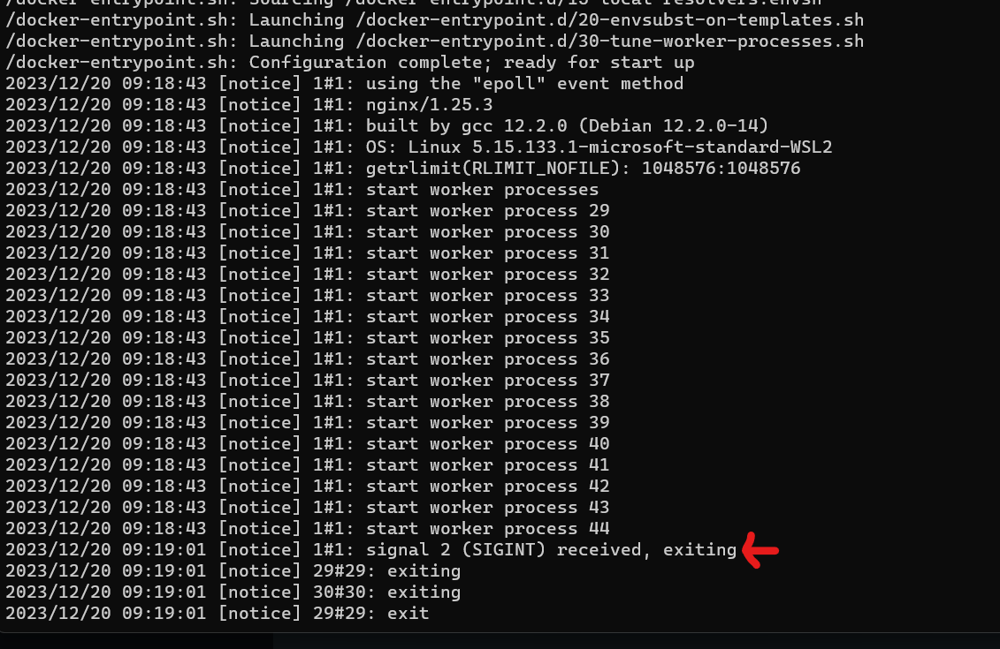
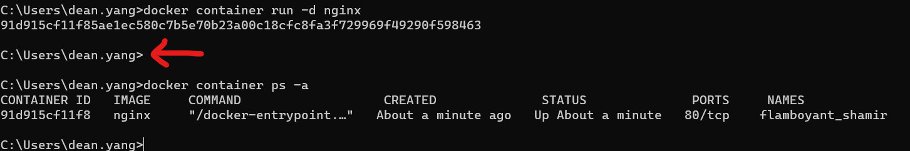
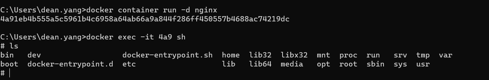

## run mode
### attach 模式
```shell
docker container run -p 80:80 nginx
```
建立好容器之後會在`前台`執行，也能直接看到`log`，此時如果直接輸入指令則會`直接影響`docker container
如 : ctrl + c 會直接停止當前正在運行的container(圖中紅箭頭處)

### detach 模式
```shell
docker container run -d 80:80 nginx
```
建立好之後在`後台`執行，不會顯示任何log，建立好只會顯示id，圖中箭頭處按 ctrl + C, 查看container 仍在執行中

此時如果要進行container 的 使用，可以用指令開幾交互模式`it`
```shell
docker exec -it <id> sh
```
如圖，執行後就進入到run 起來的container ，可以直接操作
