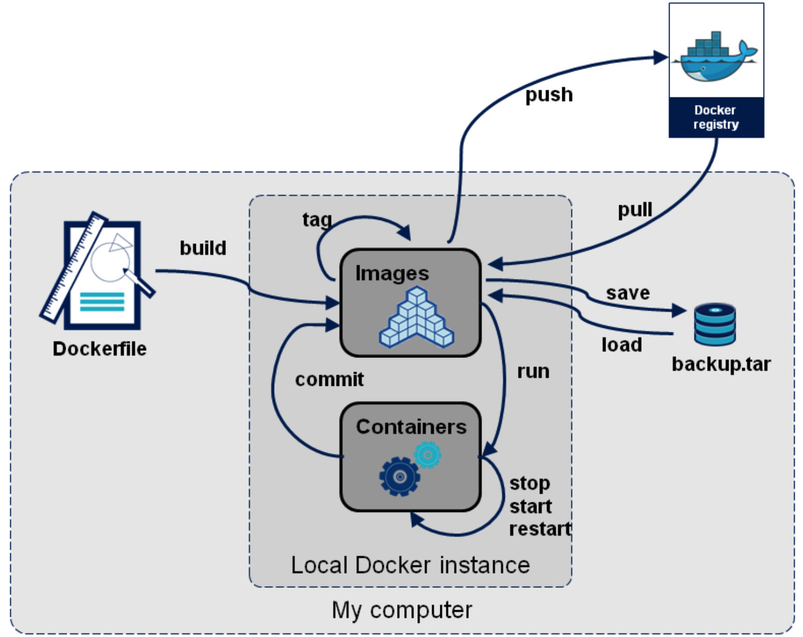

## Docker Image 獲取

會有三種方式可以取得docker image

###  registry
可能是 `private` 也可能是 `public`, 直接從網路上去做抓取

### DockerFile

透過`Dockerfile` 去做搭建，過程須透過網路

### local file

鏡像可以透過備份壓成`.tar`, 可以在本地端夾在後透過指令來讀取
```shell
docker import [OPTIONS] file|URL|- [REPOSITORY[:TAG]]
```