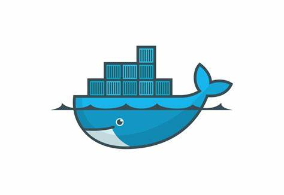
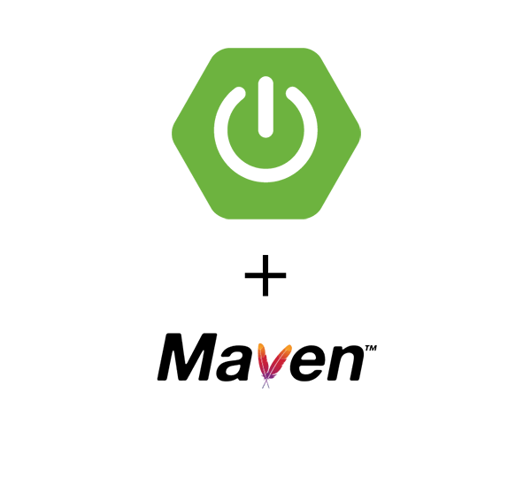

紀錄一些不再markdown 裡面的 fluid 標籤使用

### 便條紙

#### markdown

```text

這邊放字

```
- output

這邊放字


#### HTML

```html
<p class="note note-primary">标签</p>
```
- output
<p class="note note-primary">這邊放字</p>

#### 選擇
<p class="note note-primary">primary</p>
<p class="note note-secondary">secondary</p>
<p class="note note-success">success</p>
<p class="note note-warning">warning</p>
<p class="note note-info">info</p>
<p class="note note-light">light</p>

### 行內標籤
直接放在 `- output` 的下面，兩種排版放式不同，可參考實際輸出

#### markdown

```text

```
- output


#### html

```html
<span class="label label-primary">這邊放字</span>
```

- output
<span class="label label-primary">這邊放字</span>


#### 選擇
<span class="label label-primary">primary </span><span class="label label-default">default </span><span class="label label-info">info </span><span class="label label-warning">warning  </span><span class="label label-danger">danger</span>

### checkbox
#### markdown
```text


```


#### 選項
- text: 文字
- checked: 是否勾選, default false
- incline: 後方文字是否換行, default false

### 按鈕

```text

```
- output

    {% btn http://localhost:4000/2023/12/21/hexo-fluid-use/#%E6%8C%89%E9%88%95, 這裡放字, 標籤(放按鈕上久一點) %}

### 圖組
```text

  
  
  
  
  

```
- output








#### 選項
- total: 圖片總數
- n1-n2-: 每行圖片數: 3-2 指第一行3 第二行 2