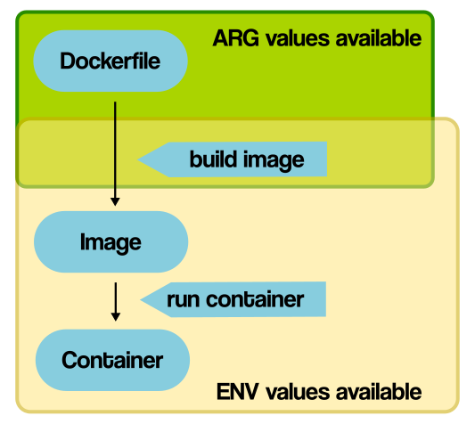

# Dockerfile
用來提供docker 建立鏡像的文檔

## 鏡像選擇(From)
### 原則
- 官方 > 開源 > 其他
- 固定版本不用 `:latest`
- 盡量選擇小體積`image`

## 文件複製及目錄

### 一般文件

可以使用 `copy` 或是 `add` 兩者在一般文件的效果是一樣的
```dockerfile
FROM python:3.9.5-alpine3.13
COPY hello.py /app/hello.py
```
```dockerfile
FROM python:3.9.5-alpine3.13
ADD hello.py /app/hello.py
```

### 壓縮檔

 在使用上會比copy好的是add 會自動將 gzip 檔解壓縮後在加入
```dockerfile
FROM python:3.9.5-alpine3.13
ADD hello.tar.gz /app/
```

### 使用原則

一般文件用 `copy` 需要解壓縮用 `add`

## 建構參數及環境變量(ARG / ENV)
兩者都可以拿來設定變量，但在使用上其實有蠻大的不同，先看code 怎麼加

### ENV
```dockerfile
FROM ubuntu:20.04
ENV VERSION=2.0.1
RUN apt-get update && \
    apt-get install -y wget && \
    wget https://github.com/ipinfo/cli/releases/download/ipinfo-${VERSION}/ipinfo_${VERSION}_linux_amd64.tar.gz && \
    tar zxf ipinfo_${VERSION}_linux_amd64.tar.gz && \
    mv ipinfo_${VERSION}_linux_amd64 /usr/bin/ipinfo && \
    rm -rf ipinfo_${VERSION}_linux_amd64.tar.gz
```

### ARG
```dockerfile
FROM ubuntu:20.04
ARG VERSION=2.0.1
RUN apt-get update && \
    apt-get install -y wget && \
    wget https://github.com/ipinfo/cli/releases/download/ipinfo-${VERSION}/ipinfo_${VERSION}_linux_amd64.tar.gz && \
    tar zxf ipinfo_${VERSION}_linux_amd64.tar.gz && \
    mv ipinfo_${VERSION}_linux_amd64 /usr/bin/ipinfo && \
    rm -rf ipinfo_${VERSION}_linux_amd64.tar.gz
```

### 差異

- env 中的變量可以在`container`中繼續使用
- arg 只存在於建立image時，但可以在建立時透過自行指定來覆蓋file裡的變量
- -build-arg
    ```text
    $ docker image build -f .\Dockerfile-arg -t ipinfo-arg-2.0.0 --build-arg VERSION=2.0.0 .
    $ docker image ls
    REPOSITORY         TAG       IMAGE ID       CREATED          SIZE
    ipinfo-arg-2.0.0   latest    0d9c964947e2   6 seconds ago    124MB
    $ docker container run -it ipinfo-arg-2.0.0
    root@b64285579756:/#
    root@b64285579756:/# ipinfo version
    2.0.0
    root@b64285579756:/#
    ```