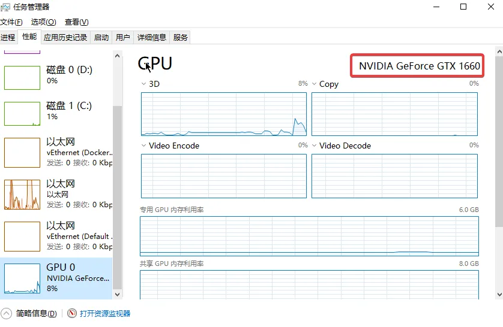
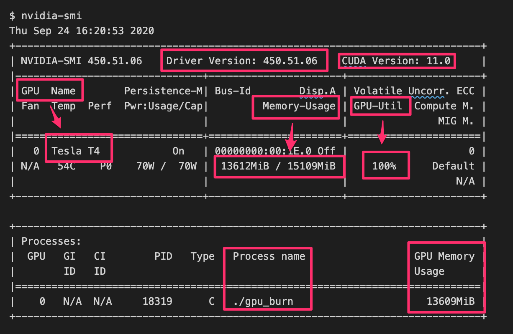
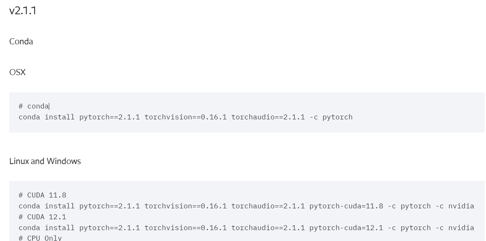
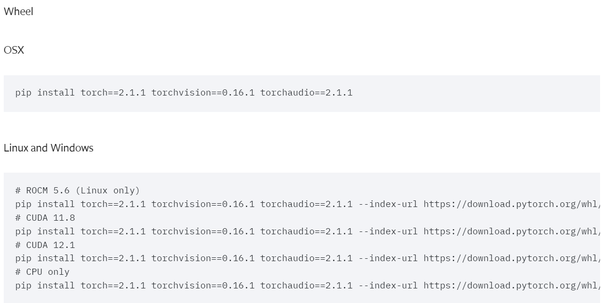

# pytorch 的 cuda use
## 所需環境
- 有 cuda 的顯卡
- nvidia 顯卡驅動
- cuda 驅動
- anaconda
- 安裝pytorch指定版本

## 安裝顯卡驅動
### 顯卡版本
- 系統管理員-> 效能 -> GPU
- 圖示

### 下載連結
依照版本下載對應的顯卡驅動
https://www.nvidia.cn/Download/index.aspx?lang=cn

## 安裝cuda 驅動
### 確認cuda 版本
安裝好之後使用指令可在右上角得到cuda 版本
```shell
nvidia-smi
```
- output


### 下載cuda toolkit 安裝
選擇自己的作業系統版本，及剛剛查到的cuda 支援版本做安裝
[https://developer.nvidia.com/cuda-downloads](https://developer.nvidia.com/cuda-downloads)

## 安裝Anaconda
pytorch 環境隔離建立管理的系統
### 官網連結
[https://www.anaconda.com/download/](https://www.anaconda.com/download/)

## 安裝 pytorch
### 官網連結
[https://pytorch.org/get-started/previous-versions/](https://pytorch.org/get-started/previous-versions/)

### 下載模式
分為使用 管理版本的安裝，及 ， 依照環境使用對應的指令下載
#### Conda

#### Wheel


## 測試是否可用cuda
安裝好之後可以寫個簡單的 來檢測是否可以啟動
### CheckCuda.py
```python
import torch

print('CUDA版本:',torch.version.cuda)

print('Pytorch版本:',torch.__version__)

print('顯卡是否可用:','可用' if(torch.cuda.is_available()) else '不可用')

print('顯卡數量:',torch.cuda.device_count())

print('是否支援BF16數字格式:','支援' if (torch.cuda.is_bf16_supported()) else '不支援')

print('當前顯卡型號:',torch.cuda.get_device_name())

print('當前顯卡的CUDA算力:',torch.cuda.get_device_capability())

print('當前顯卡的總顯存:',torch.cuda.get_device_properties(0).total_memory/1024/1024/1024,'GB')

print('是否支援TensorCore:','支援' if (torch.cuda.get_device_properties(0).major >= 7) else '不支援')

print('當前顯卡的顯存使用率:',torch.cuda.memory_allocated(0)/torch.cuda.get_device_properties(0).total_memory*100,'%')

```