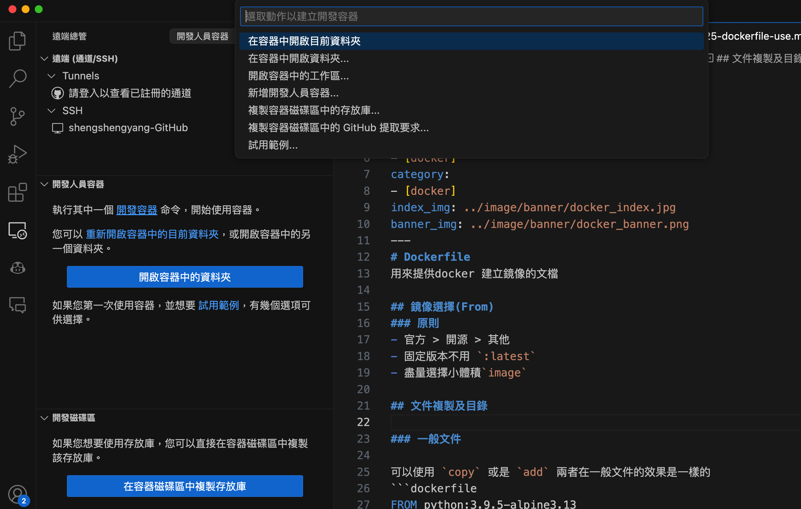

## Remote explorer

vscode 的插件，包含兩個部分

### 開發環境

#### 選擇workspace

選擇想要的資料夾或檔案

#### 選擇環境鏡像

包含許多常見環境如linux, python, node.js 等

#### 環境建立
選好後可以看到正在build 及run docker container

#### 環境查看
跑完後就會發現已經搭建好一個docker 環境，就可以在不用安裝各種環境的情況下做開發
