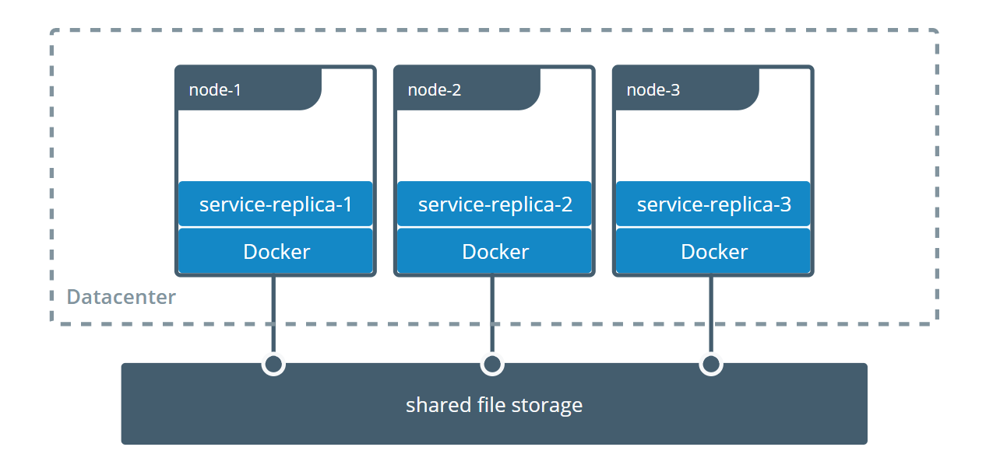

# docker volume 應用


## 多container 間共享資料
[https://docs.docker.com/storage/volumes/#share-data-among-machines](https://docs.docker.com/storage/volumes/#share-data-among-machines)

### 環境
| Hostname    | IP             | SSH Username | SSH Password |
|-------------|----------------|--------------|--------------|
| docker-host1| 192.168.200.10 | vagrant      | vagrant      |
| docker-host2| 192.168.200.11 | vagrant      | vagrant      |
| docker-host3| 192.168.200.12 | vagrant      | vagrant      |

### 安装plugin
其中兩台機器安裝plugin
```shell
[vagrant@docker-host1 ~]$ docker plugin install --grant-all-permissions vieux/sshfs
latest: Pulling from vieux/sshfs
Digest: sha256:1d3c3e42c12138da5ef7873b97f7f32cf99fb6edde75fa4f0bcf9ed277855811
52d435ada6a4: Complete
Installed plugin vieux/sshfs
```

```shell
[vagrant@docker-host2 ~]$ docker plugin install --grant-all-permissions vieux/sshfs
latest: Pulling from vieux/sshfs
Digest: sha256:1d3c3e42c12138da5ef7873b97f7f32cf99fb6edde75fa4f0bcf9ed277855811
52d435ada6a4: Complete
Installed plugin vieux/sshfs
```

### 建立volume
- 在第三台建立volume
    ```shell
    [vagrant@docker-host1 ~]$ docker volume create --driver vieux/sshfs \
                              -o sshcmd=vagrant@192.168.200.12:/home/vagrant \
                              -o password=vagrant \
                              sshvolume
    ```
- 查看
    ```shell
    [vagrant@docker-host1 ~]$ docker volume ls
    DRIVER               VOLUME NAME
    vieux/sshfs:latest   sshvolume
    [vagrant@docker-host1 ~]$ docker volume inspect sshvolume
    [
        {
            "CreatedAt": "0001-01-01T00:00:00Z",
            "Driver": "vieux/sshfs:latest",
            "Labels": {},
            "Mountpoint": "/mnt/volumes/f59e848643f73d73a21b881486d55b33",
            "Name": "sshvolume",
            "Options": {
                "password": "vagrant",
                "sshcmd": "vagrant@192.168.200.12:/home/vagrant"
            },
            "Scope": "local"
        }
    ]
    ```
### 建立container 並掛載volume
```shell
[vagrant@docker-host1 ~]$ docker run -it -v sshvolume:/app busybox sh
Unable to find image 'busybox:latest' locally
latest: Pulling from library/busybox
b71f96345d44: Pull complete
Digest: sha256:930490f97e5b921535c153e0e7110d251134cc4b72bbb8133c6a5065cc68580d
Status: Downloaded newer image for busybox:latest
/ #
/ # ls
app   bin   dev   etc   home  proc  root  sys   tmp   usr   var
/ # cd /app
/app # ls
/app # echo "this is ssh volume"> test.txt
/app # ls
test.txt
/app # more test.txt
this is ssh volume
/app #
/app #
```
在host 3 可看到
```shell
[vagrant@docker-host3 ~]$ pwd
/home/vagrant
[vagrant@docker-host3 ~]$ ls
test.txt
[vagrant@docker-host3 ~]$ more test.txt
this is ssh volume
```