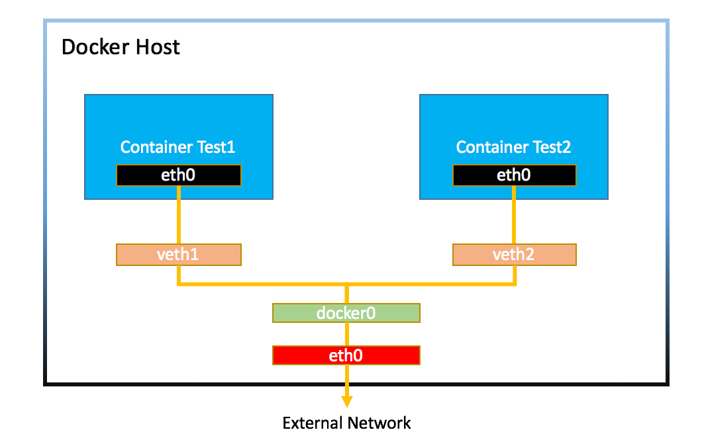

# Docker 的網路連接

允許容器之間以及容器與外部世界之間的互聯互通。

## 網路驅動

### 查看 network

```shell
docker network ls
```

- output
    ```shell
    NETWORK ID     NAME      DRIVER    SCOPE
    1847e179a316   bridge    bridge    local
    a647a4ad0b4f   host      host      local
    fbd81b56c009   none      null      local
    ```
### bridge

預設的網路驅動，用於容器間的通信。


#### 指令查看network
從輸出可以看到兩個新建的container 都連接到bridge 的網路
```shell
docker network inspect bridge
```

- output
  ```
  [
    {
        "Name": "bridge",
        "Id": "1847e179a316ee5219c951c2c21cf2c787d431d1ffb3ef621b8f0d1edd197b24",
        "Created": "2021-07-01T15:28:09.265408946Z",
        "Scope": "local",
        "Driver": "bridge",
        "EnableIPv6": false,
        "IPAM": {
            "Driver": "default",
            "Options": null,
            "Config": [
                {
                    "Subnet": "172.17.0.0/16",
                    "Gateway": "172.17.0.1"
                }
            ]
        },
        "Internal": false,
        "Attachable": false,
        "Ingress": false,
        "ConfigFrom": {
            "Network": ""
        },
        "ConfigOnly": false,
        "Containers": {
            "03494b034694982fa085cc4052b6c7b8b9c046f9d5f85f30e3a9e716fad20741": {
                "Name": "box1",
                "EndpointID": "072160448becebb7c9c333dce9bbdf7601a92b1d3e7a5820b8b35976cf4fd6ff",
                "MacAddress": "02:42:ac:11:00:02",
                "IPv4Address": "172.17.0.2/16",
                "IPv6Address": ""
            },
            "4f3303c84e5391ea37db664fd08683b01decdadae636aaa1bfd7bb9669cbd8de": {
                "Name": "box2",
                "EndpointID": "4cf0f635d4273066acd3075ec775e6fa405034f94b88c1bcacdaae847612f2c5",
                "MacAddress": "02:42:ac:11:00:03",
                "IPv4Address": "172.17.0.3/16",
                "IPv6Address": ""
            }
        },
        "Options": {
            "com.docker.network.bridge.default_bridge": "true",
            "com.docker.network.bridge.enable_icc": "true",
            "com.docker.network.bridge.enable_ip_masquerade": "true",
            "com.docker.network.bridge.host_binding_ipv4": "0.0.0.0",
            "com.docker.network.bridge.name": "docker0",
            "com.docker.network.driver.mtu": "1500"
        },
        "Labels": {}
    }
  ]
  ```
#### brctl
```shell
brctl show
```
- output
  ```shell
  bridge name     bridge id               STP enabled     interfaces
  docker0         8000.0242759468cf       no              veth8c9bb82
                                                          vethd8f9afb
  ```

在使用 brctl 之前需要進行安裝。CentOS執行 `sudo yum install -y bridge-utils` 進行安裝。 Ubuntu執行 `sudo apt-get install -y bridge-utils` 來進行安裝。

### Host
將容器放在主機的網路命名空間中，容器將直接使用主機的網路。
#### 例子
- 拉nginx
  ```shell
  docker pull nginx
  ```
- 使用 Host 網路驅動運行容器
  ```shell
  docker run --name my-nginx --network host -d nginx
  ```
  - `--name my-nginx`：為容器命名為 "my-nginx"。
  - `--network host`：指定容器使用 Host 網路驅動。
  - `-d`：讓容器在後臺運行。
  - `nginx`：指定使用的映像是 "nginx"。

- 驗證容器
  此時直接訪問80 PORT 就會直接對應到docker 容器了
  ```shell
  docker ps
  ```
### Overlay
用於不同 Docker 守護進程主機上的容器間通信，常用於 Docker Swarm。

## 網路隔離
Docker 提供網路隔離，使得容器可以在隔離的網絡中運行，保護容器與外部網絡的安全。

## 端口映射
Docker 允許將容器內部的端口映射到外部主機上的端口，從而實現外部訪問。

## 應用

### 創建和管理網路
```shell
docker network create
# 查看
docker network ls
```

### 查看NAT

```shell
docker inspect [容器ID或名稱]
```