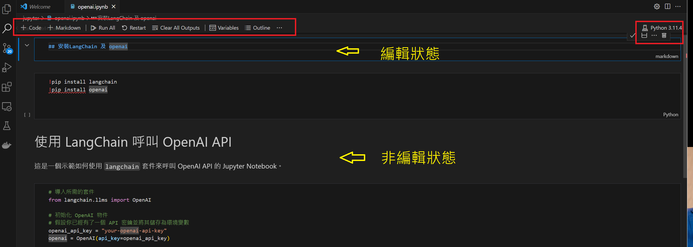

Jupyter是一個開源的交互式筆記本，廣泛用於資料科學、教育、資料可視化等領域。它允許你在網頁瀏覽器中創建和共享包含代碼、文字、圖表等的文件。

## 1.啟動 Jupyter
有三種方式可以安裝 `anaconda`, `pip`, `vscode extension`


### 
anaconda 安裝


Anaconda 是一個流行的 Python 和 R 語言的數據科學平台。它包括了 Jupyter Notebook 以及許多其他常用的數據科學套件。
#### 1. 下載 Anaconda
訪問 [Anaconda官網](https://www.anaconda.com/) 並下載對應於您操作系統的 Anaconda 版本。

#### 2. 安裝 Anaconda
運行下載的安裝程序並遵循指示完成安裝。

#### 3. 啟動 Jupyter Notebook
安裝完成後，您可以使用 Anaconda Navigator 啟動 Jupyter Notebook，或
```shell
jupyter notebook
```
### 
pip 安裝


#### 透過cli 安裝
```shell
pip install notebook
```
#### 安裝後啟動
```shell
jupyter notebook
```
### 
直接安裝 vscode 插件

安裝好vs code plugin:   後建立 `.ipynb`檔後可用GUI模式建立


## 2. 創建新的筆記本
   啟動後，你的網頁瀏覽器會打開Jupyter的界面。在這裡，你可以通過點擊“New”然後選擇“Python 3”來創建一個新的筆記本。

## 3. 使用筆記本
   Jupyter筆記本由一系列的“cell”（單元格）組成。這些單元格可以包含代碼或文本（使用Markdown語法）。

範例
```python
# 打印“Hello, World!”
print("Hello, World!")
```
執行上述代碼單元格（選擇它，然後按Shift+Enter），將輸出：
```text
Hello, World!
```
示例文本（Markdown）單元格
```markdown
# 主標題

這是一段普通的文字。

- 列表項目1
- 列表項目2
```

## 4. 儲存和共享
可以使用“File”菜單來儲存你的筆記本。Jupyter筆記本有.ipynb的擴展名。也可以將筆記本導出為HTML、PDF等格式，以便共享。

### 實際範例
最後顯示出來的形式會與 `colab` 相同，也可以方便我們直接將寫好的code 放到 colab 上跑
[https://github.com/shengshengyang/jupyter/blob/main/openai.ipynb](https://github.com/shengshengyang/jupyter/blob/main/openai.ipynb)