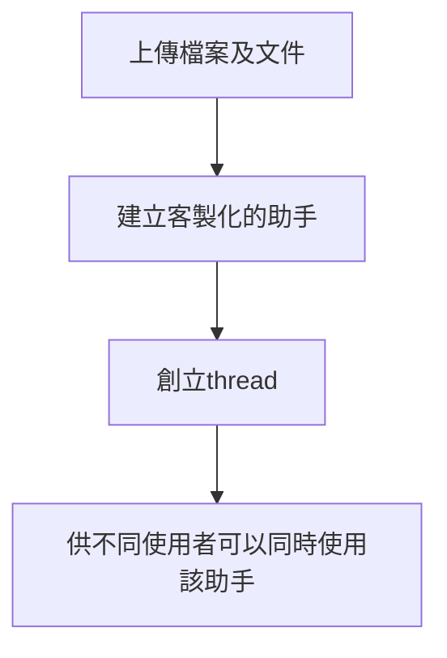

# OpenAI Assistant
## 官方文檔
[https://platform.openai.com/docs/assistants/how-it-works](https://platform.openai.com/docs/assistants/how-it-works)

## 原理

將檔案及文件上傳openAI，建立一個客製化的助手，然後創立thread 供不同使用者可以同時使用該助手

