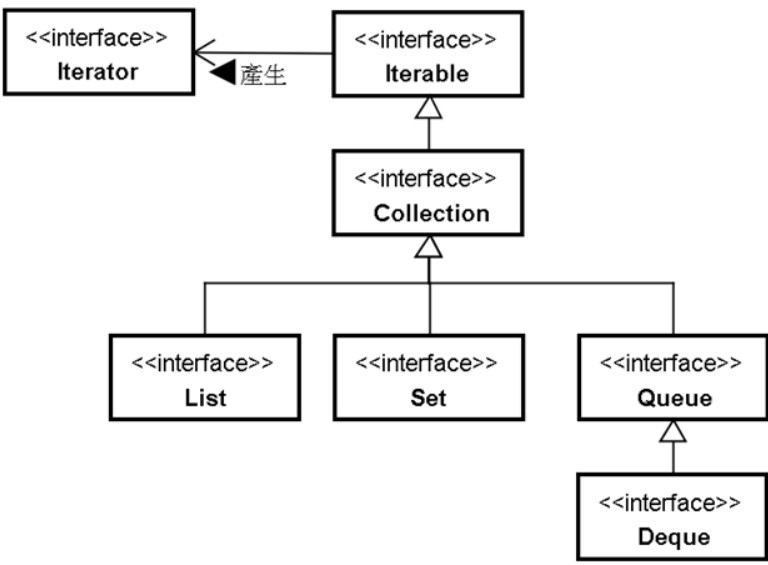

# Collection

## 繼承圖

## 概念

`Collection` 是一個框架，用於存儲或操作物件，主要的接口有

- List：保持元素插入的順序，並允許重複元素。
- Set：不允許重複元素，並且不保證順序（除非使用像 LinkedHashSet 這樣的特定類）。
- Queue：用於保存要按加入順序處理的一組元素，如任務排隊或消息隊列。
  這些接口皆繼承  ，代表所有集合皆可迭代

## Iterable

Iterable 接口是 Java 中所有集合框架的根接口。它表示該對象可以被迭代，即可以一個接一個地訪問其元素。

### 主要方法

`iterator()`：返回一個 Iterator，可用於遍歷集合中的元素。

### 實用性

通過使用 Iterable 接口，可以使用增強型 for 循環（也稱為 for-each 循環）來遍歷集合中的每個元素。

## Collection

Collection 接口是單列集合的根接口，它提供了集合的基本操作，如添加、刪除和清空等。

### 主要方法：

#### add(E e)：

向集合中添加元素。

#### remove(Object o)：

從集合中移除一個元素。

#### size()：

返回集合中元素的數量。

#### isEmpty()：

檢查集合是否為空。

#### contains(Object o)：

檢查集合是否包含特定元素。

