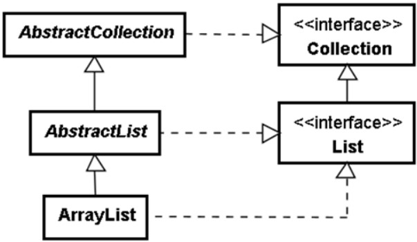
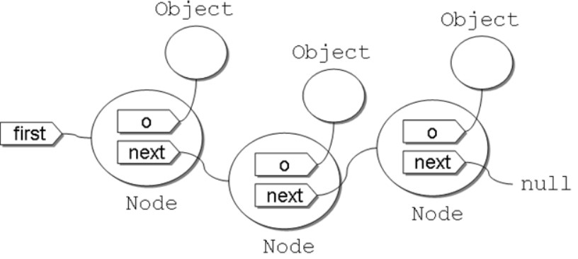

# List
## 架構圖

在JAVA SE 中，除了提供實作也也提供了abstract class 來作為擴充需求

## 具具有索引的 List
有兩種類別
- ArrayList
- LinkedList

List 介面定義了 `add、remove、set` 等許多依索引操作的方法。java.util.LinkedList 也實作了 List 介面，什麼時候該用 ArrayList？何時該用 LinkedList 呢？

### ArrayList

#### 特點: 
- 隨機訪問：由於基於數組，所以可以快速訪問任何位置的元素（即隨機訪問）。
- 性能：添加（尾部）、刪除（尾部）和獲取元素的操作非常快，但在列表中間或開頭添加或刪除元素可能較慢，因可能導致數據移動。
- 內存使用：會在內部數組大小達到其容量上限時自動增長，但可能會有一些內存浪費，尤其是數組大小遠大於實際需要時。

#### 範例:

```java
import java.util.ArrayList;
import java.util.List;

public class ArrayListExample {
    public static void main(String[] args) {
        List<String> fruits = new ArrayList<>();
        fruits.add("Apple");
        fruits.add("Banana");
        fruits.add("Cherry");

        // 隨機訪問
        System.out.println("Second fruit: " + fruits.get(1));

        // 遍歷
        for (String fruit : fruits) {
            System.out.println(fruit);
        }
    }
}

```

### LinkedList

在 LinkedList 內部使用 Node 封裝新增的物件，每次 add 新增物件之後，將會形成以下的鏈狀結構：

每次 add 物件時，才會建立新的 Node 來保存物件，不會事先耗費記憶體，若呼叫 size，則從第一個物件，逐一參考下一個物件並計數，則可取得收集的物件長度。若想呼叫 get 指定索引取得物件，從第一個物件，逐一參考下一個物件並計數，則可取得指定索引之物件。

#### 特點
- 插入和刪除：在任何位置（包括頭部和尾部）插入或刪除元素的性能很好，因為這不需要移動其他元素。
- 隨機訪問：與 ArrayList 相比，隨機訪問（如 get(int index)）性能較差，因為需要從頭或尾部遍歷列表來定位元素。
- 內存使用：每個元素都需要更多的內存，因為除了存儲數據外，還需要存儲前後元素的引用。

#### 範例

```java
import java.util.LinkedList;
import java.util.List;

public class LinkedListExample {
    public static void main(String[] args) {
        List<String> animals = new LinkedList<>();
        animals.add("Dog");
        animals.add("Cat");
        animals.addFirst("Horse"); // 在開頭添加

        // 遍歷
        for (String animal : animals) {
            System.out.println(animal);
        }

        // 刪除第一個元素
        animals.removeFirst();
    }
}

```
### 比較

| 特性          | ArrayList                                       | LinkedList                                          |
|---------------|-------------------------------------------------|-----------------------------------------------------|
| **內部實現**  | 基於動態數組（Array）                           | 基於雙向鏈表                                        |
| **隨機訪問**  | 非常快（直接通過索引訪問）                       | 較慢（需要從頭或尾遍歷）                             |
| **添加操作**  | 尾部添加快；中間或開頭添加慢（可能需要移動元素） | 在任何位置添加都很快（不需要移動其他元素）          |
| **刪除操作**  | 尾部刪除快；中間或開頭刪除慢（可能需要移動元素） | 在任何位置刪除都很快（不需要移動其他元素）          |
| **內存使用**  | 較少（只存儲數據本身）                          | 較多（存儲數據及前後元素的引用）                    |
| **性能**      | 適合讀取操作多的場景                            | 適合寫入操作多的場景                                |
| **擴容**      | 自動擴容，但擴容操作成本較高                    | 無需擴容，添加/刪除操作通常不受現有大小限制         |


## 與Collection 的比較

### Collection

#### 定義

`Collection` 同時是 List, set, queue 的超級接口，並且定義了所有class 的基本操作，如添加、刪除、清空、大小、是否為空，

#### 特點

- 一個更通用的接口，適用於各種集合類型。
- 不提供任何直接的實現，但它是實現任何具體集合類型的基礎。
- 使用 Collection 接口可以編寫更通用和靈活的代碼，因為它不依賴於特定的集合實現。

#### 範例
```java
import java.util.ArrayList;
import java.util.Collection;

public class CollectionExample {
    public static void main(String[] args) {
        Collection<String> collection = new ArrayList<>();
        collection.add("Hello");
        collection.add("World");

        // 使用 Collection 接口提供的方法
        System.out.println("Collection size: " + collection.size());
        System.out.println("Collection contains 'Hello': " + collection.contains("Hello"));

        // 遍歷集合
        for (String item : collection) {
            System.out.println(item);
        }
    }
}
```

創建了一個 `ArrayList` 的實例，但宣告為 `Collection`。讓我們不用管是哪種具體的集合類型

### AbstractList

#### 定義:
為集合的一個 abstract class, 提供了 `List` 接口的骨架實現，從而最小化了實現此接口所需的工作。

#### 用途:
當你需要實現一個自定義的列表時，你可以繼承 `AbstractList` 並實現其抽象方法

#### 特點: 

- 為實現 List 接口提供了一個方便的起點。
- 需要重寫 get(int index) 和 size() 方法。
- 可選地重寫其他方法以提高性能。

#### 範例

假設我們要創建一個簡單的不可變列表，只允許讀取操作。

```java
import java.util.AbstractList;
import java.util.List;

public class CustomList extends AbstractList<String> {

    private String[] array;

    public CustomList(String[] array) {
        this.array = array;
    }

    @Override
    public String get(int index) {
        if (index >= array.length || index < 0) {
            throw new IndexOutOfBoundsException("Index: " + index + ", Size: " + array.length);
        }
        return array[index];
    }

    @Override
    public int size() {
        return array.length;
    }

    public static void main(String[] args) {
        List<String> list = new CustomList(new String[]{"Hello", "World", "!"});
        for (String s : list) {
            System.out.println(s);
        }
    }
}

```

在這個例子中，CustomList 繼承自 AbstractList，並實現了 `get` 和 `size` 

---

參考文章:
感謝葛格[https://openhome.cc/zh-tw/java/collection/hierarchy/](https://openhome.cc/zh-tw/java/collection/hierarchy/)