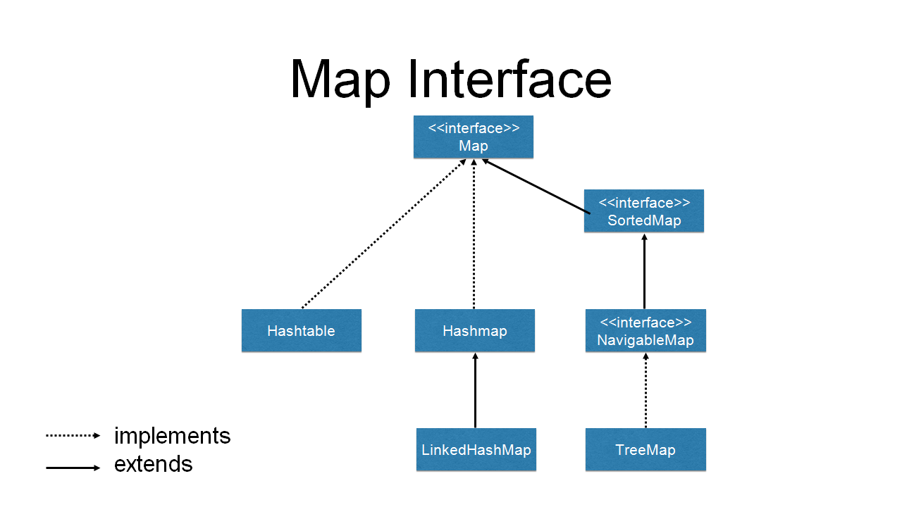

# Map

## 概述

Java 中的 Map 是一種集合介面，用於`儲存鍵（Key）`與 `值（Value）`的配對。它是 Java 集合框架（Java Collections
Framework）的一部分，提供了一種方式來存儲和管理鍵值對。

## 主要特點

- 鍵值對存儲：Map 通過鍵來唯一標識值。
- 唯一性：每個鍵在 Map 中是唯一的。
- 無序性：大多數 Map 實現不保證順序。

## 常見實現

- HashMap：基於哈希表，提供快速存取。
- TreeMap：基於紅黑樹，能夠自動排序。
- LinkedHashMap：保留插入或訪問順序。

## 泛型支持

支援泛型，可以指定鍵和值的類型。

### 方法

| 方法            | 描述                     |
|-----------------|-------------------------|
| `put(key, value)` | 添加鍵值對。             |
| `get(key)`      | 根據鍵獲取值。           |
| `remove(key)`   | 移除鍵值對。             |
| `size()`        | 返回 Map 中的鍵值對數量。 |
| `containsKey(key)` | 檢查是否包含特定鍵。     |
| `containsValue(value)` | 檢查是否包含特定值。   |

### 範例

```java
import java.util.HashMap;
import java.util.Map;

public class MapExample {
    public static void main(String[] args) {
        // 創建一個 HashMap
        Map<String, Integer> map = new HashMap<>();

        // 使用 put() 方法添加鍵值對
        map.put("Apple", 40);
        map.put("Banana", 10);
        map.put("Cherry", 30);

        // 使用 get() 方法根據鍵取得值
        System.out.println("價格 of Apple: " + map.get("Apple"));

        // 使用 size() 方法獲取 Map 的大小
        System.out.println("Map 大小: " + map.size());

        // 使用 containsKey() 檢查 Map 中是否含有特定鍵
        System.out.println("是否包含 'Banana': " + map.containsKey("Banana"));

        // 使用 containsValue() 檢查 Map 中是否含有特定值
        System.out.println("是否有價格為 30 的項目: " + map.containsValue(30));

        // 使用 remove() 方法移除鍵值對
        map.remove("Cherry");
        System.out.println("After removing Cherry, Map contains: " + map);

        // 遍歷 Map
        System.out.println("遍歷 Map:");
        for (Map.Entry<String, Integer> entry : map.entrySet()) {
            System.out.println(entry.getKey() + ": " + entry.getValue());
        }

        // 使用 Lambda 表達式遍歷 Map
        System.out.println("遍歷 Map with Lambda:");
        map.forEach((key, value) -> System.out.println(key + ": " + value));
    }
}

```

## Entry

Map.Entry<K, V> 是一個內部介面，屬於 Map 介面。它代表了 Map 中的一個鍵值對（entry）。每個 ，其中包含了一個鍵（Key）和一個值（Value）。

### Map.Entry 方法：

| 方法                | 描述                                                                |
|---------------------|--------------------------------------------------------------------|
| `getKey()`          | 返回鍵值對中的鍵。                                                  |
| `getValue()`        | 返回鍵值對中的值。                                                  |
| `setValue(V value)` | 允許你更改鍵值對中的值。這個方法在某些 Map 的實現中可能會拋出 `UnsupportedOperationException`。 |


### 範例
```java
import java.util.HashMap;
import java.util.Map;

public class MapEntryExample {
    public static void main(String[] args) {
        // 創建 HashMap 並添加一些元素
        Map<String, Integer> fruitPrices = new HashMap<>();
        fruitPrices.put("Apple", 40);
        fruitPrices.put("Banana", 10);
        fruitPrices.put("Cherry", 30);

        // 遍歷 Map 並打印鍵值對
        for (Map.Entry<String, Integer> entry : fruitPrices.entrySet()) {
            System.out.println("原始: " + entry.getKey() + " => " + entry.getValue());
        }

        // 修改某些值
        for (Map.Entry<String, Integer> entry : fruitPrices.entrySet()) {
            if ("Banana".equals(entry.getKey())) {
                entry.setValue(15); // 更新 Banana 的價格
            }
        }

        // 再次遍歷 Map 並打印更新後的鍵值對
        System.out.println("更新後:");
        for (Map.Entry<String, Integer> entry : fruitPrices.entrySet()) {
            System.out.println(entry.getKey() + " => " + entry.getValue());
        }
    }
}

```