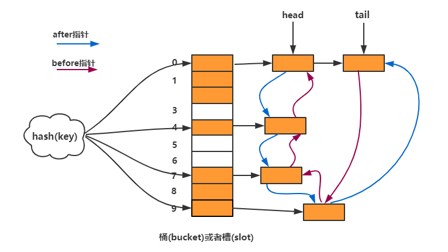

Java 集合框架提供了一系列的數據結構實現，其中， `HashMap`、`TreeMap` 和`LinkedHashMap`是三種常用的Map實現

## HashMap
使用 HashMap 主要是因為效能，假設我們想在列表中找到一個特定的元素；這將花費 O(n) 時間。如果使用二進位制搜尋對列表進行排序，則時間複雜度將為 O(log n)。
它非同步，因此不是線程安全的。如果需要多線程訪問，可以考慮使用`Collections.synchronizedMap`將其包裝起來。

### 特點

- 根據 `HashCode`
- 內容無序
- 允許 key / value 為 null
- 不同步
- 初始預設容量為 16，負載因子為 0.75

### 非同步
由於HashMap 本身為 非同步 ，再多線程時會有問題，因此可以用 synchronizedMap

### 範例
```java
import java.util.HashMap;

public class HashMapExample {
    public static void main(String[] args) {
        HashMap<Integer, String> map = new HashMap<>();
        map.put(1, "Apple");
        map.put(2, "Banana");
        map.put(3, "Cherry");

        System.out.println(map);
    }
}

```

## TreeMap

TreeMap是Java集合框架中的一部分，實現了NavigableMap接口，並繼承自AbstractMap類。它使用紅黑樹（一種自平衡二叉樹）的數據結構來存儲鍵值對（Key-Value pair），因此所有插入到TreeMap中的鍵必須實現`Comparable`接口（或者在創建TreeMap時提供一個Comparator），以確保元素是有序的。

另兩種的比較放在: [SortedMap NavigableMap 介紹](../../../../2024/02/24/treemap-compare)
### 特點

- **有序性**：TreeMap中的元素按照鍵的自然排序或者構造時提供的Comparator進行排序。這意味著當遍歷TreeMap時，鍵值對會按照鍵的排序順序顯示。
- **效率**：TreeMap提供了有效的查找、插入和刪除操作，這些操作的時間複雜度為O(log n)，其中n是TreeMap中的項目數量。
- **鍵的唯一性**：和HashMap一樣，TreeMap中的鍵必須是唯一的。如果嘗試插入一個已存在的鍵（與某個已存在的鍵相等），其對應的值會被新值覆蓋。
- **Null值**：TreeMap允許將null作為一個或多個值，但是作為鍵則取決於Comparator的實現。如果使用自然排序，則不能有null鍵，因為會拋出NullPointerException。

### 範例
在此示例中，TreeMap用於存儲和自動按股票代碼排序的股票價格。當需要根據股票代碼快速查找、更新或分析股票價格時，這種方法非常有效。
```java
import java.util.TreeMap;

public class TreeMapExample {
    public static void main(String[] args) {
        // 創建一個TreeMap來存儲股票價格，其中鍵是股票代碼
        TreeMap<String, Double> stockPrices = new TreeMap<>();
        
        // 添加一些股票和它們的價格
        stockPrices.put("AAPL", 150.0);
        stockPrices.put("MSFT", 250.5);
        stockPrices.put("GOOGL", 1200.3);
        stockPrices.put("AMZN", 3100.8);
        
        // 顯示排序後的股票價格
        stockPrices.forEach((key, value) -> System.out.println(key + ": " + value));
    }
}

```

## LinkedHashMap

LinkedHashMap 是 Java 集合框架中的一部分，它基於 HashMap 的同時，使用一個`雙向鏈表來維持元素的插入順序或者訪問順序`。這使得 LinkedHashMap 在保存了 HashMap 的所有特性（例如快速的存取速度）的同時，還能按一定的順序遍歷映射中的元素。

### 特點

- **保持插入順序**：默認情況下，LinkedHashMap 會按照元素插入的順序來遍歷元素，這一點與 HashMap 不同，後者則是不保證任何順序。
- **可選的訪問順序**：通過在構造函數中設置一個特殊的布爾值（accessOrder），可以讓 LinkedHashMap 按訪問順序（從最少訪問到最頻繁訪問）來遍歷元素，這對於構建像 LRU（最近最少使用）緩存機制特別有用。
- **性能**：LinkedHashMap 的性能使得它在插入和訪問時非常快，幾乎與 HashMap 相同，因為它是在 HashMap 的基礎上增加了鏈表功能。具體來說，它提供了固定的時間性能（O(1)）對於基本操作，如添加、刪除和包含。

### 範例
LRU（Least Recently Used）
LinkedHashMap 可以非常容易地實現 LRU（最近最少使用）緩存機制。在這種應用中，當緩存達到預定大小限制時，最老（最少使用）的元素會被自動移除，從而為新元素騰出空間。

```java
import java.util.LinkedHashMap;
import java.util.Map;

// 实现一个简单的 LRU 缓存
class LRUCache<K, V> extends LinkedHashMap<K, V> {
    private final int capacity; // 缓存的容量

    public LRUCache(int capacity) {
        // true 表示让 LinkedHashMap 按访问顺序排序
        super(capacity, 0.75f, true);
        this.capacity = capacity;
    }

    @Override
    protected boolean removeEldestEntry(Map.Entry<K, V> eldest) {
        // 当 map 中的数据量大于指定的缓存容量时，移除最老的元素
        return size() > capacity;
    }
}

public class TestLRUCache {
    public static void main(String[] args) {
        LRUCache<Integer, String> cache = new LRUCache<>(2);

        cache.put(1, "Apple");
        cache.put(2, "Banana");
        System.out.println(cache.keySet()); // 输出：[1, 2]

        cache.get(1); // 访问键为 1 的元素
        cache.put(3, "Cherry"); // 添加新元素，此时容量超出，会移除键为 2 的元素
        System.out.println(cache.keySet()); // 输出：[1, 3]

        cache.put(4, "Date"); // 继续添加新元素，移除键为 1 的元素
        System.out.println(cache.keySet()); // 输出：[3, 4]
    }
}


```