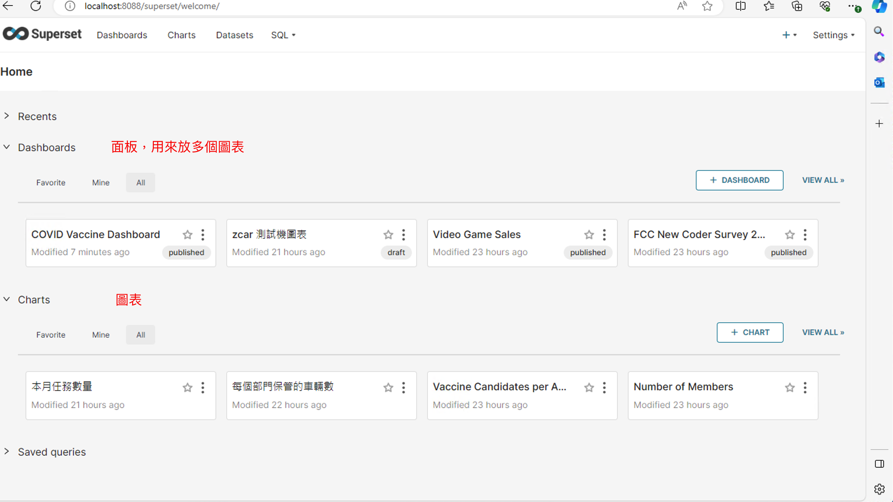
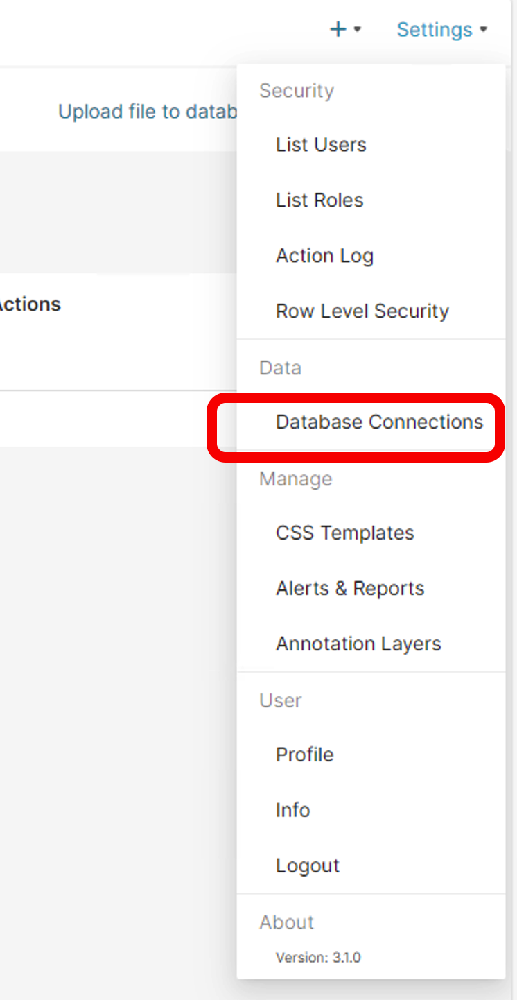
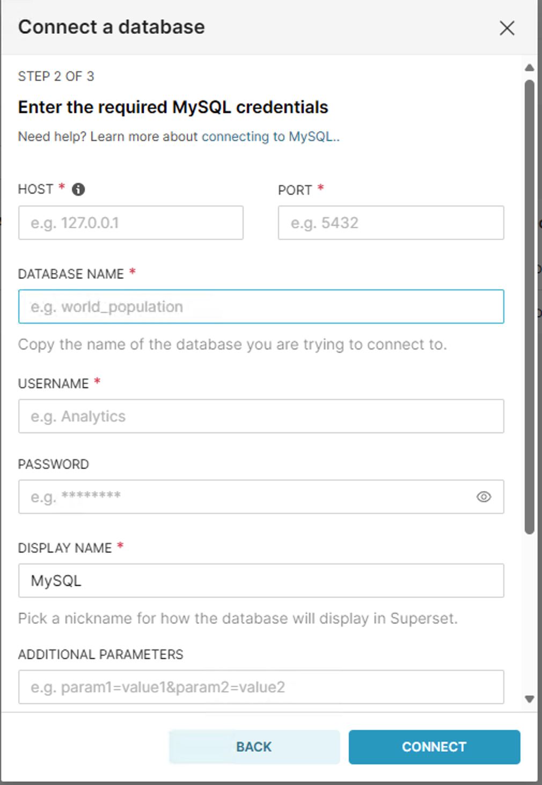
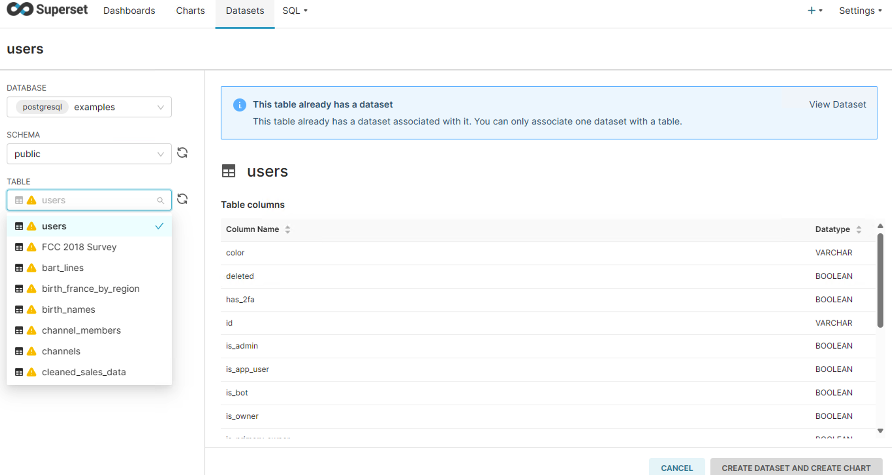
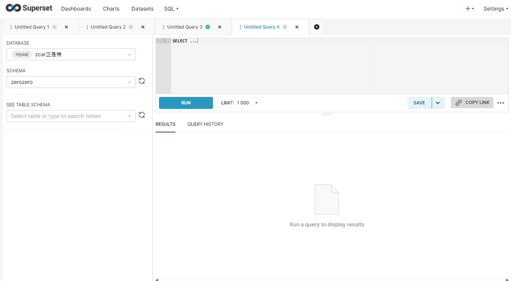

# apache superset
GPT
Apache Superset 是一個開源的數據探索和可視化平台，旨在快速、直觀地對數據進行分析和分享。它由 Airbnb 的數據團隊於 2015 年創建，後來成為 Apache 軟件基金會（ASF）的項目之一。Superset 能夠與各種數據源連接，包括傳統的 SQL 數據庫（如 MySQL 和 PostgreSQL）、大數據處理系統（如 Apache Hive 和 Presto）以及現代的數據倉庫解決方案（如 Snowflake、BigQuery 和 Redshift）。

## 安裝

### docker-compose

#### clone repo
```shell
git clone https://github.com/apache/superset.git
```

#### run

```shell
cd superset
docker compose up
```

#### 更多設定
[https://superset.apache.org/docs/installation/installing-superset-using-docker-compose/](https://superset.apache.org/docs/installation/installing-superset-using-docker-compose/)


## 介面

### 首頁
會有面板跟圖表兩種


### connect database

#### setting

在設定中可以找到資料池連線


#### credentials

輸入連線資訊



### dataset

從資料庫選取的資料集，會自動取出欄位



### query lab

與 `dateset` 不同的是這邊可以全課製打sql, 如有需要table join 等操作必須使用此項
