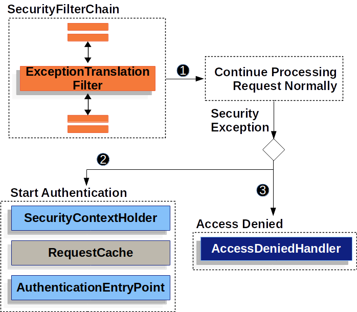

# Spring Security
## 簡介
Spring Security 是一個強大的、高度可定制的認證和訪問控制框架，是保護基於Spring的應用的標準選擇。它提供了一整套的安全性保障措施，以保護應用程序免受常見的安全威脅。



## 核心特性

### 認證 (Authentication)

#### 
支持多種身份驗證機制，如表單登錄、LDAP、基於記憶體的身份驗證、JSON Web Token (JWT) 等。

#### 
提供了多種密碼編碼器，如BCryptPasswordEncoder、Pbkdf2PasswordEncoder等，以安全地存儲密碼。

### 授權 (Authorization)

#### 
基於角色和權限的訪問控制，可以細粒度地控制訪問權限。

#### 
通過注解或AOP可以對特定的方法調用進行安全性檢查。

### CSRF保護

跨站請求偽造（CSRF）保護：默認啟用的CSRF保護，用於防止CSRF攻擊。

### 跨域資源共享 (CORS)
CORS 支持：配置CORS以允許或限制跨域請求。

### Session 管理

Session 定制：提供了對Session策略的豐富定制，包括Session固定保護、Session超時等。

## 基礎範例

```java
@Configuration
@EnableWebSecurity
public class WebSecurityConfig extends WebSecurityConfigurerAdapter {

    @Override
    protected void configure(HttpSecurity http) throws Exception {
        http
            .authorizeRequests()
                .antMatchers("/", "/home").permitAll() // 允許對於網站根目錄和/home路徑的訪問
                .anyRequest().authenticated() // 其他所有路徑的訪問均需驗證權限
                .and()
            .formLogin()
                .loginPage("/login") // 指定登錄頁面的路徑
                .permitAll() // 允許所有用戶訪問我們的登錄頁面
                .and()
            .logout()
                .permitAll(); // 允許用戶進行登出
    }

    @Autowired
    public void configureGlobal(AuthenticationManagerBuilder auth) throws Exception {
        auth
            .inMemoryAuthentication()
                .withUser("user").password(passwordEncoder().encode("password")).roles("USER") // 在記憶體中配置一個用戶
                .and()
                .withUser("admin").password(passwordEncoder().encode("admin")).roles("USER", "ADMIN");
    }

    @Bean
    public PasswordEncoder passwordEncoder() {
        return new BCryptPasswordEncoder(); // 使用 BCrypt 加密
    }
}

```