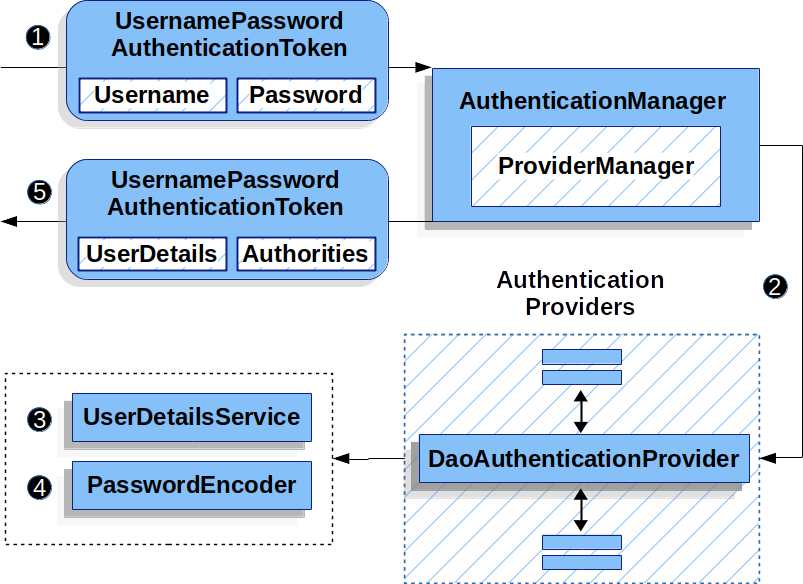
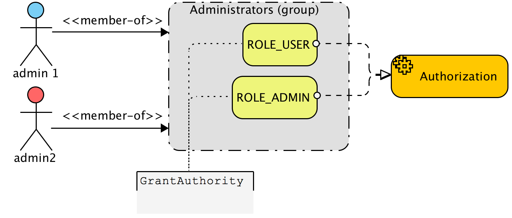

依照前篇文章成功驗證後, 會生成授權
- [spring security authentication](../../../../2024/03/02/spring-security-authenication)

# 授權 authorization

## UsernamePasswordAuthenticationToken
`UsernamePasswordAuthenticationToken`是Spring Security中代表用戶身份驗證請求的一種實現。實現`Authentication`接口，用於封裝用戶名和密碼的身份驗證資訊。



### 1. 身份驗證前

包含和 ，用於提交到`AuthenticationManager`進行身份驗證

```java
UsernamePasswordAuthenticationToken(Object principal, Object credentials)
```
- `principal` 通常是用戶名或帳號
- `credentials` 為密碼

### 2. 身份驗證後
在認證通過後會renew 一個Object

```java
UsernamePasswordAuthenticationToken(Object principal, Object credentials, Collection<? extends GrantedAuthority> authorities)
```
- `principal`： 這時代表已驗證的用戶，通常是一個UserDetails對象，包含了用戶的詳細資訊。
- `credentials`：出於安全考慮，一旦用戶通過身份驗證，該資訊通常會被清空或設為null，因為後續不再需要密碼。
- `authorities`：一個`GrantedAuthority`對象的集合，代表了該用戶擁有的權限。這允許Spring Security對用戶進行細粒度的訪問控制。

### 驗證後的細微度劃分
`UserDetails`和`Authorities`是實現細粒度安全控制的兩個關鍵概念。它們共同作用於身份驗證和授權過程，確保只有具有適當權限的用戶能夠訪問特定資源。以下是對這兩個概念的詳細解釋：

#### UserDetail
接口，其中包括`用戶名`、`密碼`、`賬戶狀態`（如是否啟用、賬戶是否過期等）以及`用戶的權限`
UserDetails接口的主要方法包括：

- **getUsername()**: 獲取用戶的用戶名。
- **getPassword()**: 獲取用戶的密碼。
- **isEnabled()**: 判斷用戶是否啟用。
- **isAccountNonExpired()**: 判斷賬戶是否未過期。
- **isCredentialsNonExpired()**: 判斷憑證（密碼）是否未過期。
- **isAccountNonLocked()**: 判斷賬戶是否未鎖定。
- **getAuthorities()**: 獲取用戶的權限集合。

#### Authorities

代表用戶的權限或角色, 透過 `GrantedAuthority` 封裝授權字串
後續可以通過基於`基於角色的訪問控制`（如hasRole('ROLE_ADMIN')）和`基於表達式的訪問控制`（如hasAuthority('READ_PRIVILEGE')）來實現細粒度的安全策略。



### 範例

#### 自定義UserDetail

```java
import org.springframework.security.core.userdetails.UserDetails;
import org.springframework.security.core.authority.SimpleGrantedAuthority;
import org.springframework.security.core.GrantedAuthority;

import java.util.Collection;
import java.util.stream.Collectors;

public class CustomUserDetails implements UserDetails {
    private User user; // 假設User是你的用戶實體

    public CustomUserDetails(User user) {
        this.user = user;
    }

    @Override
    public Collection<? extends GrantedAuthority> getAuthorities() {
        return user.getRoles().stream()
            .flatMap(role -> role.getPermissions().stream())
            .map(permission -> new SimpleGrantedAuthority(permission.getName()))
            .collect(Collectors.toList());
    }

    @Override
    public String getPassword() {
        return user.getPassword();
    }

    @Override
    public String getUsername() {
        return user.getUsername();
    }

    // 省略其他方法實現...
}

```

#### 自定義UserDetailsService

```java
import org.springframework.security.core.userdetails.UserDetailsService;
import org.springframework.security.core.userdetails.UsernameNotFoundException;

public class CustomUserDetailsService implements UserDetailsService {
    @Override
    public UserDetails loadUserByUsername(String username) throws UsernameNotFoundException {
        User user = userRepository.findByUsername(username);
        if (user == null) {
            throw new UsernameNotFoundException("User not found");
        }
        return new CustomUserDetails(user);
    }

    // userRepository是一個虛構的DAO接口，用於從資料庫中查找用戶
}

```

#### 使用`@PreAuhorize`
```java
import org.springframework.security.access.prepost.PreAuthorize;

@RestController
public class TestController {

    @PreAuthorize("hasAuthority('READ_PRIVILEGE')")
    @GetMapping("/read")
    public String read() {
        return "Reading content...";
    }

    @PreAuthorize("hasAuthority('WRITE_PRIVILEGE')")
    @PostMapping("/write")
    public String write() {
        return "Writing content...";
    }
}

```