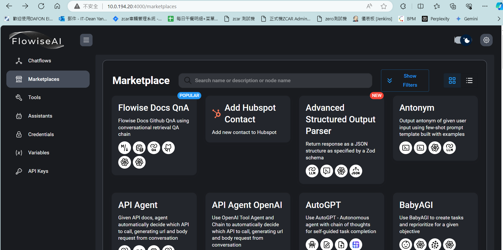

自上篇[LlamaIndex 自訂義RAG 系統](../../../../2024/03/18/2024-03-18-llamaindex)
如果覺得寫程式更改很麻煩，`flowise`這個開源專案很好的結合了工作流  跟low code應用

## 官方部屬文件

### github
[https://github.com/FlowiseAI/Flowise](https://github.com/FlowiseAI/Flowise)

### docs

[https://docs.flowiseai.com/](https://docs.flowiseai.com/)

## 部屬方法

1. clone public repo
    ```shell
    git clone https://github.com/FlowiseAI/Flowise.git
    ```
2. 安裝docker 及 docker compose
   這部分可參考官方說明[https://docs.docker.com/engine/install/](https://docs.docker.com/engine/install/)

3. cd docker and copy .env.template
    ```shell
    cd docker &&
    cp .env.example .env
    ```
4. 更改`.env`
   主要要更改的部分有
    - FILE_SIZE_LIMIT: 避免embedding pdf 檔案過大
    - USERNAME / PASSWORD
    - CORS相關設定，若要嵌入至其他網頁時若沒有設定會被擋
    - DATABASE 如果有要做連接資料須寫在這邊
    ```text
    PORT=4000
    DATABASE_PATH=/root/.flowise
    APIKEY_PATH=/root/.flowise
    SECRETKEY_PATH=/root/.flowise
    LOG_PATH=/root/.flowise/logs
    BLOB_STORAGE_PATH=/root/.flowise/storage
    
    CORS_ORIGINS="*"
    IFRAME_ORIGINS="*"
    EMBEDDING_ORIGINS="*"

    # NUMBER_OF_PROXIES= 1
    
    # DATABASE_TYPE=postgres
    # DATABASE_PORT=""
    # DATABASE_HOST=""
    # DATABASE_NAME="flowise"
    # DATABASE_USER=""
    # DATABASE_PASSWORD=""
    # DATABASE_SSL=true
    # DATABASE_SSL_KEY_BASE64=<Self signed certificate in BASE64>
    
    FLOWISE_USERNAME=it
    FLOWISE_PASSWORD=itit
    # FLOWISE_SECRETKEY_OVERWRITE=myencryptionkey
    FLOWISE_FILE_SIZE_LIMIT=200mb
    # DEBUG=true
    # LOG_LEVEL=debug (error | warn | info | verbose | debug)
    # TOOL_FUNCTION_BUILTIN_DEP=crypto,fs
    # TOOL_FUNCTION_EXTERNAL_DEP=moment,lodash
    
    # LANGCHAIN_TRACING_V2=true
    # LANGCHAIN_ENDPOINT=https://api.smith.langchain.com
    # LANGCHAIN_API_KEY=your_api_key
    # LANGCHAIN_PROJECT=your_project
    
    # DISABLE_FLOWISE_TELEMETRY=true
    ```
5. 起`docker compose`
    ```shell
    docker compose up -d
    ```
   起來之後就會在設定的 port 
   


