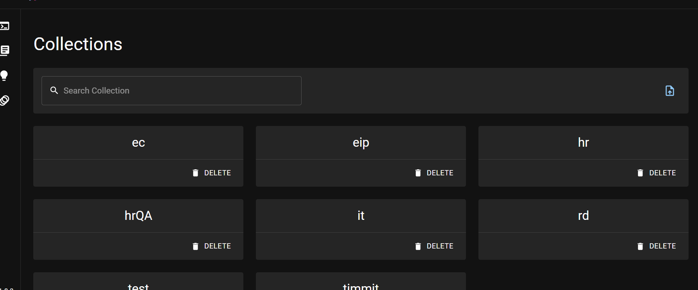
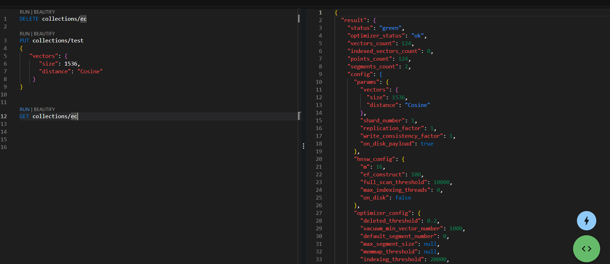

目前常見的向量資料庫有以下，看中qdrant 的支援跟易用性都不錯，而且是用`rust`寫的，就來使用看看

| 特性/資料庫 | Pinecone | Weaviate | Milvus | Qdrant | Chroma | Elasticsearch | PGvector |
| --- | --- | --- | --- | --- | --- | --- | --- |
| 是否為開源 | ❌ | ✅ | ✅ | ✅ | ✅ | ❌ | ✅ |
| 自我託管 | ❌ | ✅ | ✅ | ✅ | ✅ | ✅ | ✅ |
| 雲管理 | ✅ | ✅ | ✅ | ✅ | ❌ | ✔️ | ✅ |
| 專為向量設計 | ✅ | ✅ | ✅ | ✅ | ✅ | ❌ | ❌ |
| 開發者體驗 | - | - | - | - | - | - | - |
| 社群支援 | 8k☆ github, 4k slack | 23k☆ github, 4k slack | 13k☆ github, 3k discord | 9k☆ github, 6k discord | 23k slack | 6k☆ github |
| 每秒查詢數量 (使用 text nytimes-256-angular) | 150* | 791 | 2406 | 326 | ? | 700-100* | 141 |
| 查詢延遲 (毫秒) (Recall/Percentile 95 (millis), nytimes-256-angular) | 1* | 21 | 4 | ? | 8 | ❌ |
| 支援的索引類型 | HNSW | 多種 (11總計) | HNSW | HNSW | HNSW | HNSW/IVFFlat |
| 混合搜尋 (即純量過濾) | ✅ | ✅ | ✅ | ✅ | ✅ | ✅ | ✅ |
| 磁盤索引支持 | ✅ | ✅ | ✅ | ✅ | ❌ | ✅ |
| 基於角色的訪問控制 | ✅ | ❌ | ✅ | ❌ | ❌ | ✅ | ❌ |
| 動態區段放置 vs. 靜態數據分片 | 靜態分片 | 動態區段放置 | 靜態分片 | 動態區段放置 | 靜態分片 | - |
| 免費託管層 | ✅ | ✅ | (免費自我託管) | (免費自我託管) | (免費自我託管) | (變化) |
| 定價 (50k 向量 @1536) | $70 | fr. $25 | fr. $65 | est. $9 | 變化 | $95 | 變化 |
| 定價 (20M 向量, 20M 請求 @768) | $227 ($2074 for high performance) | $1536 | fr. $309 ($2291 for high performance) | fr. $281 ($820 for high performance) | 變化 | est. $1225 | 變化 |

來源: [https://benchmark.vectorview.ai/vectordbs.html](https://benchmark.vectorview.ai/vectordbs.html)

## Docker 部屬

### pull

```shell
docker pull qdrant/qdrant
```

### run

```shell
docker run -p 6333:6333 \
    -v $(pwd)/path/to/data:/qdrant/storage \
    qdrant/qdrant
```
### run costume config
```shell
docker run -p 6333:6333 \
    -v $(pwd)/path/to/data:/qdrant/storage \
    -v $(pwd)/path/to/custom_config.yaml:/qdrant/config/custom_config.yaml \
    qdrant/qdrant \
    ./qdrant --config-path config/custom_config.yaml
```

## Docker compose

### config

```yaml
services:
  qdrant:
    image: qdrant/qdrant:latest
    restart: always
    container_name: qdrant
    ports:
      - 6333:6333
      - 6334:6334
    expose:
      - 6333
      - 6334
      - 6335
    configs:
      - source: qdrant_config
        target: /qdrant/config/production.yaml
    volumes:
      - ./qdrant_data:/qdrant_data

configs:
  qdrant_config:
    content: |
      log_level: INFO        
```

## 加 api-key

### local build

可以在`/config/qdrant`中的 `config.ymal`中找到

```yaml
api_key: your_secret_api_key_here
```

之後build 一個自己的image

### use default

如果要使用default image 來做更改，也可以

```shell
docker run -p 6333:6333 \
    -v $(pwd)/path/to/data:/qdrant/storage \
    -v $(pwd)/path/to/custom_config.yaml:/qdrant/config/production.yaml \
    qdrant/qdrant
```

### run

```shell
docker compose up -d
```

## 使用

不需要額外載工具，可以直接切dashboard使用，首頁會列出現在有的collection

### collection list
```text
http://localhost:6333/dashboard
```


### cli

內建cli，可以省去打curl或寫code的時間，並且有 cheat sheet可以呼叫
按綠色的code會有飯粒，按文字上面的`run`即可執行，結果會輸出在右側


### 創建collection

1536 是 ada2 embedding 的維度

```shell
curl -X PUT http://localhost:6333/collections/rd \
  -H 'Content-Type: application/json' \
  --data-raw '{
    "vectors": {
      "size": 1536,
      "distance": "Cosine"
    } 
  }'
```

### 創建包含 apikey 的collection

```bash
curl -X PUT http://localhost:6333/collections/eip   -H 'Content-Type: application/json' -H 'Authorization: Bearer api-key'   --data-raw '{
    "vectors": {
      "size": 1536,
      "distance": "Cosine"
    }
  }'
```


### 看資訊

```shell
curl -X GET http://localhost:6333/collections/your-collection-name
```

### 移除Collection

```shell
curl -X DELETE http://localhost:6333/collections/your-collection-name
```

