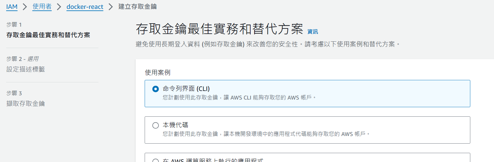
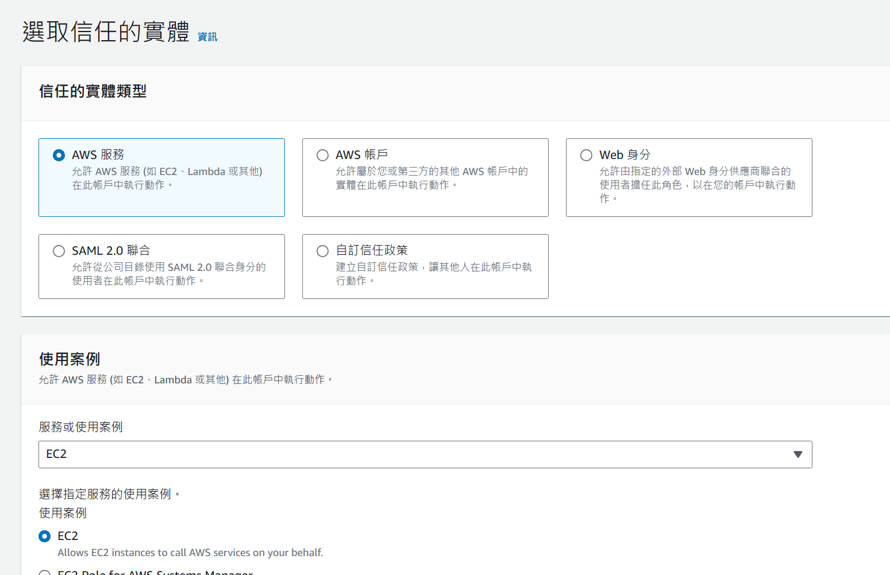
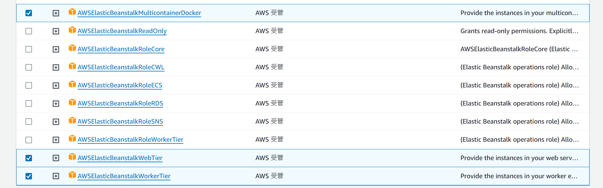
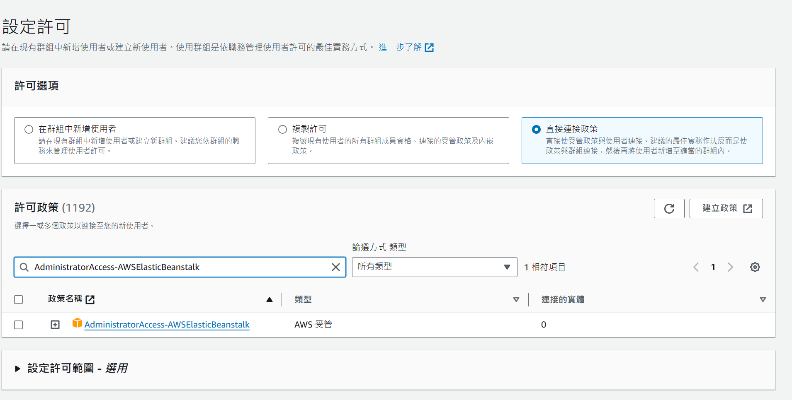
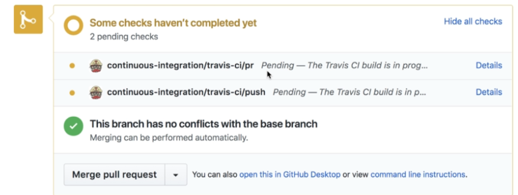

## 簡介

`travis ci` 是一個雲端的 `CI/CD` saas 服務

## 使用

透過在github 等啟動第三方授權即可連接，後續透過添加`yaml`檔來做連結

### .travis.yaml

```yaml
# 需要sudo權限
sudo: required

# 使用的服務，這裡指定了docker
services:
  - docker

# 安裝前的步驟
before_install:
  # 構建Docker映像，標籤為shengshengyang/docker-react，Dockerfile使用Dockerfile.dev
  - docker build -t shengshengyang/docker-react -f Dockerfile.dev .

# 腳本執行的步驟，這裡執行的是測試
script:
  # 運行docker容器，設置環境變量CI為true，運行shengshengyang/docker-react映像，並執行npm run test -- --coverage
  # npm run test -- --coverage是指執行測試並產生測試覆蓋率報告
  - docker run -e CI=true shengshengyang/docker-react npm run test -- --coverage

# 部署的配置
deploy:
  # 部署到AWS Elastic Beanstalk
  provider: elasticbeanstalk
  # 指定AWS區域
  region: "ap-southeast-1"
  # 指定Elastic Beanstalk的環境名稱
  env: frontend-dev
  # 指定S3 bucket的名稱，Elastic Beanstalk會將部署的檔案儲存到這個S3 bucket
  bucket: elasticbeanstalk-ap-southeast-1-491667161403
  # 僅在master分支發生push事件時觸發部署
  on:
    branch: master
  # AWS存取鑰匙ID，通常透過Travis CI的環境變量設置
  access_key_id: $AWS_ACCESS_KEY
  # AWS密鑰，同樣透過Travis CI的環境變量設置
  secret_access_key: $AWS_SECRET_KEY

```

## AWS Elastic Beanstalk

是一個 PaaS（平台即服務）解決方案，用於部署和擴展網頁應用程式
[https://aws.amazon.com/tw/elasticbeanstalk/](https://aws.amazon.com/tw/elasticbeanstalk/)

### 建立金鑰
建立`travis ci`可以連結的金鑰，須記下來之後會用在`AWS_ACCESS_KEY` 及 `AWS_SECRET_KEY`



### 建立角色

為了讓travis 可以訪問，須設定一些iam/role



#### 選擇權限



### 建立使用者



### pull request

