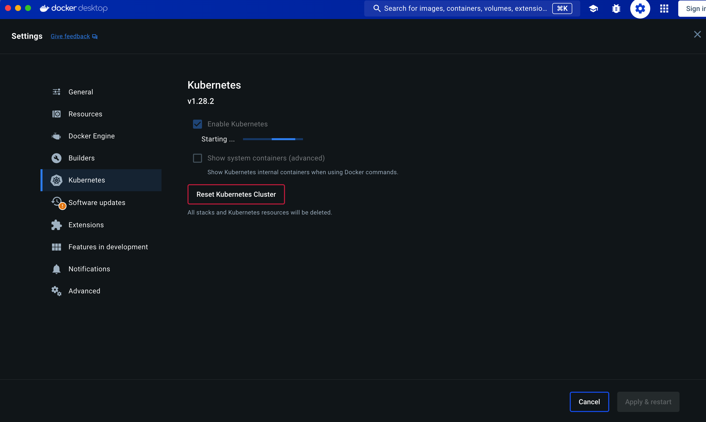
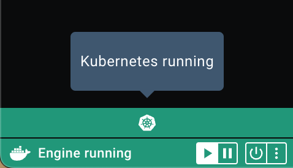
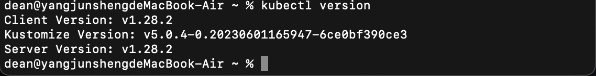

得益於`docker desktop`已經有集成kubernetes，在`mac os` 或 `windows`都可以直接使用來建成本地端的k8s做練習

### 啟動設定
勾選啟用後，按下方的`apply & restart`



### 啟動狀態
可在側邊欄最下方看到已經啟動的k8s



### 啟動後確認
也可以在終端機輸入指令來確認

```shell
kubectl version
```

