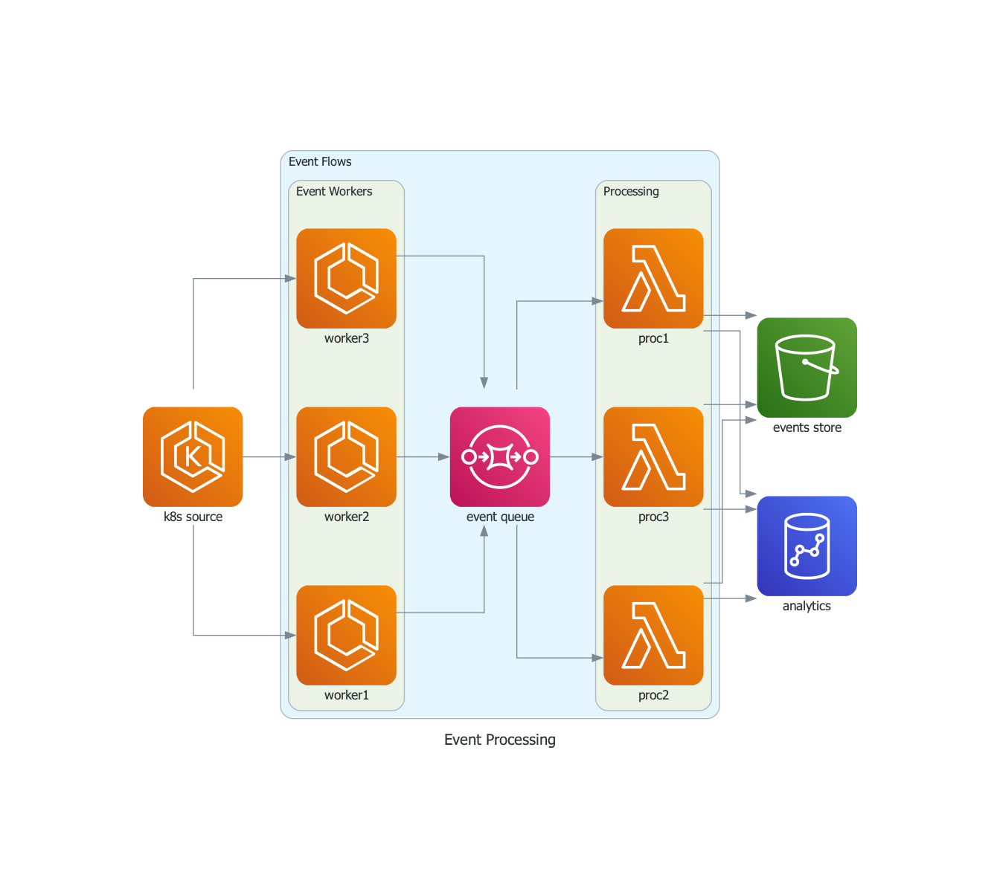

> github 連結
> https://github.com/mingrammer/diagrams

## 安裝

### Graphviz

開源的圖形可視化軟件，專門用來表示結構化數據，特別是圖和網狀結構。它由AT&T Labs Research開發，基於GNU通用公共許可證發布。

這專案需要先安裝 [Graphviz](https://www.graphviz.org/)才能使用

### python 

至少`3.7`以上

```shell
# using pip (pip3)
$ pip install diagrams

# using pipenv
$ pipenv install diagrams

# using poetry
$ poetry add diagrams
```

## 使用


code
```python
from diagrams import Diagram
from diagrams.aws.compute import EC2
from diagrams.aws.database import RDS
from diagrams.aws.network import ELB

with Diagram("Web Service", show=False):
    ELB("lb") >> EC2("web") >> RDS("userdb")
```

產出的圖


code
```python
from diagrams import Cluster, Diagram
from diagrams.aws.compute import ECS, EKS, Lambda
from diagrams.aws.database import Redshift
from diagrams.aws.integration import SQS
from diagrams.aws.storage import S3

with Diagram("Event Processing", show=False):
    source = EKS("k8s source")

    with Cluster("Event Flows"):
        with Cluster("Event Workers"):
            workers = [ECS("worker1"),
                       ECS("worker2"),
                       ECS("worker3")]

        queue = SQS("event queue")

        with Cluster("Processing"):
            handlers = [Lambda("proc1"),
                        Lambda("proc2"),
                        Lambda("proc3")]

    store = S3("events store")
    dw = Redshift("analytics")

    source >> workers >> queue >> handlers
    handlers >> store
    handlers >> dw
```

產出的圖



### 結語

比起`draw.io` 等自行拉線，雖然少了便利性，但卻很方便直接，推薦