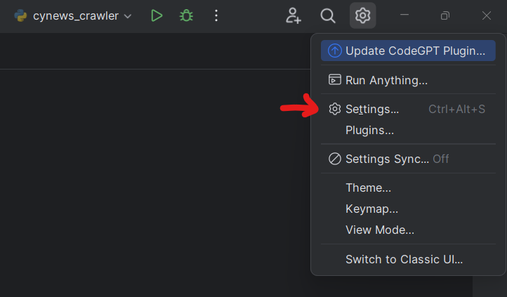
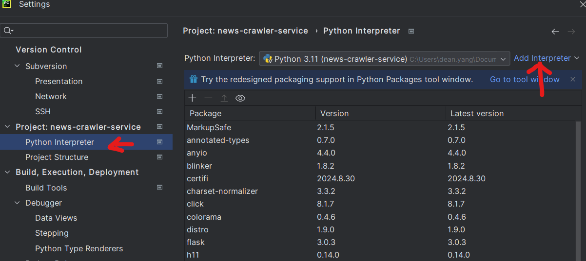
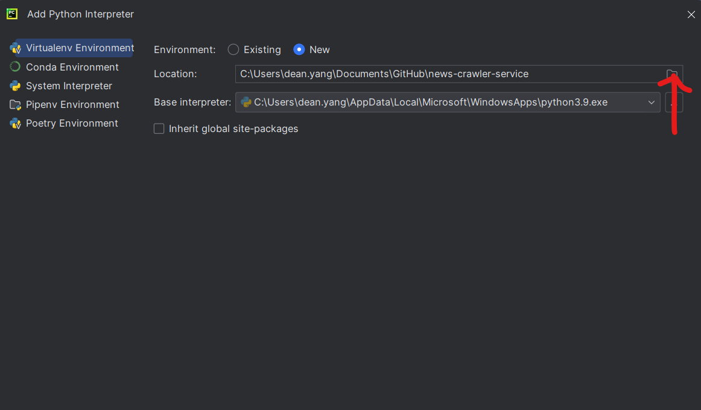

# 建立及執行虛擬環境（venv）的步驟

## 1. 確認已安裝 Python 3

在建立虛擬環境之前，請先確認電腦中已安裝 Python 3。可以使用以下命令檢查：

```bash
python --version
```

## 2. 建立虛擬環境

### Windows / Mac / Linux

```bash
python -m venv myenv
```

## 3. 啟動虛擬環境

### Windows:

```bash
myenv\Scripts\activate
```

### Mac / Linux

```bash
source myenv/bin/activate
```

<p class="note note-warning">啟動後，命令提示符會顯示 (myenv)，表示虛擬環境已啟動。</p>

## 4. 在虛擬環境中執行 Python 腳本

```bash
python project/my_script.py
```

## 6. 停用虛擬環境

```bash
deactivate
```

## 7. 刪除虛擬環境

如果不再需要該虛擬環境，直接刪除 myenv 資料夾即可。

```bash
rm -rf myenv  # macOS / Linux
rmdir /S myenv  # Windows
```

# 更改PyCharm 的 設定

## 1. 開啟`setting` `python interpreter`




## 2. 將路徑指到剛建立的venv 環境當中

