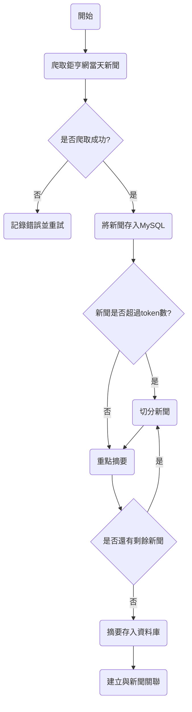
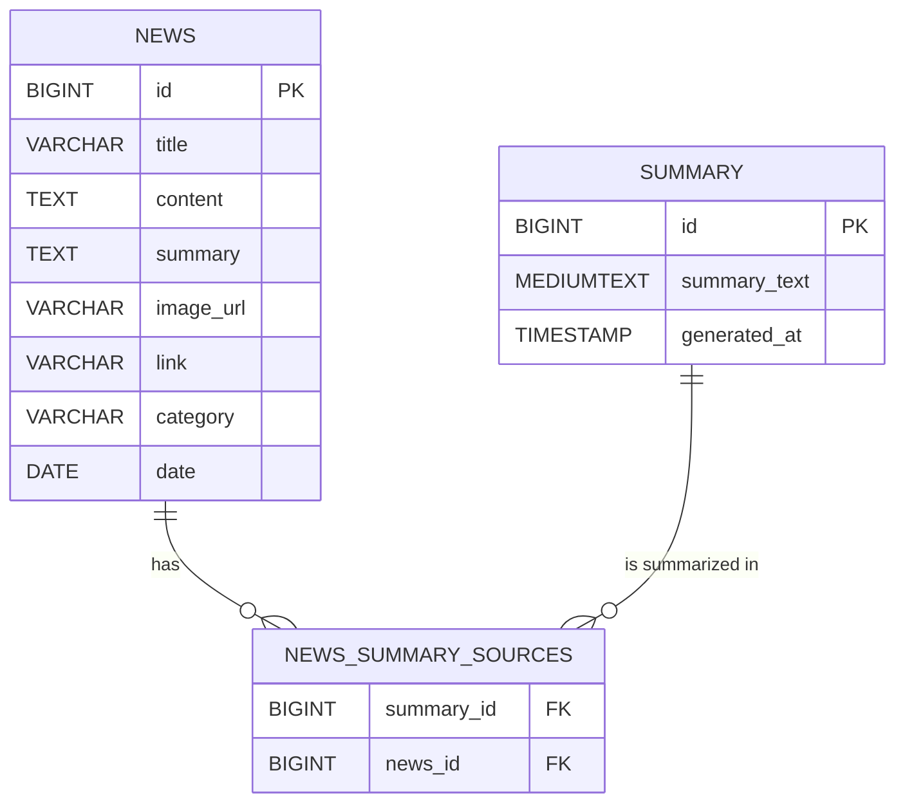

### 先上專案
[https://github.com/shengshengyang/news-crawler-service](https://github.com/shengshengyang/news-crawler-service)

起因是因為覺得新聞太多，想要透過大語言模型來做統整根分類，讓我們快速閱讀並且獲得一些建議
以下是分類新聞的流程圖:



### 爬蟲
參考
[https://blog.jiatool.com/posts/cnyes_news_spider/](https://blog.jiatool.com/posts/cnyes_news_spider/)

寫得很詳細，接下來就是透過取到的資料，分類後存入DB，並做一些防呆避免重複插入

### prompt
用來做摘要的提示詞

```json
[
  {
    "role": "system",
    "content": "你是一位金融市場專家，擅長根據新聞資料進行分析並預測股市走勢。"
  },
  {
    "role": "user",
    "content": "請閱讀以下新聞摘要，根據相似的內容進行統整，並針對相似的內容給予股價預測可能走勢，最後分組回答：\n\n{content}"
  }
]
```

### ER model


### 完整code
```python
import time
import random
import requests
import mysql.connector
from mysql.connector import Error
from dotenv import load_dotenv
import os

# 載入 .env 文件
load_dotenv()
class CnyesNewsSpider():
    def get_newslist_info(self, page=1, limit=30):
        """ 爬取新聞資料

        :param page: 頁數
        :param limit: 一頁新聞數量
        :return newslist_info: 新聞資料
        """
        headers = {
            'Origin': 'https://news.cnyes.com/',
            'Referer': 'https://news.cnyes.com/',
            'user-agent': 'Mozilla/5.0 (Windows NT 10.0; Win64; x64) AppleWebKit/537.36 (KHTML, like Gecko) Chrome/122.0.0.0 Safari/537.36',
        }
        r = requests.get(f"https://api.cnyes.com/media/api/v1/newslist/category/wd_stock?page={page}&limit={limit}",
                         headers=headers)
        if r.status_code != requests.codes.ok:
            print('請求失敗', r.status_code)
            return None
        newslist_info = r.json()['items']
        return newslist_info

    def save_news_to_db(self, news_data):
        """ 將新聞資料儲存到資料庫
        :param news_data: 單筆新聞資料
        """
        try:
            # 連接 MySQL 資料庫
            connection = mysql.connector.connect(
                host=os.getenv('MYSQL_HOST'),
                database=os.getenv('MYSQL_DATABASE'),
                user=os.getenv('MYSQL_USER'),
                password=os.getenv('MYSQL_PASSWORD')
            )

            if connection.is_connected():
                cursor = connection.cursor()

                # 檢查新聞是否已存在
                check_query = "SELECT id FROM news WHERE link = %s"
                cursor.execute(check_query, (news_data['link'],))
                if cursor.fetchone() is None:
                    # 插入新聞資料
                    insert_query = """INSERT INTO news (title, summary, content, image_url, link, category, date)
                                      VALUES (%s, %s, %s, %s, %s, %s, %s)"""
                    cursor.execute(insert_query, (
                        news_data['title'],
                        news_data['summary'],
                        news_data['content'],
                        news_data['image_url'],
                        news_data['link'],
                        news_data['category'],
                        news_data['date']
                    ))
                    connection.commit()
                    print(f"新聞已成功插入資料庫：{news_data['title']}")

        except Error as e:
            print(f"Error: {e}")
        finally:
            if connection.is_connected():
                cursor.close()
                connection.close()


if __name__ == "__main__":
    cnyes_news_spider = CnyesNewsSpider()
    newslist_info = cnyes_news_spider.get_newslist_info()

    for news in newslist_info["data"]:
        news_data = {
            'title': news["title"],
            'summary': news["summary"],
            'content': news.get("content", ""),  # API 返回的資料中可能沒有內文
            'image_url': news.get("image_url", ""),
            'link': f'https://news.cnyes.com/news/id/{news["newsId"]}',
            'category': news["categoryName"],
            'date': time.strftime("%Y-%m-%d", time.localtime(news["publishAt"]))
        }

        # 儲存到資料庫
        cnyes_news_spider.save_news_to_db(news_data)

    # 加入隨機延遲，避免被反爬蟲偵測
    time.sleep(random.uniform(2, 5))
```

下一篇會用openai library 做切分及重點統整