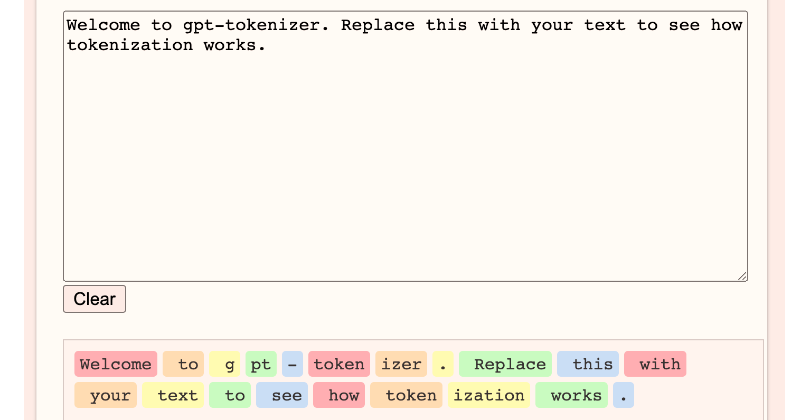

# Generative AI Fundamentals

## Foundation models (基礎模型)


Generative AI is powered by models that are pretrained on internet-scale data called <span class="label label-warning">foundation models (FMs)</span>. can adapt a single FM to <span class="label label-success">perform multiple tasks</span>, include text generation, text summarization, information extraction, image generation, chatbot interactions, and question answering.

生成式人工智慧由基於互聯網規模資料預訓練的模型提供支持，這些模型稱為<span class="label label-warning">基礎模型（FM）</span>，可以調整單一 FM 來<span class="label label-success">執行多個任務</span>，包括文字生成、文字摘要、資訊提取、圖像生成、聊天機器人互動和問答。

## 生命週期

### 1. Data selection 數據選擇

<span class="label label-primary">Unlabeled data includes raw data</span>, such as images, text files, or videos, with no meaningful informative labels to provide context. FMs require training on massive datasets from diverse sources.

<span class="label label-primary">未標記數據包括原始數據</span>，例如圖像、文字檔案或視頻，沒有有意義的資訊標籤來提供上下文。 FM 需要對來自不同來源的海量資料集進行訓練。

### 2. Pre-training 預訓練


FMs are typically <span class="label label-info">pre-trained through self-supervised learning</span>.
FM 通常是透過<span class="label label-info">自我監督學習進行預先訓練</span>的。

After the initial pre-training, the model can be <span class="label label-info">further pre-trained on additional data</span>. This is known as continuous pre-training. The goal is to expand the model's knowledge base and improve its ability to understand and generalize across different domains or tasks.

在初始預訓練之後，可以對<span class="label label-info">額外資料進一步對模型進行預訓練</span>。這稱為連續預訓練。目標是擴展模型的知識庫並提高其跨不同領域或任務的理解和泛化能力。

### 3. Optimization 最佳化

can be optimized through techniques like <span class="label label-success">prompt engineering, retrieval-augmented generation (RAG), and fine-tuning</span> on task-specific data.

可以透過<span class="label label-success">提示工程、檢索增強生成（RAG）和針對特定任務資料的微調</span>等技術進行最佳化。

### 4. Evaluation 評估

FM's performance can be measured using appropriate metrics and benchmarks

FM 的性能可以使用適當的指標和基準來衡量。

### 5. Deployment 部署

Deployment can involve integrating the model into applications, APIs, or other software systems.

部署可能涉及將模型整合到應用程式、API 或其他軟體系統中。

### 6. Feedback and continuous improvement 反饋和持續改進

The feedback loop permits continuous enhancement of the foundation model through fine-tuning, continuous pre-training, or re-training, as needed.

回饋循環允許根據需要透過微調、連續預訓練或重新訓練來持續增強基礎模型。

## Large language models 大型語言模型

Large language models (LLMs) can be based on a variety of architectures, but the most common architecture in today's state-of-the-art models is the <span class="label label-danger">transformer architecture</span>.

大型語言模型 ( LLMs ) 可以基於多種架構，但當今最先進的模型中<span class="label label-danger">最常見的架構是 Transformer 架構</span>，可以理解和產生類似人類的文本。

### Tokens 

Tokens are the basic units of text that the model processes, provide standardization of input data

標記是模型處理的文字的基本單位, 提供輸入資料的標準化

[計算token 範例網站](https://codesandbox.io/p/sandbox/gpt-tokenizer-tjcjoz?file=%2Fsrc%2FApp.tsx)




### Embeddings and  Vector 嵌入和向量

Embeddings are numerical representations of tokens, where each token is assigned a vector (a list of numbers) that captures its meaning and relationships with other tokens. 

嵌入是標記的數字表示，其中每個標記都分配有一個向量（數字列表），該向量捕獲其含義以及與其他標記的關係。


LLMs use these tokens, embeddings, and vectors to understand and generate text. The models can capture complex relationships in language, so they can generate coherent and contextually appropriate text, answer questions, summarize information, and even engage in creative writing.

LLMs使用這些標記、嵌入和向量來理解和產生文本。這些模型可以捕捉語言中的複雜關係，因此它們可以產生連貫且適合上下文的文本、回答問題、總結訊息，甚至進行創意寫作。


## Diffusion models 擴散模型

Diffusion is a deep learning architecture system that starts with pure noise or random data. The models gradually add more and more meaningful information to this noise until they end up with a clear and coherent output

Diffusion 是一種從純雜訊或隨機資料開始的深度學習架構系統。這些模型逐漸為這些噪音添加越來越多有意義的訊息，直到最終得到清晰且連貫的輸出

### Forward diffusion 前向擴散
system <span class="label label-warning">gradually introduces a small amount of noise</span> to an input image until only the noise is left over.
使用前向擴散，系統<span class="label label-warning">逐漸向輸入影像引入少量噪聲</span>，直到只剩下噪聲。


### Reverse diffusion 反向擴散

the noisy image is <span class="label label-primary">gradually introduced to denoising until a new image is generated</span>.

<span class="label label-primary">逐漸將雜訊影像引入去噪，直到產生新影像</span>。


## Multimodal models 多式聯運模型

can process and generate multiple modes of data simultaneously.

可以同時處理和產生多種模式的資料

## Other generative models 其他生成模型

### Generative adversarial networks (GANs)

### Variational autoencoders (VAEs)

## Optimizing model outputs 最佳化模型輸出

### Prompt engineering 提示工程

Prompt engineering focuses on developing, designing, and optimizing prompts to enhance the output of FMs for your needs

提示工程專注於開發、設計和最佳化提示，以增強 FM 的輸出以滿足您的需求。

- **Instructions(說明)**: task for the FM to do
  - **Context(上下文)**: external information to guide
  - **Input data(輸入資料)**:  input for which you want a response
  - **Output indicator(輸出指示器)**: output type or format

#### example
```text

You are an experienced journalist that excels at condensing long articles into concise summaries. Summarize the following text in 2–3 sentences.
Text: [Long article text goes here]
```

### Fine-tuning 微調

Fine-tuning is a <span class="label label-danger">supervised learning process</span> that involves taking a pre-trained model and adding specific, smaller datasets.

微調是一個<span class="label label-danger">監督學習過程</span>，涉及採用預先訓練的模型並添加特定的較小資料集。

- **Instruction fine-tuning**: uses examples of how the model should respond to a specific instruction
- **Reinforcement learning from human feedback (RLHF)** : provides human feedback data

### Retrieval-augmented generation 檢索增強生成

supplies domain-relevant data as context to produce responses based on that data, will not change the weights of the foundation model
提供領域相關資料作為上下文以根據該資料產生回應, 不會改變基礎模型的權重