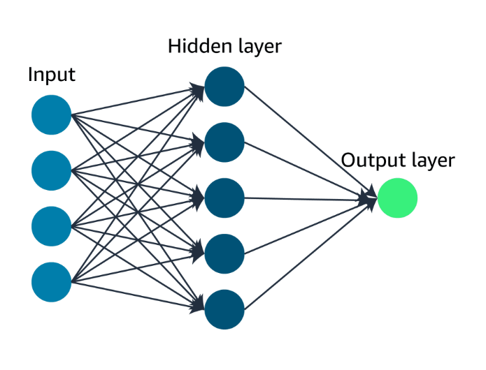

# Deep Learning(深度學習)

field of deep learning is inspired by the structure and function of the brain. It involves the use of artificial neural networks, which are computational models that are designed to mimic the way the human brain processes information.

深度學習領域的靈感來自大腦的結構和功能，人工神經網路是旨在模仿人腦處理資訊方式的計算模型。

## Neural networks (神經網路)
neural networks have lots of tiny units called nodes that are connected together. These nodes are organized into layers. The layers include an input layer, one or more hidden layers, and an output layer.
神經網路也有很多稱為節點的微小單元，它們連接在一起。這些節點被組織成層。這些圖層包括一個輸入圖層、一個或多個隱藏圖層和一個輸出圖層。

### Computer vision (電腦視覺)

for computers to interpret and understand digital images and videos, for tasks such as image classification, object detection, and image segmentation.

使計算機能夠解釋和理解數位圖像和視頻, 為圖像分類、物件檢測和圖像分割等任務提供強大的技術

### Natural language processing (自然語言處理)

deals with the interaction between computers and human languages,making possible tasks such as text classification, sentiment analysis, machine translation, and language generation.
處理計算機和人類語言之間的交互，使文本分類、情感分析、機器翻譯和語言生成等任務成為可能。