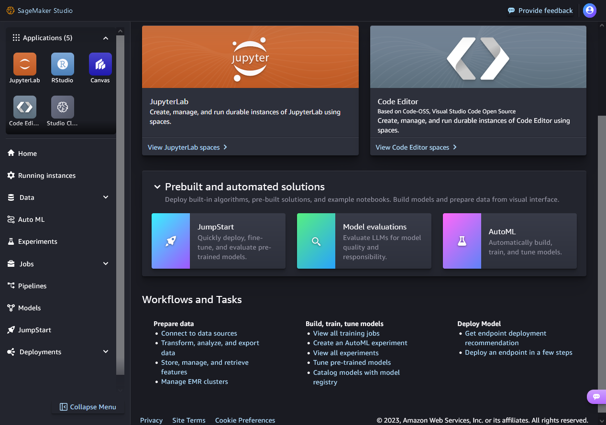

# Machine Learning Development Lifecycle

## Business goal identification
Defining the success criteria or key performance indicators (KPIs) for the ML workload is critical.
為 ML 工作負載定義成功標準或關鍵績效指標 （KPI） 至關重要

## ML problem framing ML

converting it into a machine learning problem 轉換為機器學習問題。

## Data processing

### Amazon SageMaker Data Wrangler

low-code no-code (LCNC) tool, mport, prepare, transform, featurize, and analyze data by using a web interface. Customers can add their own Python scripts and transformations to customize workflows. 

低代碼無代碼 （LCNC） 工具。它提供了一個端到端解決方案，用於使用 Web 介面導入、準備、轉換、特徵化和分析數據。客戶可以添加自己的 Python 腳本和轉換來自定義工作流。

### Amazon SageMaker Studio Classic

built-in integration of Amazon EMR and AWS Glue interactive sessions to handle large-scale interactive data preparation and machine learning workflows within your SageMaker Studio Classic notebook.
內置了 Amazon EMR 和 AWS Glue 互動式會話的集成 ，可在 SageMaker Studio Classic 筆記本中處理大規模互動式數據準備和機器學習工作流。

### SageMaker Processing API

can run scripts and notebooks to process, transform, and analyze datasets ]

## Managing Features

### Amazon SageMaker Feature Store

Features stored in the store can be retrieved and enriched before being served to the ML models for inferences.

存儲中的特徵可以在提供給 ML 模型進行推理之前進行檢索

## Model training and evaluation

### Amazon SageMaker 

- Customers aiming at a LCNC option can use Amazon SageMaker Canvas.
  以 LCNC 選項為目標的客戶可以使用
- saves the resulting model artifacts in an Amazon Simple Storage Service (Amazon S3) bucket that can be used later for inference.
  生成的模型構件保存在 Amazon Simple Storage Service （Amazon S3） 儲存桶中，以便稍後用於推理。
### Amazon SageMaker JumpStart
pretrained, open source models that customers can use for a wide range of problem types.

預訓練的開源模型，客戶可以將其用於各種問題類型。

## Model evaluation

### Model evaluation datasets

The data you use is partitioned into three parts: training set, validation set, and test set
數據分為三個部分：訓練集、驗證集和測試集。訓練集用於訓練模型

### Test set

one last time to ensure its predictive quality meets your standards.
進行最後一次測試，以確保其預測品質符合您的標準。

### Classification and regression problems

#### Classification metrics
- Accuracy 準確性
- Precision 精度
- Recall 召回
- F1
- AUC-ROC
  
  ROC is a probability curve, and AUC represents the degree or measure of separability.
  ROC 是概率曲線，AUC 表示可分離性的程度或度量。

#### Regression metrics
- Mean squared error 均方誤差
  
  The smaller the MSE, the better the model's predictive accuracy.
- R squared R 平方
  R squared explains the fraction of variance accounted for by the model.
  R 平方 （R squared） 解釋模型所佔的方差比例。

### 

### Amazon SageMaker Experiments

experiment with multiple combinations of data, algorithms, and parameters, all while observing the impact of incremental changes on model accuracy.

試驗數據、演算法和參數的多種組合，同時觀察增量更改對模型準確性的影響。

### Amazon SageMaker Automatic Model Tuning 

Hyperparameter tuning is a way to find the best version of your models.

超參數優化是查找模型最佳版本的一種方法。

## Deployment 

## Monitoring 

### Amazon SageMaker Model Monitor

observe the quality of SageMaker ML models in production, detecting violations of user-defined thresholds for data quality, model quality, bias drift, and feature attribution drift.

客戶可以觀察生產中 SageMaker ML 模型的品質, 檢測違反使用者定義的數據品質、模型品質、偏差漂移和特徵歸因漂移閾值的行為，説明保持模型品質。

