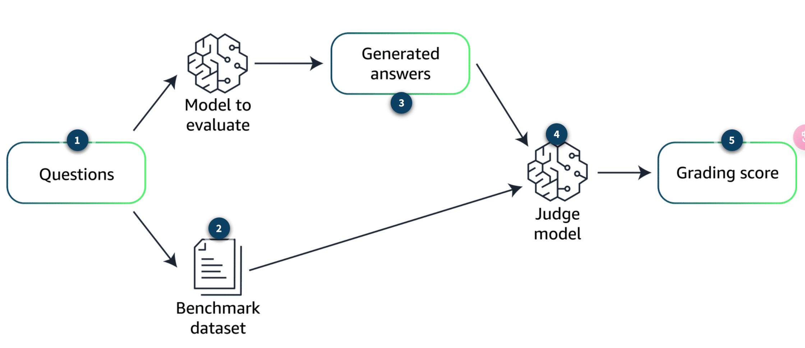

# Model evaluation

## Common Metric

### Rouge

used to `evaluate automatic summarization of texts, in addition to machine translation quality in NLP.` The main idea behind ROUGE is to count the number of overlapping units. 

ROUGE 是一組指標，用於`評估文本的自動摘要，以及 NLP 中的機器翻譯品質`。ROUGE 背後的主要思想是計算重疊單元的數量

- **ROUGE-N**: overlap of n-grams between the generated text and the reference text.assesses the fluency of the text and the extent to which it includes key ideas from the reference
  衡量生成的文本和引用文本之間的 n 元語法重疊, 評估文本的流暢性以及它包含參考文獻中關鍵思想的程度。
- **ROUGE-L**: longest common subsequence between the generated text and the reference texts. evaluating the `coherence and order of the narrative` in the outputs
  使用生成的文本和參考文本之間的最長公共子序列, 評估輸出中敘述的`連貫性和順序`。

### BLEU

evaluate the `quality of text that has been machine-translated from one natural language` to another.applies a penalty for overly short translations (brevity penalty).
評估已`從一種自然語言機器翻譯為另一種自然語言的文本質量`的指標, 對過短的翻譯進行懲罰（簡潔懲罰）

### The BERTScore

pretrained contextual embeddings from models like BERT to evaluate the quality of text-generation tasks. evaluates the semantic similarity. increasingly used alongside traditional metrics like BLEU and ROUGE

BERT 等模型的預訓練上下文嵌入來評估文本生成任務的品質,  評估語義相似性，而不是依賴於精確的詞彙匹配, 越來越多地與 BLEU 和 ROUGE 等傳統指標一起使用

## Evaluate LLM results

### Human evaluation

- **User experience**: intuitive and satisfying 直觀和滿意度
- **Contextual approriateness**: contextually relevant and sensitive to the nuances of human communication? 人類交流的細微差別敏感的方式
- **Creativity and flexibility**: complex scenarios that require a nuanced understanding 意外查詢或複雜場景的能力

 ### Benchmark datasets

- **Accuracy**: perform specific tasks according to predefined standards 執行特定任務的準確度
- **Speed and efficiency**: How quickly does the mode generate responses and how does this impact operational efficiency?
  模式生成回應的速度有多快，這對運營效率有何影響？
- **Scalability**: maintain its performance as the scale of data or number of users increases?
  隨著數據規模或用戶數量的增加而保持其性能？

### Creating a benchmark dataset

#### 1. Create relevant questions

subject matter experts (SMEs) create relevant and challenging questions related to the topic of interest or specific documents.

主題專家 （SME） 創建與感興趣的主題或特定文檔相關的且具有挑戰性的問題。

#### 2. Context identification 上下文識別

SMEs identify pertinent sections of the documents that provide context necessary for generating answers.

SME 確定文件的相關部分，這些部分為生成答案提供了必要的上下文。

#### 3. Answer drafting

draft precise answers, which become the benchmark for evaluating the RAG system's responses.
起草精確的答案，這些答案成為評估RAG系統回應的基準。

### evaluation process

#### The judge model
external model that is used to compare the answers from the SMEs available in the benchmark dataset against the answers 

外部模型，用於將基準測試數據集中可用的SME的答案與模型生成的答案進行比較

# Defense in depth

## depth for AI on AWS

### 1. Data protection

- all data at rest is `encrypted with AWS Key Management Service (AWS KMS)` or customer managed key.
  所有靜態數據都`使用 AWS Key Management Service （AWS KMS） 或客戶管理的金鑰進行加密`
- all data and models are versioned and backed up using `Amazon Simple Storage Service (Amazon S3) versioning`.
  所有數據和模型都使用 `Amazon Simple Storage Service （Amazon S3） 版本控制進行版本控制和備份`。

### 2. Identity and access management

only authorized users, applications, or services can access and interact with the cloud infrastructure and its services.

只有授權使用者、應用程式或服務才能訪問雲基礎設施及其服務並與之交互。

### 3. Application protection

against various threats, such as unauthorized access, data breaches, denial-of-service (DoS) attacks, and other security vulnerabilities.

防範各種威脅的措施，例如未經授權的訪問、數據洩露、拒絕服務 （DoS） 攻擊和其他安全漏洞。

#### tools

- AWS Shield 
- Amazon Cognito 
- Others

### 4. Network and edge protection

protect the network infrastructure and the boundaries of a cloud environment

保護網路基礎設施和雲環境的邊界。

#### tools
- Amazon Virtual Private Cloud (Amazon VPC)
- AWS WAF

### 5. Infrastructure protection

Protect against various threats, such as unauthorized access, data breaches, system failures, and natural disasters.

抵禦各種威脅，例如未經授權的訪問、數據洩露、系統故障和自然災害。

#### tools

- AWS Identity and Access Management (IAM)
- IAM user groups and network access control lists (network ACLs)

### Threat detection and incident response

#### Threat detection

- AWS Security Hub
- Amazon GuardDuty

#### Incident response

- AWS Lambda
- Amazon EventBridge

### Policies, procedures, and awareness

- least privilege using AWS Identity and Access Management Access
  IAM 最低許可權策略
- Access Analyzer to look for overly permissive accounts, roles, and resources.
  Access Analyzer 查找過於寬鬆的帳戶、角色和資源
- restrict access using short-termed credentials.
  短期憑證限制訪問

 ## Compliance Standards

# Compliance Standards 合規性標準

## AWS compliance

### National Institute of Standards and Technology (NIST)
commonly used for U.S. federal information systems.protect the confidentiality, integrity, and availability of the information and information systems.
通常用於美國聯邦信息系統, 以驗證它們是否有足夠的保護措施來保護資訊和資訊系統的機密性、完整性和可用性。

### European Union Agency for Cybersecurity (ENISA)

trust in digital products, services, and processes by drafting cybersecurity certification schemes.

起草網路安全認證計劃來提高對數位產品、服務和流程的信任。

### International  Organization for Standardization (ISO)

security standard that outlines recommended security management practices and comprehensive security controls, based on the guidance provided in the ISO/IEC 27002 best practice document.

安全標準，它根據 ISO/IEC 27002 最佳實踐文檔中提供的指南概述了推薦的安全管理實踐和全面的安全控制。

### The AWS System and Organization Controls (SOC)

reports are independent assessments conducted by third parties that show how AWS has implemented and maintained key compliance controls and objectives.
報告是由第三方進行的獨立評估，展示了 AWS 如何實施和維護關鍵的合規性控制和目標。

### Health Insurance Portability and Accountability Act (HIPPA)

AWS empowers covered entities and their business associates under the U.S. HIPAA regulations to use the secure AWS environment for processing, maintaining, and storing protected health information.

AWS 使美國 HIPAA 法規規定的涵蓋實體及其業務夥伴能夠使用安全的 AWS 環境來處理、維護和存儲受保護的健康資訊。

### General Data Protection Regulation (GDPR)

The European Union's GDPR safeguards the fundamental right of EU citizens to privacy and the protection of their personal information. The GDPR establishes stringent requirements that raise and unify the standards for data protection, security, and compliance across the EU.

歐盟的GDPR保護歐盟公民的基本隱私權和個人信息保護權。GDPR 制定了嚴格的要求，以提高和統一整個歐盟的數據保護、安全性和合規性標準。

### Payment	Card Industry Data Security Standard(PCI DSS)

The PCI DSS is a private information security standard that is managed by the PCI Security Standards Council. This council was established by a group of major credit card companies, including American Express, Discover Financial Services, JCB International, Mastercard, and Visa.

PCI DSS是由PCI安全標準委員會管理的私人資訊安全標準。該委員會由一組主要信用卡公司成立，包括 American Express、Discover Financial Services、JCB International、Mastercard 和 Visa。

## AI standards compliance

### complexity and opacity
highly complex with opaque decision-making processe makes it challenging to audit and understand how they arrive at outputs, which is crucial for compliance

非常複雜，決策過程不透明, 使得審計和了解他們如何得出產出變得具有挑戰性

### dynamism and adaptability

dynamic and can adapt and change over time

動態的，可以隨著時間的推移而適應和變化

### Emergent capabilities

unexpected or unintended capabilities that arise as a result of complex interactions within the AI system
AI 系統內的複雜交互而產生的意外或意外能力

### unique risk

algorithmic bias, privacy violations, misinformation, and AI-powered automation displacing human workers.
演算法偏見、侵犯隱私、錯誤資訊以及 AI 驅動的自動化取代了人類工人。

- Biased training data
- Human bias

### Algorithm accountability

should be transparent, explainable, and subject to oversight and accountability measures.

應該是透明的、可解釋的，並受到監督和問責措施的約束。

## AWS Governance and Compliance

###   AWS Config

view of the configuration of AWS resources in your AWS account.
AWS 資源配置的詳細視圖

- `Resource administration`: Exercise governance over your resource configurations and detect resource misconfigurations.
  對資源配置進行管理並偵測資源錯誤配置。
- `Auditing and compliance`:providing access to the historical configurations of your resources.
  提供資源歷史配置的存取權來協助您證明合規性。
- `Managing and troubleshooting configuration changes`: how any resource you intend to modify is related to other resources
  要修改的任何資源與其他資源的關係

###  Amazon Inspector

vulnerability management service,  automatically discovers and scans running AWS resources for known software vulnerabilities and unintended network exposure,  include Amazon Elastic Compute Cloud (Amazon EC2) instances, container images, and Lambda functions.
漏洞管理服務, 會自動發現並掃描正在執行的 AWS 資源, 包括 Amazon Elastic Compute Cloud (Amazon EC2) 執行個體、容器映像和 Lambda 函數

- `Package vulnerability`: common vulnerabilities and exposures (CVEs)
  常見漏洞和風險 (CVE)
- `Code vulnerability`:data leaks, weak cryptography, and missing encryption.
  資料外洩、弱加密和缺失加密。
- `Network reachability`:paths to Amazon EC2 instances
  通往 Amazon EC2 執行個體的開放網路路徑

###  AWS Audit Manager 
`automates evidence collection` so you can conveniently assess whether your policies, procedures, and activities (also known as controls) are operating effectively.
`自動收集證據`，以便您可以方便地評估您的政策、程序和活動（也稱為控制）是否有效運作。

###  AWS Artifact

`on-demand downloads of AWS security and compliance documents`, such as AWS ISO certifications, PCI reports, and SOC Reports.
AWS `安全性和合規性文件的按需下載`，例如 AWS ISO 認證、PCI 報告和 SOC 報告。

###  AWS Cloudtrail

Actions taken by a user, role, or an AWS `service are recorded` as events in CloudTrail.  include actions taken in the AWS Management Console, AWS Command Line Interface (AWS CLI), and AWS SDKs and APIs.
使用者、角色或 AWS `服務執行的操作將作為事件記錄`在 CloudTrail 中, 包括在 AWS 管理主控台、AWS 命令(AWS CLI) 列介面 (AWS CLI) 以及 AWS 開發工具包和 API 中執行的操作。

###  AWS Trusted Advisor 

optimize costs, increase performance, improve security and resilience, and operate at scale in the cloud.
優化成本、提高效能、提高安全性和彈性