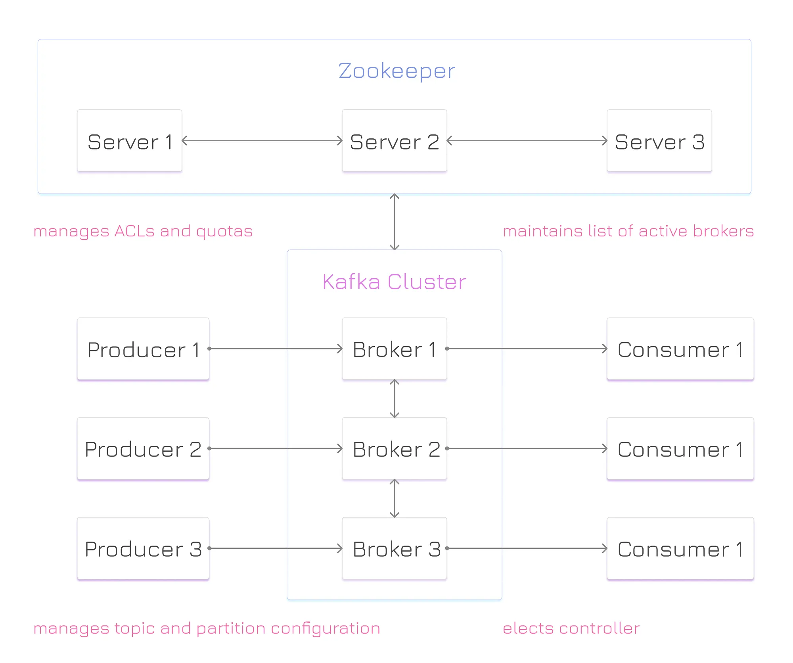
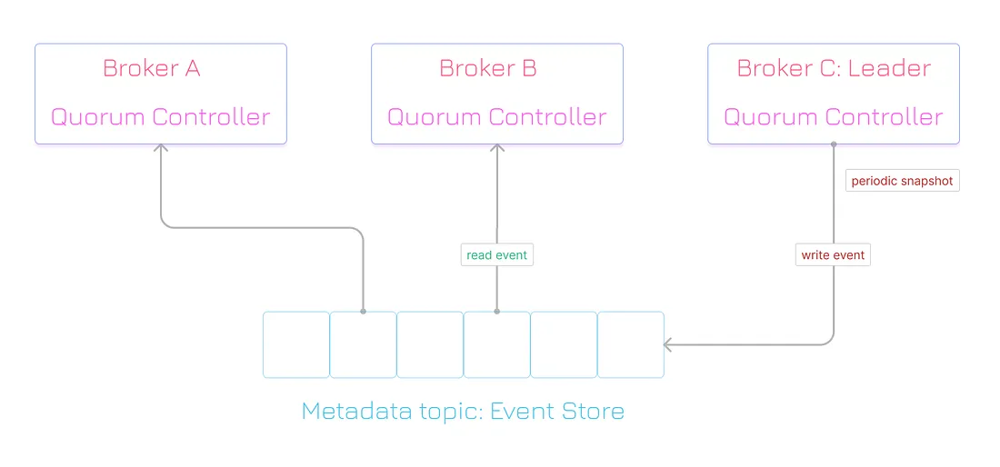

# Zookerper
Zookeeper 是一個分佈式協調服務，主要用於管理和協調分佈式系統中的各種配置信息、元數據和狀態信息。在 Apache Kafka 中，Zookeeper 用於管理 Kafka 集群的元數據，包括主題（Topic）、分區（Partition）、Broker 等信息。
Kafka 使用 Zookeeper 來管理元數據和集群協調，但在新版本（如 Kafka 2.8）中開始移除對 Zookeeper 的依賴。




## 配置

### docker-compose.yml

同時建立 Zookeeper 和 Kafka 服務，可以使用 Docker 快速搭建本地開發環境。

```yaml
version: '3'
services:
  zookeeper:
    image: confluentinc/cp-zookeeper:latest
    container_name: zookeeper
    ports:
      - "2181:2181"
    environment:
      ZOOKEEPER_CLIENT_PORT: 2181
      ZOOKEEPER_TICK_TIME: 2000

  kafka:
    image: confluentinc/cp-kafka:latest
    container_name: kafka
    ports:
      - "9092:9092"
    depends_on:
      - zookeeper
    environment:
      KAFKA_BROKER_ID: 1
      KAFKA_ZOOKEEPER_CONNECT: 'zookeeper:2181'
      KAFKA_ADVERTISED_LISTENERS: PLAINTEXT://localhost:9092
      KAFKA_LISTENERS: PLAINTEXT://0.0.0.0:9092
      KAFKA_OFFSETS_TOPIC_REPLICATION_FACTOR: 1
```

### application.properties


```properties
# Kafka
spring.kafka.bootstrap-servers=localhost:9092

spring.kafka.producer.key-serializer=org.apache.kafka.common.serialization.StringSerializer
spring.kafka.producer.value-serializer=org.springframework.kafka.support.serializer.JsonSerializer

spring.kafka.consumer.key-deserializer=org.apache.kafka.common.serialization.StringDeserializer
spring.kafka.consumer.value-deserializer=org.springframework.kafka.support.serializer.JsonDeserializer
spring.kafka.consumer.properties.spring.json.trusted.packages=*

spring.kafka.listener.type=batch
spring.kafka.listener.ack-mode=record
```

## 使用

### 創建 KafkaConfig

```java
@Configuration
public class KafkaConfig {

    @Bean
    public ProducerFactory<String, ClockInEvent> producerFactory() {
        Map<String, Object> configProps = new HashMap<>();
        // 配置生產者屬性
        configProps.put(ProducerConfig.BOOTSTRAP_SERVERS_CONFIG, "localhost:9092");
        configProps.put(ProducerConfig.KEY_SERIALIZER_CLASS_CONFIG, StringSerializer.class);
        configProps.put(ProducerConfig.VALUE_SERIALIZER_CLASS_CONFIG, JsonSerializer.class);
        // 其他必要的配置
        return new DefaultKafkaProducerFactory<>(configProps);
    }

    @Bean
    public ProducerFactory<String, ClockInResult> replyProducerFactory() {
        Map<String, Object> configProps = new HashMap<>();
        // 配置回覆生產者屬性
        configProps.put(ProducerConfig.BOOTSTRAP_SERVERS_CONFIG, "localhost:9092");
        configProps.put(ProducerConfig.KEY_SERIALIZER_CLASS_CONFIG, StringSerializer.class);
        configProps.put(ProducerConfig.VALUE_SERIALIZER_CLASS_CONFIG, JsonSerializer.class);
        // 其他必要的配置
        return new DefaultKafkaProducerFactory<>(configProps);
    }

    @Bean
    public ConsumerFactory<String, ClockInEvent> consumerFactory() {
        Map<String, Object> configProps = new HashMap<>();
        // 配置消費者屬性
        configProps.put(ConsumerConfig.BOOTSTRAP_SERVERS_CONFIG, "localhost:9092");
        configProps.put(ConsumerConfig.GROUP_ID_CONFIG, "attendance-group");
        configProps.put(ConsumerConfig.KEY_DESERIALIZER_CLASS_CONFIG, StringDeserializer.class);
        configProps.put(ConsumerConfig.VALUE_DESERIALIZER_CLASS_CONFIG, JsonDeserializer.class);
        configProps.put(JsonDeserializer.TRUSTED_PACKAGES, "*");
        // 其他必要的配置
        return new DefaultKafkaConsumerFactory<>(configProps);
    }

    @Bean
    public ConsumerFactory<String, ClockInResult> replyConsumerFactory() {
        Map<String, Object> configProps = new HashMap<>();
        // 配置回覆消費者屬性
        configProps.put(ConsumerConfig.BOOTSTRAP_SERVERS_CONFIG, "localhost:9092");
        configProps.put(ConsumerConfig.GROUP_ID_CONFIG, "reply-group");
        configProps.put(ConsumerConfig.KEY_DESERIALIZER_CLASS_CONFIG, StringDeserializer.class);
        configProps.put(ConsumerConfig.VALUE_DESERIALIZER_CLASS_CONFIG, JsonDeserializer.class);
        configProps.put(JsonDeserializer.TRUSTED_PACKAGES, "*");
        // 其他必要的配置
        return new DefaultKafkaConsumerFactory<>(configProps);
    }

    @Bean
    public KafkaTemplate<String, ClockInEvent> kafkaTemplate() {
        return new KafkaTemplate<>(producerFactory());
    }

    @Bean
    public KafkaTemplate<String, ClockInResult> replyKafkaTemplate() {
        return new KafkaTemplate<>(replyProducerFactory());
    }

    @Bean
    public ConcurrentKafkaListenerContainerFactory<String, ClockInEvent> kafkaListenerContainerFactory(
            ConsumerFactory<String, ClockInEvent> cf,
            KafkaTemplate<String, ClockInResult> replyTemplate) {

        ConcurrentKafkaListenerContainerFactory<String, ClockInEvent> factory =
                new ConcurrentKafkaListenerContainerFactory<>();
        factory.setConsumerFactory(cf);
        factory.setReplyTemplate(replyTemplate);  // 設置回覆模板
        return factory;
    }

    @Bean
    public ReplyingKafkaTemplate<String, ClockInEvent, ClockInResult> replyingKafkaTemplate(
            ProducerFactory<String, ClockInEvent> pf,
            ConcurrentMessageListenerContainer<String, ClockInResult> repliesContainer) {
        return new ReplyingKafkaTemplate<>(pf, repliesContainer);
    }

    @Bean
    public ConcurrentMessageListenerContainer<String, ClockInResult> repliesContainer(
            ConsumerFactory<String, ClockInResult> cf) {
        ContainerProperties containerProperties = new ContainerProperties("clock-in-response-topic");
        containerProperties.setGroupId("reply-group");
        return new ConcurrentMessageListenerContainer<>(cf, containerProperties);
    }
}
```

### Contoller 使用

此事件要回覆使用者是否成功，所以使用 `ReplyingKafkaTemplate` 來發送請求並等待回覆。
並且使用`RequestReplyMessageFuture` 來設置超時時間，避免無限等待。
```java
 @PostMapping("/clock-in")
    @ResponseBody
    public String clockIn(@RequestBody Map<String, Double> location, Principal principal) throws Exception {
        String username = principal.getName();
        double latitude = location.get("latitude");
        double longitude = location.get("longitude");

        // 創建打卡事件
        ClockInEvent event = new ClockInEvent(username, latitude, longitude);

        // 創建消息並設置回覆主題
        org.springframework.messaging.Message<ClockInEvent> message = MessageBuilder
                .withPayload(event)
                .setHeader(KafkaHeaders.TOPIC, "clock-in-request-topic")
                .setHeader(KafkaHeaders.REPLY_TOPIC, "clock-in-response-topic")
                .build();

        // 發送請求並等待回覆
        RequestReplyMessageFuture<String, ClockInEvent> future = replyingKafkaTemplate.sendAndReceive(message);

        // 設置超時時間，避免無限等待
        org.springframework.messaging.Message<ClockInResult> response = (org.springframework.messaging.Message<ClockInResult>) future.get(10, TimeUnit.SECONDS);
        ClockInResult result = response.getPayload();

        return result.getMessage();
    }
```

## 未來

由於zookeeper 是會在未來的版本中被移除，所以在新版本中不需要再使用zookeeper 來管理kafka，會改用Raft協議來管理kafka集群。
接下來會將此段作改寫，寫成使用Raft協議來管理kafka集群。

### 使用Raft協議的好處

- 無需單獨安裝和管理 Zookeeper。
- 簡化了 Kafka 的部署和管理。
- 提高了 Kafka 的可用性和可靠性。
- 更好的性能和效率。
- 更好的擴展性和容錯性。
- 更好的安全性和可管理性。
- 


圖片來源: https://romanglushach.medium.com/the-evolution-of-kafka-architecture-from-zookeeper-to-kraft-f42d511ba242