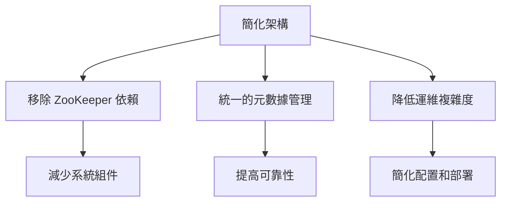
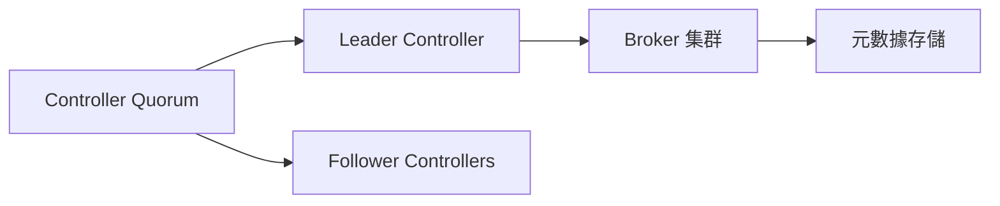
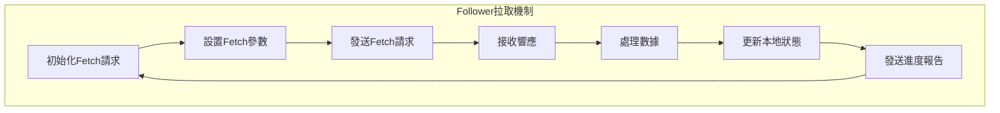
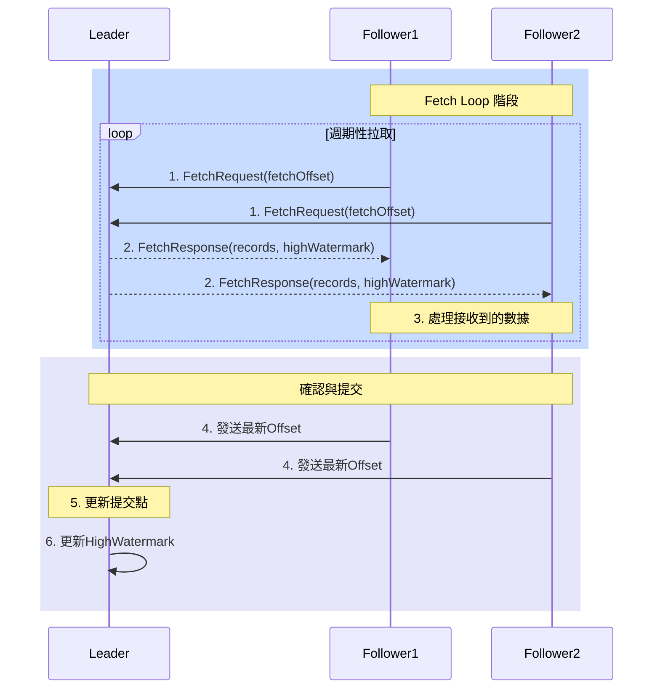
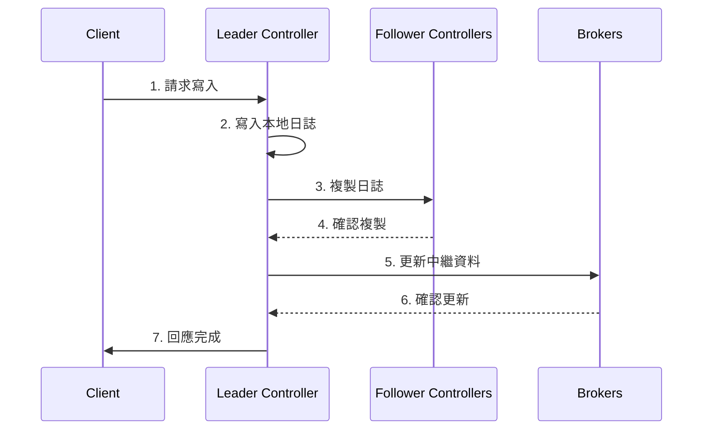


可以先了解raft與 kraft 前身 zookeeper
- **[raft 共識演算法](../../../../2024/12/30/raft)**
- **[使用Spring 連接zookeeper管理kafka](../../../../2024/11/22/spring-kafka-zookeeper)**


## 為何要用KRaft

Kafka KRaft 是 Kafka 2.8 版本中引入的一個新特性，用於取代 ZooKeeper 作為 Kafka 集群的元數據管理服務。Kafka KRaft 基於 Raft 共識協議，具有更高的可靠性和性能，並且可以更好地支持 Kafka 集群的擴展和管理。

關鍵角色

## Kafka KRaft vs Raft

| 特性 | Raft | Kafka KRaft |
|------|------|-------------|
| 目的 | 通用分散式一致性協議 | Kafka專用，取代ZooKeeper |
| 架構複雜度 | 較複雜，需外部服務 | 較簡單，內建於Kafka |
| 擴展性 | 一般 | 針對Kafka優化 |
| 性能 | 通用性能 | 針對Kafka優化性能 |

### KRaft 對於raft 的變革

kraft 設定定期時間拉取日誌，取代raft 中以 leader 發送為主的機制，這樣可以減少leader的負擔，並且可以更好的支持多個follower的情況。

### KRaft運作流程

