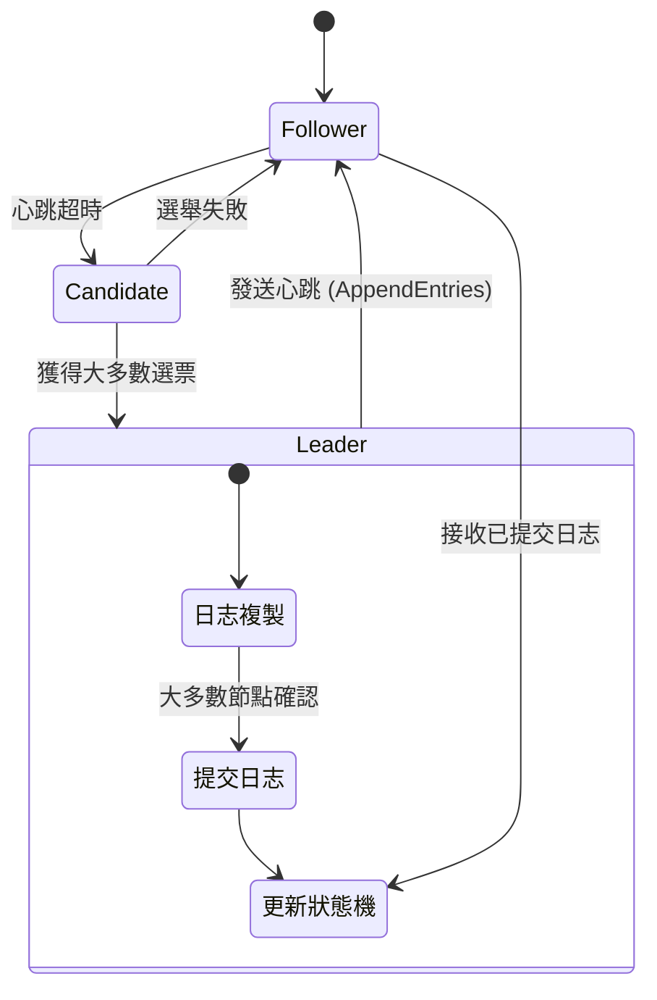
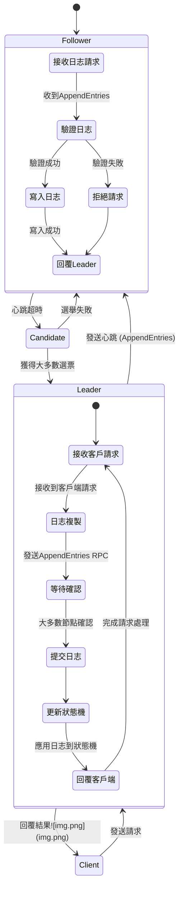

~~背景是遊戲raft?? 不是，這裡是在講共識演算法的Raft~~

# Raft

## 什麼是Raft?

Raft是一種共識演算法，用於在分散式系統中維護一致性。Raft通過選舉機制確保了系統中的一致性，並且在選舉過程中，Raft通過一個稱為`leader`的節點來協調其他節點的操作。

## Raft的基本概念

Raft的基本概念包括：

- **Leader**：Raft系統中的一個節點，負責協調其他節點的操作。
- **Follower**：Raft系統中的其他節點，接收Leader的指令並執行。
- **Candidate**：Raft系統中的一個節點，用於進行Leader的選舉。

## Raft的運作原理

Raft的運作原理如下：

1. **Leader選舉**：當Leader節點失效時，Raft系統中的其他節點會進行Leader的選舉，選舉出一個新的Leader節點。
2. **日誌複製**：Leader節點會將自己的日誌複製到其他節點，以確保系統中的一致性。
3. **指令執行**：Follower節點接收Leader的指令並執行，確保系統中的一致性。
4. **Leader失效**：當Leader節點失效時，Raft系統中的其他節點會進行Leader的選舉，選舉出一個新的Leader節點。
5. **日誌複製**：新的Leader節點會將自己的日誌複製到其他節點，以確保系統中的一致性。
6. **指令執行**：Follower節點接收Leader的指令並執行，確保系統中的一致性。
7. **心跳機制**：Leader節點會定期向其他節點發送心跳，以確保系統中的一致性。
8. **狀態機**：Raft系統中的每個節點都有一個狀態機，用於執行指令並維護系統的狀態。

## Raft的 lifecycle

## Raft的流程圖

只有 **leader** 可以接收 **client** 的請求，然後將請求分發給其他節點，其他節點接收到 **leader** 的請求後，執行請求並將結果返回給**leader**，**leader** 再將結果返回給 **client**。

**leader** 會有 **timeout** 機制，如果在 **timeout** 時間內沒有收到其他節點的回應，則會進行重新選舉。

重新選舉的流程如下：

1. 節點進入 **候選人** 狀態，並向其他節點發送選舉請求。
2. 其他節點收到選舉請求後，會進入 **投票** 狀態，並向候選人發送投票。
3. 候選人收到足夠的投票後，成為新的 **leader**。
4. 新的 **leader** 開始向其他節點發送 **心跳**，以確保系統中的一致性。

**leader** 接收請求後會先將請求寫入 **日誌**，然後將 **日誌** 複製到其他節點，其他節點接收到 **日誌** 後，執行 **日誌**
並將結果返回給 **leader**，**leader** 再將結果返回給 **client**。

其中如果有已經提交的 **日誌**，則不會再次執行。

實際發送request 的結合流程如下， 其中會依靠AppendEntries 來進行日誌複製，並且透過心跳機制來確保系統的一致性。

## 資源

用圖像了解raft: [https://thesecretlivesofdata.com/raft/](https://thesecretlivesofdata.com/raft/)

中文解釋raft: [https://medium.com/bsos-taiwan/raft-the-best-choice-of-consensus-within-the-organization-1cc555d54d6d](https://medium.com/bsos-taiwan/raft-the-best-choice-of-consensus-within-the-organization-1cc555d54d6d)
