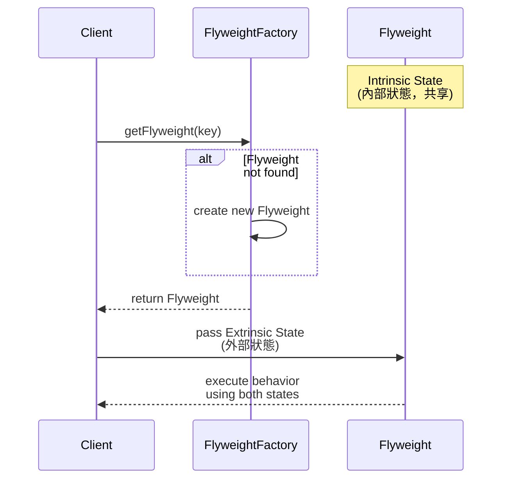


目錄
- **[design pattern 以java 為例](../../../../2024/03/30/design-pattern#創建型模式（Creational-Patterns）)**
  

# Flyweight Pattern (享元模式)

## 定義

透過共享物件來減少系統中創建重複物件的內存使用量，特別適合用於大規模物件的場景中。該模式的核心在於將物件分解為內部狀態（intrinsic state）和外部狀態（extrinsic state），並共享內部狀態以達到節省資源的效果。



## 核心概念

### 1. 內部狀態（Intrinsic State）

- 固定且可以被多個物件共享的狀態。
- 通常由享元物件自身管理。

### 2. 外部狀態（Extrinsic State）

- 會隨著物件的使用情況而變化的狀態。
- 通常由客戶端管理。

### 3. 共享池（Flyweight Factory）

- 用於管理享元物件的工廠。
- 通常實現為單例模式。

## 範例

### 重構前


在下列程式中，HotelRoom 類別同時持有「房型資訊」與「房間編號」等所有資料。當系統中有大量相同房型（例如：Deluxe Double）的房間時，會造成重複資訊的儲存，浪費記憶體。

```java
// 重構前：HotelRoom.java
public class HotelRoom {
    // 同時包含「共用的狀態」與「個別的狀態」
    private String roomType; // e.g., "Deluxe", "Suite", ...
    private String bedType;  // e.g., "Double", "Twin", ...
    private int capacity;    // e.g., 2, 4, ...
    private double price;    // e.g., 1200, 2500, ...

    private int roomNumber;  // 每個房間都不同
    private boolean isOccupied;

    public HotelRoom(String roomType, String bedType, int capacity, double price,
                     int roomNumber, boolean isOccupied) {
        this.roomType = roomType;
        this.bedType = bedType;
        this.capacity = capacity;
        this.price = price;
        this.roomNumber = roomNumber;
        this.isOccupied = isOccupied;
    }

    public void displayRoomInfo() {
        System.out.println("Room Number: " + roomNumber 
            + ", Type: " + roomType 
            + ", Bed: " + bedType 
            + ", Capacity: " + capacity 
            + ", Price: " + price 
            + (isOccupied ? " (Occupied)" : " (Available)"));
    }

    // getters, setters ...
}
```
假設有一個 Hotel 類別管理所有房間，每新增一個房間，都要重複建立相同房型的資訊：

```java
// 重構前：Hotel.java
import java.util.ArrayList;
import java.util.List;

public class Hotel {
    private List<HotelRoom> rooms;

    public Hotel() {
        rooms = new ArrayList<>();
        
        // 即使 Deluxe Double 的共用資訊都一樣，仍要多次儲存
        rooms.add(new HotelRoom("Deluxe", "Double", 2, 1200, 101, false));
        rooms.add(new HotelRoom("Deluxe", "Double", 2, 1200, 102, true));

        // Suite King 也是一樣的重複資訊
        rooms.add(new HotelRoom("Suite", "King", 4, 2500, 201, false));
        rooms.add(new HotelRoom("Suite", "King", 4, 2500, 202, false));
        // ... 可能還有更多房間
    }

    public void showAllRooms() {
        for (HotelRoom room : rooms) {
            room.displayRoomInfo();
        }
    }
}
```
問題
- `重複儲存`：roomType, bedType, capacity, price 在相同房型的每個物件都重複存在。
- `浪費記憶體`：若系統中有成百上千的房間，重複資料會佔用大量資源。
- `不易維護`：若要修改某個共用房型資訊，可能會需要對多個物件進行調整。

### 重構後

- *Intrinsic State (內部狀態)* ：可被多個物件共享、不會因使用情境而改變的資料。
  可以抽取「房型、床型、可容納人數、基本價格」等作為內部狀態。
- *Extrinsic State (外部狀態)* ：依賴運行情境、需要額外傳入或分別儲存的資料。
  「房間編號、是否被佔用」屬於外部狀態。

#### RoomType
```java
// 重構後：RoomType.java (Flyweight)
public class RoomType {
    private String roomType;  // e.g., "Deluxe", "Suite"
    private String bedType;   // e.g., "Double", "Twin"
    private int capacity;     // e.g., 2, 4
    private double basePrice; // e.g., 1200, 2500

    public RoomType(String roomType, String bedType, int capacity, double basePrice) {
        this.roomType = roomType;
        this.bedType = bedType;
        this.capacity = capacity;
        this.basePrice = basePrice;
    }

    // 可根據需要擴充更多方法
    public void showRoomTypeInfo() {
        System.out.printf("Type: %s, Bed: %s, Capacity: %d, Base Price: %.2f%n",
                roomType, bedType, capacity, basePrice);
    }

    // getters ...
}
```

#### Flyweight Factory

```java
// 重構後：RoomTypeFactory.java
import java.util.HashMap;
import java.util.Map;

public class RoomTypeFactory {
    private static final Map<String, RoomType> ROOM_TYPES = new HashMap<>();

    public static RoomType getRoomType(String roomType, String bedType, int capacity, double basePrice) {
        // 以 key 作為區分不同房型的依據
        String key = roomType + "-" + bedType + "-" + capacity + "-" + basePrice;
        if (!ROOM_TYPES.containsKey(key)) {
            RoomType newType = new RoomType(roomType, bedType, capacity, basePrice);
            ROOM_TYPES.put(key, newType);
        }
        return ROOM_TYPES.get(key);
    }
}
```

#### 修正 HotelRoom 類別只保存外部狀態

```java
// 重構後：HotelRoom.java
public class HotelRoom {
    private final RoomType roomType; // Flyweight (共享)
    private final int roomNumber;    // 外部狀態
    private boolean isOccupied;      // 外部狀態

    public HotelRoom(RoomType roomType, int roomNumber, boolean isOccupied) {
        this.roomType = roomType;
        this.roomNumber = roomNumber;
        this.isOccupied = isOccupied;
    }

    public void displayRoomInfo() {
        System.out.printf("Room Number: %d, %s",
                roomNumber, (isOccupied ? "Occupied" : "Available") + " -> ");
        // 顯示共用的房型資訊
        roomType.showRoomTypeInfo();
    }
}
```

#### Hotel 類別改為透過工廠取得房型

```java
// 重構後：Hotel.java
import java.util.ArrayList;
import java.util.List;

public class Hotel {
    private List<HotelRoom> rooms;

    public Hotel() {
        rooms = new ArrayList<>();

        // 透過工廠取得相同的 RoomType，重複使用
        RoomType deluxeDouble = RoomTypeFactory.getRoomType("Deluxe", "Double", 2, 120.0);
        rooms.add(new HotelRoom(deluxeDouble, 101, false));
        rooms.add(new HotelRoom(deluxeDouble, 102, true));

        RoomType suiteKing = RoomTypeFactory.getRoomType("Suite", "King", 4, 250.0);
        rooms.add(new HotelRoom(suiteKing, 201, false));
        rooms.add(new HotelRoom(suiteKing, 202, true));
        // ... 可再新增更多房間
    }

    public void showAllRooms() {
        for (HotelRoom room : rooms) {
            room.displayRoomInfo();
        }
    }
}
```

### 優點

1. `減少記憶體消耗`
   在重構前，每個 HotelRoom 物件都重複保存了相同的「房型資訊」。若飯店中有上千個房間，且重複的房型很多，就會造成大量重複儲存。
   重構後，，顯著減少記憶體使用量。
2. `資料一致性高`
   若需要修改某個房型的共用資訊（例如：Deluxe Double 的價格），只要在 RoomType 中統一調整即可，所有引用該房型的房間都能。
3. `維護性更佳`
   分離「內部狀態」(可共享的房型資訊) 與「外部狀態」(房號、佔用情況) 後，可明確區分出哪些資料需要共享、哪些資料需要獨立保存，更容易擴充與維護程式。
