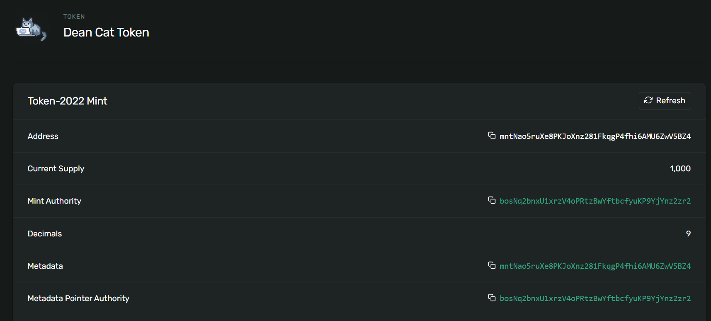

# 用solana 鑄幣

## 建議是在linux 環境下執行

如果是windows 可以使用wsl2，以下為指令

- 列出所有可安裝的linux 版本

    ```bash
    wsl --list --online
    ```

- 安裝特定版本

    ```bash
    wsl --install -d Ubuntu-22.04
    ```
- 啟動特定版本

    ```bash
    wsl -d Ubuntu-22.04
    ```
  
- 安裝C/C++ 編譯器

    ```bash
    sudo apt update
    sudo apt install -y build-essential
    ```

## 1. 安裝solana cli

```bash
sh -c "$(curl -sSfL https://release.solana.com/v1.9.0/install)"
```

## 2. 建立錢包


```bash
solana-keygen grind --starts-with bos:2
```

:2 的意思是建立的個數，會建立以下的json，前面的檔名就是錢包地址

```text
Searching with 22 threads for:
        2 pubkeys that start with 'bos' and end with ''
Searched 1000000 keypairs in 1s. 0 matches found.
Searched 2000000 keypairs in 3s. 0 matches found.
Wrote keypair to bosNq2bnxU1xrzV4oPRtzBwYftbcfyuKP9YjYnz2zr2.json
Searched 3000000 keypairs in 5s. 1 matches found.
Wrote keypair to bos4qUdiXHGb6Ks36GLx9mZtiXmujYsdryi1xQZHheZ.json
```

## 3. 設定config

```bash
# 設定為devnet
solana config set --url https://api.devnet.solana.com

# 設定錢包
solana config set --keypair bosNq2bnxU1xrzV4oPRtzBwYftbcfyuKP9YjYnz2zr2.json
```

- 查看config

  ```bash
  solana config get
  ```

  ```text
  Config File: /home/dean/.config/solana/cli/config.yml
  RPC URL: https://api.devnet.rpcpool.com
  WebSocket URL: wss://api.devnet.rpcpool.com/ (computed)
  Keypair Path: bosNq2bnxU1xrzV4oPRtzBwYftbcfyuKP9YjYnz2zr2.json
  Commitment: confirmed
  ```

## 4. 取得空投

由於後續的操作都需要手續費，所以需要先取得空投

```bash
solana airdrop 1
```

或是可以到[https://faucet.solana.com/](https://faucet.solana.com/) ，複製剛剛取得的錢包地址，點選request airdrop

取得後可以查看錢包

```bash
solana balance
```

```text
5 SOL
```


## 5. 建立mint

### 先建立keypair
```bash
solana-keygen grind --starts-with mnt:2
```

```text
Searching with 22 threads for:
        2 pubkeys that start with 'mnt' and end with ''
Searched 1000000 keypairs in 1s. 0 matches found.
Searched 2000000 keypairs in 3s. 0 matches found.
Searched 3000000 keypairs in 5s. 0 matches found.
Wrote keypair to mnt6xLhrLGXya1swUvm27jRCvn6hP6YbWoqRbXPqKvL.json
Wrote keypair to mntNao5ruXe8PKJoXnz281FkqgP4fhi6AMU6ZwV5BZ4.json
```

### 建立token mint

可以去這裡取得 program id   [https://solana.com/developers/guides/token-extensions/getting-started](https://solana.com/developers/guides/token-extensions/getting-started)

由於等等要加入 metadata，所以需要加入 --enable-metadata
```bash
spl-token create-token --program-id TokenzQdBNbLqP5VEhdkAS6EPFLC1PHnBqCXEpPxuEb --enable-metadata mntNao5ruXe8PKJoXnz281FkqgP4fhi6AMU6ZwV5BZ4.json
```

```text
Creating token mntNao5ruXe8PKJoXnz281FkqgP4fhi6AMU6ZwV5BZ4 under program TokenzQdBNbLqP5VEhdkAS6EPFLC1PHnBqCXEpPxuEb
To initialize metadata inside the mint, please run `spl-token initialize-metadata mntNao5ruXe8PKJoXnz281FkqgP4fhi6AMU6ZwV5BZ4 <YOUR_TOKEN_NAME> <YOUR_TOKEN_SYMBOL> <YOUR_TOKEN_URI>`, and sign with the mint authority.

Address:  mntNao5ruXe8PKJoXnz281FkqgP4fhi6AMU6ZwV5BZ4
Decimals:  9

Signature: 3S3wAKhzkCwHTKvCc4znECNfSB3PYtenZ9TjWLhYygPr56ZrgZW1FqJirSJqicZhhvRarrUywvkgT8NSpYz9u9VF
```

### 初始化metadata

先將json 及 圖片檔上傳至可以直接打開的地方，這裡以github 為例可以先到連結處，後面加上，這樣就可以直接打開
```text
https://github.com/shengshengyang/Solana-test-coin/blob/main/metadata.json?raw=true
```

會重導到以下網址
```text
https://raw.githubusercontent.com/shengshengyang/Solana-test-coin/refs/heads/main/metadata.json
```

初始化metadata
```bash
spl-token initialize-metadata mntNao5ruXe8PKJoXnz281FkqgP4fhi6AMU6ZwV5BZ4 'Dean Cat Token' 'TST' https://raw.githubusercontent.com/shengshengyang/Solana-test-coin/refs/heads/main/metadata.json
```

可以發現圖片跟資訊都上去了，以下參考
[https://explorer.solana.com/address/mntNao5ruXe8PKJoXnz281FkqgP4fhi6AMU6ZwV5BZ4?cluster=devnet](https://explorer.solana.com/address/mntNao5ruXe8PKJoXnz281FkqgP4fhi6AMU6ZwV5BZ4?cluster=devnet)

## 6. 建立token account

```bash
spl-token create-account mntNao5ruXe8PKJoXnz281FkqgP4fhi6AMU6ZwV5BZ4
Creating account EqihFdtYEB7uywF2Nij6pCsDn7Adfg225gLEQ83K1u5s
```

## 7. 鑄幣

鑄造1000 個token
```bash
 spl-token mint mntNao5ruXe8PKJoXnz281FkqgP4fhi6AMU6ZwV5BZ4 1000
```

鑄完之後會發現sol 變少了(被當成gas fee)，但是token account 多了1000 個token，代表鑄幣 成功!




## 8. 轉帳

```bash
spl-token transfer \
  mntNao5ruXe8PKJoXnz281FkqgP4fhi6AMU6ZwV5BZ4 \
  AMOUNT \
  RECIPIENT_TOKEN_ACCOUNT
```

## 結語

以上純屬開發好玩用，無任何實際幣的價值，請勿將此當作真正的錢包使用，謝謝
