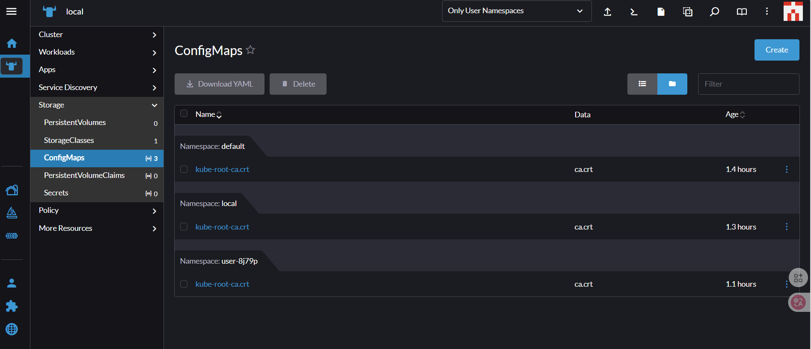

# Windows WSL2 上安裝 K3s 與 Rancher

## 1. WSL2 開啟 Ubuntu 環境

### 1.1 啟用 WSL2

以系統管理員開啟 PowerShell，執行：

```powershell
wsl --install
```

完成安裝後重啟電腦，開啟「開始選單」搜尋「Ubuntu」，啟動 Ubuntu 終端機。

### 1.2 確認 WSL2 版本

```bash
wsl -l -v
```

---

## 2. 安裝 K3s Kubernetes

### 2.1 使用官方安裝腳本

```bash
curl -sfL https://get.k3s.io | sh -
```

### 2.2 驗證節點狀態

```bash
sudo k3s kubectl get nodes
```

### 2.3 配置 kubectl（免 sudo 可選）

```bash
mkdir -p ~/.kube
sudo cp /etc/rancher/k3s/k3s.yaml ~/.kube/config
sudo chown $(id -u):$(id -g) ~/.kube/config
```

---

## 3. 安裝 Helm 與 cert-manager

### 3.1 安裝 Helm

```bash
curl https://raw.githubusercontent.com/helm/helm/main/scripts/get-helm-3 | bash
helm version
```

### 3.2 新增 Rancher Helm repo

```bash
helm repo add rancher-latest https://releases.rancher.com/server-charts/latest
helm repo update
```

### 3.3 安裝 cert-manager

```bash
kubectl create namespace cert-manager
kubectl apply -f https://github.com/cert-manager/cert-manager/releases/download/v1.14.4/cert-manager.yaml
kubectl get pods -n cert-manager -w
```

---

## 4. 安裝 Rancher

### 4.1 建立命名空間

```bash
kubectl create namespace cattle-system
```

### 4.2 安裝 Rancher

```bash
helm install rancher rancher-latest/rancher \
  --namespace cattle-system \
  --set hostname=rancher.localhost \
  --set replicas=1
```

---

## 5. 使用 Rancher UI

### 5.1 等待 Pod 啟動

```bash
kubectl -n cattle-system get pods -w
```

等待 `STATUS=Running`、`READY=1/1`

### 5.2 取得密碼

```bash
kubectl -n cattle-system get secret rancher-admin -o jsonpath='{.data.password}' | base64 --decode
```

### 5.3 透過 port-forward 訪問 UI

```bash
kubectl -n cattle-system port-forward svc/rancher 8443:443
```

然後瀏覽器打開：

```
https://localhost:8443
```

---

## 6. 常見問題與排查

| 問題描述                                 | 解決方案                                      |
|-----------------------------------------|-----------------------------------------------|
| 無法讀取 k3s.yaml                        | 用 `sudo k3s kubectl` 或複製 kubeconfig 給自己 |
| Pod 一直 ContainerCreating              | 執行 `kubectl describe pod` 查看錯誤            |
| Rancher 卡在啟動                         | 查看 `kubectl logs -n cattle-system <pod>`     |
| `namespace not found` 錯誤              | 手動建立命名空間 `kubectl create namespace cattle-system` |
| 無法開啟 UI                              | 使用 `port-forward` 或檢查 hostname 設定        |

---

## 7. 快速安裝腳本總結

```bash
# 安裝 K3s
curl -sfL https://get.k3s.io | sh -

# 複製 kubeconfig
mkdir -p ~/.kube
sudo cp /etc/rancher/k3s/k3s.yaml ~/.kube/config
sudo chown $(id -u):$(id -g) ~/.kube/config

# 安裝 Helm
curl https://raw.githubusercontent.com/helm/helm/main/scripts/get-helm-3 | bash
helm repo add rancher-latest https://releases.rancher.com/server-charts/latest
helm repo update

# 安裝 cert-manager
kubectl create namespace cert-manager
kubectl apply -f https://github.com/cert-manager/cert-manager/releases/download/v1.14.4/cert-manager.yaml
kubectl get pods -n cert-manager -w

# 安裝 Rancher
kubectl create namespace cattle-system
helm install rancher rancher-latest/rancher --namespace cattle-system --set hostname=rancher.localhost --set replicas=1

# 開啟 UI
kubectl -n cattle-system port-forward svc/rancher 8443:443
```

---

## 8. 參考資源

- https://k3s.io/
- https://rancher.com/
- https://github.com/cert-manager/cert-manager
- https://learn.microsoft.com/en-us/windows/wsl/
