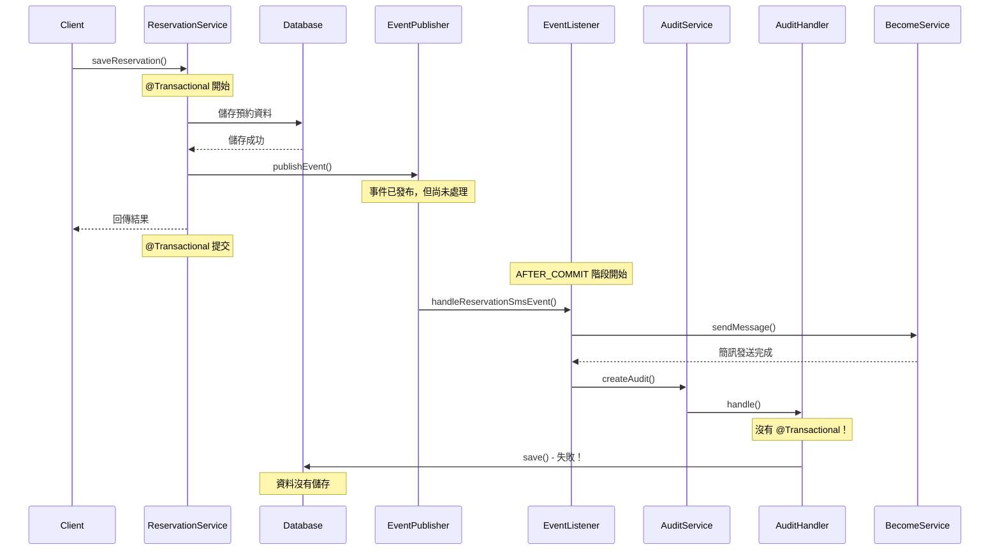

## 前言

在 Spring 應用程式中，`@TransactionalEventListener` 是一個非常實用的功能，可以讓我們在交易的特定階段執行特定邏輯。然而今天遇到一個常見問題：程式碼明明有執行，debug 也確實走到了資料庫儲存的程式碼，但最終資料卻沒有儲存到資料庫中。

## Spring Transaction 基礎概念

### 什麼是 Spring Transaction？

Spring Transaction 管理是 Spring Framework 的核心功能之一，它提供了宣告式的交易管理機制。透過 `@Transactional` 註解，我們可以輕鬆地為方法添加交易支援。

### Transaction Propagation 傳播行為

Spring 提供了多種交易傳播行為：

| 傳播行為 | 描述 |
|---------|------|
| `REQUIRED` | 如果當前有交易，就加入該交易；如果沒有，就建立新交易（預設） |
| `REQUIRES_NEW` | 總是建立新交易，如果當前有交易就暫停它 |
| `SUPPORTS` | 如果當前有交易就加入，沒有就以非交易方式執行 |
| `NOT_SUPPORTED` | 以非交易方式執行，如果當前有交易就暫停它 |
| `MANDATORY` | 必須在交易中執行，如果沒有交易就拋出異常 |
| `NEVER` | 不能在交易中執行，如果有交易就拋出異常 |
| `NESTED` | 在當前交易中建立巢狀交易 |

## TransactionalEventListener 介紹

### 基本概念

`@TransactionalEventListener` 是 Spring 4.2 引入的功能，允許我們在交易的特定階段監聽和處理事件。

### 執行階段 (TransactionPhase)

```java
public enum TransactionPhase {
    BEFORE_COMMIT,    // 交易提交前
    AFTER_COMMIT,     // 交易提交後（預設）
    AFTER_ROLLBACK,   // 交易回滾後
    AFTER_COMPLETION  // 交易完成後（無論提交或回滾）
}
```

## 問題場景重現

### 程式碼結構

我們的系統架構如下：

```java
@Service
@Transactional
public class ReservationServiceImpl {
    
    @Transactional
    public ReservationDto saveReservation(ReservationRequest request, 
                                         ReservationAuditEvent event) {
        // 1. 建立預約資料
        ReservationMn reservationMn = createReservation(request);
        
        // 2. 儲存到資料庫
        saveWithAudit(reservationMn, reservationDts, event);
        
        // 3. 發送事件（在交易中）
        eventPublisher.publishEvent(
            new SendMessageRequest(reservationMn.getUuid(), BecomeMessageType.N)
        );
        
        return result;
    }
}
```

```java
@Component
public class ReservationSmsEventListener {
    
    @TransactionalEventListener(phase = TransactionPhase.AFTER_COMMIT)
    public void handleReservationSmsEvent(SendMessageRequest event) {
        try {
            // 發送簡訊
            becomeService.sendMessage(event.uuid(), event.type());
            
            // 記錄 audit log（問題出現在這裡！）
            reservationLogService.createAudit(mn, null, mn, null, auditEvent);
        } catch (Exception e) {
            log.error("處理失敗", e);
        }
    }
}
```

## 問題分析與流程圖

### 執行流程圖



### 問題核心

關鍵問題在於：

1. **原始交易已結束**：當 `AFTER_COMMIT` 階段執行時，原本的 `@Transactional` 已經提交並結束
2. **新操作沒有交易**：Listener 中的資料庫操作沒有在任何交易中執行
3. **資料庫連接問題**：沒有交易的資料庫操作可能不會真正提交到資料庫

## 詳細解決方案

### 解決方案 1：在 Handler 層級加上交易（推薦）

```java
@Component
@SupportsAuditEvent({
    ReservationAuditEvent.RESERVATION_NOTIFICATION,
    ReservationAuditEvent.RESERVATION_NOTIFICATION_FAILED,
    // ... 其他事件
})
@Slf4j
public class ReservationCommonLogHandler extends BaseServiceImpl 
    implements ReservationAuditLogHandler {

    private final ReservationLogDao reservationLogDao;

    @Override
    @Transactional(propagation = Propagation.REQUIRES_NEW, 
                   rollbackFor = Exception.class)
    public void handle(ReservationMn reservationMnBefore, 
                      List<ReservationDt> reservationDtListBefore,
                      ReservationMn reservationMn, 
                      List<ReservationDt> reservationDtList, 
                      ReservationAuditEvent event) {
        try {
            log.debug("開始建立審計日誌: reservationUuid={}, event={}", 
                     reservationMn.getUuid(), event);
            
            ReservationLog auditLog = new ReservationLog();
            auditLog.setReservationUuid(reservationMn.getUuid());
            auditLog.setLogType(event);
            auditLog.setLogSource(getLogSourceByUser(getUser()));
            auditLog.setSubject(getAuditSubject(event));
            auditLog.setCreatedTime(Instant.now());
            auditLog.setCreatedBy(getCurrentUserId());

            // 強制刷新到資料庫
            ReservationLog savedLog = reservationLogDao.save(auditLog);
            reservationLogDao.flush();
            
            log.info("審計日誌已成功儲存: id={}, reservationUuid={}, event={}", 
                    savedLog.getId(), reservationMn.getUuid(), event);

        } catch (Exception e) {
            log.error("建立審計日誌失敗: reservationUuid={}, event={}", 
                     reservationMn.getUuid(), event, e);
            // 重新拋出異常，讓交易回滾
            throw new RuntimeException("審計日誌儲存失敗", e);
        }
    }
}
```

### 解決方案 2：在 Service 層級加上交易

```java
@Service
@Slf4j
public class ReservationLogServiceImpl implements ReservationLogService {
    
    private final ReservationAuditLogHandlerFactory auditLogHandlerFactory;

    @Override
    @Transactional(propagation = Propagation.REQUIRES_NEW,
                   isolation = Isolation.READ_COMMITTED,
                   rollbackFor = Exception.class)
    public void createAudit(ReservationMn reservationBeforeUpdate, 
                           List<ReservationDt> reservationDtListBeforeUpdate, 
                           ReservationMn reservationMn, 
                           List<ReservationDt> newReservationDtList, 
                           ReservationAuditEvent reservationAuditEvent) {

        if (reservationAuditEvent == null) {
            log.warn("ReservationAuditEvent is null, 跳過審計日誌建立");
            return;
        }

        try {
            log.debug("開始建立審計日誌: reservationUuid={}, event={}",
                    reservationMn.getUuid(), reservationAuditEvent);

            // 從工廠取得對應的處理器
            ReservationAuditLogHandler handler = 
                auditLogHandlerFactory.getHandler(reservationAuditEvent);

            // 執行審計日誌處理
            handler.handle(reservationBeforeUpdate, reservationDtListBeforeUpdate,
                    reservationMn, newReservationDtList, reservationAuditEvent);

            log.debug("審計日誌建立完成: reservationUuid={}, event={}",
                    reservationMn.getUuid(), reservationAuditEvent);

        } catch (IllegalArgumentException e) {
            log.error("不支援的審計事件類型: event={}, reservationUuid={}",
                    reservationAuditEvent, reservationMn.getUuid(), e);
            throw e;
        } catch (Exception e) {
            log.error("建立審計日誌時發生錯誤: event={}, reservationUuid={}",
                    reservationAuditEvent, reservationMn.getUuid(), e);
            throw new RuntimeException("審計日誌建立失敗", e);
        }
    }
}
```

### 解決方案 3：調整事件監聽階段

如果希望在原始交易中執行 audit log：

```java
@Component
@Slf4j
public class ReservationSmsEventListener {

    @TransactionalEventListener(phase = TransactionPhase.BEFORE_COMMIT)
    public void handleReservationSmsEvent(SendMessageRequest event) {
        try {
            log.info("處理訂位簡訊事件（交易提交前）: UUID={}, 事件={}", 
                    event.uuid(), event.type());
            
            // 在原始交易中執行，可以使用現有的交易
            reservationLogService.createAudit(mn, null, mn, null, auditEvent);
            
            // 簡訊發送可能需要在交易提交後執行
            // 這裡可以考慮使用 @Async 或者另外的事件
            
        } catch (Exception e) {
            log.error("處理訂位事件失敗", e);
            // 異常會導致整個交易回滾
            throw new RuntimeException("事件處理失敗", e);
        }
    }

    @TransactionalEventListener(phase = TransactionPhase.AFTER_COMMIT)
    public void sendSmsAfterCommit(SendMessageRequest event) {
        try {
            log.info("發送簡訊（交易提交後）: UUID={}, 事件={}", 
                    event.uuid(), event.type());
            becomeService.sendMessage(event.uuid(), event.type());
        } catch (Exception e) {
            log.error("發送簡訊失敗", e);
            // 這裡的失敗不會影響主要業務
        }
    }
}
```

## 為什麼必須使用 REQUIRES_NEW？

### SUPPORTS 的問題

```java
@Transactional(propagation = Propagation.SUPPORTS)
public void handle(...) {
    // 問題：如果當前沒有交易，就以非交易方式執行
    reservationLogDao.save(auditLog); // 可能不會真正儲存
}
```

**執行流程：**
1. Listener 在 `AFTER_COMMIT` 階段執行
2. 此時原始交易已經結束，沒有活躍的交易
3. `SUPPORTS` 會以非交易方式執行
4. 資料庫操作可能不會提交 ❌

### REQUIRES_NEW 的優勢

```java
@Transactional(propagation = Propagation.REQUIRES_NEW)
public void handle(...) {
    // 強制建立新交易，確保資料庫操作在交易中執行
    reservationLogDao.save(auditLog); // 一定會儲存
}
```

**執行流程：**
1. 不管當前是否有交易，都建立新的交易
2. 在新交易中執行資料庫操作
3. 新交易獨立提交
4. 資料確實儲存到資料庫 ✅

## 最佳實踐建議

### 1. 明確交易邊界

```java
@Service
public class AuditService {
    
    // 明確標示這個方法需要獨立的交易
    @Transactional(
        propagation = Propagation.REQUIRES_NEW,
        isolation = Isolation.READ_COMMITTED,
        rollbackFor = Exception.class,
        timeout = 30
    )
    public void createAuditLog(AuditEvent event) {
        // 審計日誌處理
    }
}
```

### 2. 異常處理策略

```java
@TransactionalEventListener(phase = TransactionPhase.AFTER_COMMIT)
public void handleEvent(MyEvent event) {
    try {
        // 主要邏輯
        processEvent(event);
    } catch (Exception e) {
        // 記錄錯誤但不影響主流程
        log.error("事件處理失敗，但不影響主要業務", e);
        
        // 可以考慮重試機制或錯誤通知
        handleEventFailure(event, e);
    }
}
```

### 3. 效能考量

```java
@Component
public class PerformanceAwareEventListener {
    
    @Async("eventExecutor")
    @TransactionalEventListener(phase = TransactionPhase.AFTER_COMMIT)
    public void handleAsyncEvent(MyEvent event) {
        // 使用非同步處理避免阻塞主流程
        asyncProcessEvent(event);
    }
}
```

### 4. 監控和日誌

```java
@Component
@Slf4j
public class MonitoredEventListener {
    
    private final MeterRegistry meterRegistry;
    
    @TransactionalEventListener(phase = TransactionPhase.AFTER_COMMIT)
    public void handleEvent(MyEvent event) {
        Timer.Sample sample = Timer.start(meterRegistry);
        
        try {
            processEvent(event);
            
            // 記錄成功指標
            meterRegistry.counter("event.processed", "status", "success").increment();
            
        } catch (Exception e) {
            // 記錄失敗指標
            meterRegistry.counter("event.processed", "status", "failure").increment();
            log.error("事件處理失敗: {}", event, e);
            
        } finally {
            sample.stop(Timer.builder("event.processing.time")
                .register(meterRegistry));
        }
    }
}
```

## 常見陷阱與注意事項

### 1. 交易傳播設定錯誤

❌ **錯誤做法：**
```java
@Transactional(propagation = Propagation.SUPPORTS)
public void handleAfterCommit() {
    // 在 AFTER_COMMIT 階段沒有交易，SUPPORTS 會以非交易方式執行
}
```

✅ **正確做法：**
```java
@Transactional(propagation = Propagation.REQUIRES_NEW)
public void handleAfterCommit() {
    // 強制建立新交易
}
```

### 2. 忘記處理異常

❌ **錯誤做法：**
```java
@TransactionalEventListener
public void handleEvent(MyEvent event) {
    // 沒有 try-catch，異常會導致不可預期的行為
    riskyOperation();
}
```

✅ **正確做法：**
```java
@TransactionalEventListener
public void handleEvent(MyEvent event) {
    try {
        riskyOperation();
    } catch (Exception e) {
        log.error("事件處理失敗", e);
        // 根據業務需求決定是否重新拋出異常
    }
}
```

### 3. 阻塞主要業務流程

❌ **錯誤做法：**
```java
@TransactionalEventListener(phase = TransactionPhase.BEFORE_COMMIT)
public void handleEvent(MyEvent event) {
    // 耗時操作會阻塞主要交易的提交
    timeConsumingOperation();
}
```

✅ **正確做法：**
```java
@Async
@TransactionalEventListener(phase = TransactionPhase.AFTER_COMMIT)
public void handleEvent(MyEvent event) {
    // 非同步處理，不阻塞主流程
    timeConsumingOperation();
}
```

## 總結

使用 `@TransactionalEventListener` 時，最重要的是理解交易的生命週期和事件執行的時機：

1. **`AFTER_COMMIT` 階段沒有交易**：原始交易已經結束，需要新建交易
2. **使用 `REQUIRES_NEW`**：確保在新交易中執行資料庫操作
3. **適當的異常處理**：避免影響主要業務流程
4. **考慮效能影響**：使用非同步處理避免阻塞

透過正確的交易管理和事件處理，我們可以建立穩健且高效的事件驅動系統。
