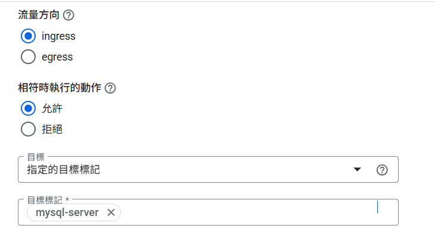
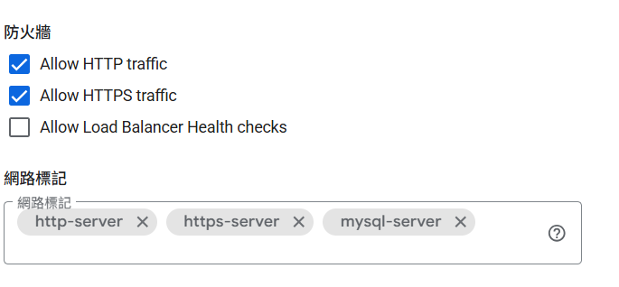

## 前言

在 Google Cloud Platform (GCP) 上部署 MariaDB 時，預設情況下資料庫只能在內部網路存取。如果需要從外部連接到資料庫，需要進行防火牆規則設定和資料庫配置修改。

## 問題現象

### 典型連接失敗場景

當嘗試從外部連接 GCP 上的 MariaDB 時，通常會遇到以下問題：

```bash
# 連接超時
mysql -h YOUR_EXTERNAL_IP -u root -p
ERROR 2003 (HY000): Can't connect to MySQL server on 'YOUR_EXTERNAL_IP' (110)
```

透過 `netstat` 檢查會發現 MariaDB 只綁定在本地：
```bash
sudo netstat -tlnp | grep 3306
tcp    0    0 127.0.0.1:3306    0.0.0.0:*    LISTEN    xxxx/mariadbd
```

## 解決方案

### 步驟一：設定 GCP 防火牆規則

#### 方法一：透過 GCP Console

1. **開啟防火牆設定**
    - 進入 GCP Console → VPC network → Firewall

2. **建立新的防火牆規則**
   ```
   名稱：allow-mysql-3306
   方向：Ingress
   動作：Allow
   目標：Specified target tags
   目標標籤：mysql-server
   來源 IP 範圍：YOUR_IP/32 (建議) 或 0.0.0.0/0 (不安全)
   協議和端口：TCP → 3306
   ```
    

3. **為 VM 添加網路標籤**
    - 進入 Compute Engine → VM instances
    - 編輯 VM 實例
    - 在 Network tags 欄位添加 `mysql-server`
   


#### 方法二：透過 gcloud 命令

```bash
# 建立防火牆規則
gcloud compute firewall-rules create allow-mysql-3306 \
    --allow tcp:3306 \
    --source-ranges YOUR_IP/32 \
    --target-tags mysql-server

# 為 VM 添加標籤
gcloud compute instances add-tags YOUR_INSTANCE_NAME \
    --tags mysql-server \
    --zone YOUR_ZONE
```

### 步驟二：修改 MariaDB 配置

#### 1. 找到配置檔位置

```bash
sudo find /etc -name "*.cnf" | grep -i maria
```

通常會找到：
```
/etc/mysql/mariadb.conf.d/50-server.cnf
/etc/mysql/mariadb.cnf
```

#### 2. 修改綁定地址

編輯主要的服務器配置檔：
```bash
sudo nano /etc/mysql/mariadb.conf.d/50-server.cnf
```

找到並修改：
```ini
# 原始設定（只允許本地連接）
bind-address = 127.0.0.1

# 修改為（允許所有 IP 連接）
bind-address = 0.0.0.0
```

#### 3. 重啟 MariaDB 服務

```bash
sudo systemctl restart mariadb
```

#### 4. 驗證設定

檢查 MariaDB 是否正確綁定：
```bash
sudo netstat -tlnp | grep 3306
```

預期結果：
```
tcp    0    0 0.0.0.0:3306    0.0.0.0:*    LISTEN    xxxx/mariadbd
```

### 步驟三：建立遠端使用者

#### 1. 登入 MariaDB

```bash
mysql -u root -p
```

#### 2. 建立允許遠端連接的使用者

```sql
-- 建立新使用者（允許從任何 IP 連接）
CREATE USER 'remote_user'@'%' IDENTIFIED BY 'your_strong_password';

-- 授予權限
GRANT ALL PRIVILEGES ON *.* TO 'remote_user'@'%';

-- 刷新權限
FLUSH PRIVILEGES;

-- 離開 MariaDB
EXIT;
```

### 步驟四：測試外部連接

從外部電腦測試連接：

```bash
# 使用 MySQL 客戶端
mysql -h YOUR_EXTERNAL_IP -u remote_user -p

# 測試端口連通性
telnet YOUR_EXTERNAL_IP 3306

# 使用 nmap 掃描
nmap -p 3306 YOUR_EXTERNAL_IP
```

## 安全性考量

### 1. IP 白名單設定

**強烈建議**不要使用 `0.0.0.0/0` 允許所有 IP 連接：

```bash
# 只允許特定 IP
gcloud compute firewall-rules create allow-mysql-specific-ip \
    --allow tcp:3306 \
    --source-ranges 203.0.113.0/32,198.51.100.0/32 \
    --target-tags mysql-server
```

### 2. 使用者權限最小化

```sql
-- 建立只有特定資料庫權限的使用者
CREATE USER 'app_user'@'203.0.113.0' IDENTIFIED BY 'strong_password';
GRANT SELECT, INSERT, UPDATE, DELETE ON myapp.* TO 'app_user'@'203.0.113.0';
```

### 3. 啟用 SSL 連接

修改 MariaDB 配置啟用 SSL：
```ini
[mariadb]
ssl-cert = /etc/mysql/server-cert.pem
ssl-key = /etc/mysql/server-key.pem
ssl-ca = /etc/mysql/ca-cert.pem
```

### 4. 變更預設端口

```ini
[mariadb]
port = 3307  # 使用非標準端口
```

## 故障排除

### 常見問題與解決方法

#### 1. 連接被拒絕
```bash
ERROR 2003 (HY000): Can't connect to MySQL server
```
**解決方法：**
- 檢查防火牆規則是否正確
- 確認 VM 網路標籤設定
- 驗證 MariaDB 綁定地址

#### 2. 認證失敗
```bash
ERROR 1045 (28000): Access denied for user
```
**解決方法：**
- 確認使用者是否允許從該 IP 連接
- 檢查密碼是否正確
- 驗證使用者權限

#### 3. 端口無回應
**檢查步驟：**
```bash
# 檢查 MariaDB 狀態
sudo systemctl status mariadb

# 檢查端口監聽
sudo ss -tlnp | grep 3306

# 檢查防火牆狀態
sudo ufw status  # Ubuntu
sudo firewall-cmd --list-all  # CentOS
```

## 最佳實踐建議

1. **定期更新**：保持 MariaDB 版本更新
2. **監控連接**：設定連接數監控和告警
3. **備份策略**：建立自動備份機制
4. **日誌審計**：啟用查詢日誌追蹤
5. **連接池**：使用連接池避免連接數過多

## 總結

透過以上步驟，你可以成功設定 GCP 上的 MariaDB 允許外部連接：

1. ✅ 設定 GCP 防火牆規則開放 3306 端口
2. ✅ 修改 MariaDB 綁定地址為 `0.0.0.0`
3. ✅ 建立允許遠端連接的使用者帳號
4. ✅ 測試外部連接功能

全開放僅為測試用，安全性永遠是首要考量。建議僅允許必要的 IP 地址連接，使用強密碼，並考慮啟用 SSL 加密連接。
