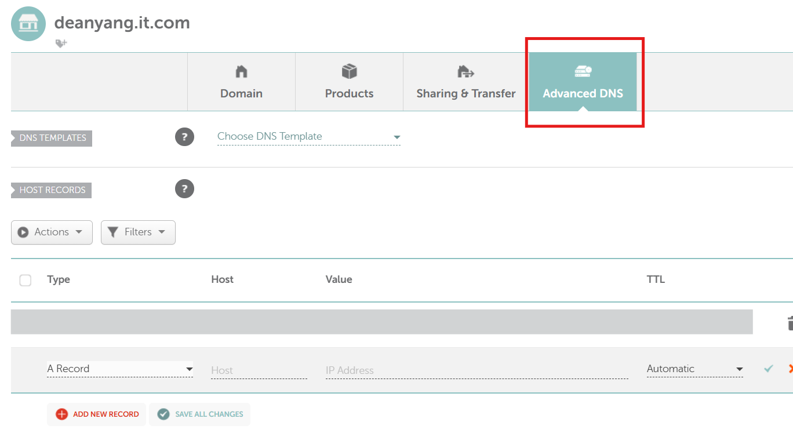

## 前言

在雲端部署 Spring Boot API 時，設定 HTTPS 是必要的安全措施，特別是當你的前端應用需要調用 API 時。本文將完整介紹如何在 GCP VM 上部署 Spring Boot 應用，並使用 Nginx 反向代理搭配 Let's Encrypt 實現自動化的 HTTPS 配置。

## 架構概述

我們將建立以下架構：
```
用戶 → 域名(HTTPS:443) → Nginx → Spring Boot(8080) → MySQL
```

優勢：
- ✅ 免費的 SSL 證書（Let's Encrypt）
- ✅ 自動證書更新
- ✅ 反向代理提供額外安全性
- ✅ 支援 CORS 跨域請求

## 步驟一：購買並設定域名

### 1.1 購買域名

推薦在 [Namecheap](https://namecheap.com) 購買域名：
- .com 域名：約 $12/年
- .xyz 域名：約 $3/年（經濟選擇）

### 1.2 設定 DNS A Record

在 Namecheap 控制台設定：

**路徑**：Domain List → Manage → Advanced DNS



**設定內容**：
```
Type: A Record
Host: api
Value: YOUR_GCP_VM_EXTERNAL_IP  # 替換為你的 GCP VM 外部 IP
TTL: Automatic
```

### 1.3 驗證 DNS 生效

```bash
nslookup api.yourdomain.com
```

**預期輸出**：
```
Server:     8.8.8.8
Address:    8.8.8.8#53

Non-authoritative answer:
Name:   api.yourdomain.com
Address: YOUR_GCP_VM_EXTERNAL_IP
```

## 步驟二：安裝必要軟體

### 2.1 更新系統並安裝 Nginx

```bash
sudo apt update && sudo apt upgrade -y
sudo apt install nginx -y
```

**驗證安裝**：
```bash
sudo systemctl status nginx
```

**預期輸出**：
```
● nginx.service - A high performance web server and a reverse proxy server
   Loaded: loaded (/lib/systemd/system/nginx.service; enabled; vendor preset: enabled)
   Active: active (running) since Thu 2025-09-12 07:15:23 UTC; 1min 23s ago
     Docs: man:nginx(8)
 Main PID: 1234 (nginx)
    Tasks: 3 (limit: 1152)
   Memory: 6.1M
```

### 2.2 安裝 Certbot

```bash
sudo apt install snapd -y
sudo snap install core; sudo snap refresh core
sudo snap install --classic certbot
sudo ln -s /snap/bin/certbot /usr/bin/certbot
```

**驗證安裝**：
```bash
certbot --version
```

**預期輸出**：
```
certbot 2.7.4
```

### 2.3 安裝 Java（如果未安裝）

```bash
sudo apt install openjdk-17-jre -y
java --version
```

## 步驟三：設定 Nginx 反向代理

### 3.1 建立 Nginx 配置檔

```bash
sudo nano /etc/nginx/sites-available/default
```

**完整配置內容**：
```nginx
server {
    listen 80;
    server_name api.yourdomain.com;  # 替換為你的域名
    
    location / {
        # 反向代理到 Spring Boot
        proxy_pass http://127.0.0.1:8080;
        proxy_set_header Host $host;
        proxy_set_header X-Real-IP $remote_addr;
        proxy_set_header X-Forwarded-For $proxy_add_x_forwarded_for;
        proxy_set_header X-Forwarded-Proto $scheme;
        
        # CORS 設定
        add_header Access-Control-Allow-Origin * always;
        add_header Access-Control-Allow-Methods "GET, POST, OPTIONS, PUT, DELETE" always;
        add_header Access-Control-Allow-Headers "DNT,User-Agent,X-Requested-With,If-Modified-Since,Cache-Control,Content-Type,Range,Authorization" always;
        
        # 處理預檢請求
        if ($request_method = 'OPTIONS') {
            add_header Access-Control-Allow-Origin * always;
            add_header Access-Control-Allow-Methods "GET, POST, OPTIONS, PUT, DELETE" always;
            add_header Access-Control-Allow-Headers "DNT,User-Agent,X-Requested-With,If-Modified-Since,Cache-Control,Content-Type,Range,Authorization" always;
            add_header Access-Control-Max-Age 1728000 always;
            add_header Content-Type 'text/plain; charset=utf-8' always;
            add_header Content-Length 0 always;
            return 204;
        }
    }
}
```

### 3.2 測試並重載 Nginx 設定

```bash
sudo nginx -t
```

**預期輸出**：
```
nginx: the configuration file /etc/nginx/nginx.conf syntax is ok
nginx: configuration file /etc/nginx/nginx.conf test is successful
```

```bash
sudo systemctl reload nginx
sudo systemctl enable nginx
```

### 3.3 設定防火牆

```bash
sudo ufw allow 'Nginx Full'
sudo ufw allow ssh
sudo ufw enable
```

**檢查防火牆狀態**：
```bash
sudo ufw status
```

**預期輸出**：
```
Status: active

To                         Action      From
--                         ------      ----
Nginx Full                 ALLOW       Anywhere
22/tcp                     ALLOW       Anywhere
```

## 步驟四：部署 Spring Boot 應用

### 4.1 上傳 JAR 檔案

**從本機執行**：
```bash
scp your-app.jar username@YOUR_GCP_VM_EXTERNAL_IP:~/
```

### 4.2 SSH 連線到 GCP VM

```bash
ssh username@YOUR_GCP_VM_EXTERNAL_IP
```

### 4.3 啟動 Spring Boot 應用

```bash
# 背景執行應用
nohup java -jar your-app.jar > app.log 2>&1 &

# 記錄程序 ID
echo $! > app.pid
```

### 4.4 驗證應用運行

```bash
# 檢查端口
netstat -tlnp | grep :8080
```

**預期輸出**：
```
tcp6    0    0 :::8080    :::*    LISTEN    12345/java
```

```bash
# 測試本地連接
curl -I http://localhost:8080
```

**預期輸出**：
```
HTTP/1.1 200
Content-Type: application/json
Content-Length: 45
Date: Thu, 12 Sep 2025 07:30:15 GMT
```

### 4.5 測試通過 Nginx 訪問

```bash
curl -I http://api.yourdomain.com
```

## 步驟五：申請 SSL 證書

### 5.1 使用 Certbot 申請證書

**重要**：確保域名 DNS 已生效且 HTTP 可正常訪問。

```bash
sudo certbot --nginx -d api.yourdomain.com
```

**執行過程輸出**：
```
Saving debug log to /var/log/letsencrypt/letsencrypt.log
Requesting a certificate for api.yourdomain.com

Successfully received certificate.
Certificate is saved at: /etc/letsencrypt/live/api.yourdomain.com/fullchain.pem
Key is saved at:         /etc/letsencrypt/live/api.yourdomain.com/privkey.pem
This certificate expires on 2025-12-11.
These files will be updated when the certificate renews.

Certbot has set up a scheduled task to automatically renew this certificate in the background.

Deploying certificate
Successfully deployed certificate for api.yourdomain.com to /etc/nginx/sites-enabled/default

Congratulations! You have successfully enabled HTTPS on https://api.yourdomain.com
```

### 5.2 驗證 SSL 設定

```bash
curl -I https://api.yourdomain.com
```

**預期輸出**：
```
HTTP/2 200 
server: nginx/1.18.0
date: Thu, 12 Sep 2025 07:35:20 GMT
content-type: application/json
content-length: 45
access-control-allow-origin: *
access-control-allow-methods: GET, POST, OPTIONS, PUT, DELETE
```

### 5.3 檢查自動生成的 Nginx 配置

```bash
sudo cat /etc/nginx/sites-enabled/default
```

你會看到 Certbot 自動添加了 SSL 相關配置：
```nginx
server {
    server_name api.yourdomain.com;
    
    location / {
        # 你的代理配置...
    }

    listen 443 ssl; # managed by Certbot
    ssl_certificate /etc/letsencrypt/live/api.yourdomain.com/fullchain.pem; # managed by Certbot
    ssl_certificate_key /etc/letsencrypt/live/api.yourdomain.com/privkey.pem; # managed by Certbot
    include /etc/letsencrypt/options-ssl-nginx.conf; # managed by Certbot
    ssl_dhparam /etc/letsencrypt/ssl-dhparams.pem; # managed by Certbot
}

server {
    if ($host = api.yourdomain.com) {
        return 301 https://$host$request_uri;
    } # managed by Certbot

    listen 80;
    server_name api.yourdomain.com;
    return 404; # managed by Certbot
}
```

## 步驟六：設定自動更新

### 6.1 驗證自動更新服務

```bash
sudo systemctl status certbot.timer
```

**預期輸出**：
```
● certbot.timer - Run certbot twice daily
   Loaded: loaded (/lib/systemd/system/certbot.timer; enabled; vendor preset: enabled)
   Active: active (waiting) since Thu 2025-09-12 07:35:45 UTC; 2min ago
     Docs: man:systemd.timer(5)
  Trigger: Thu 2025-09-12 17:42:15 UTC; 10h left
```

### 6.2 查看定時任務

```bash
sudo systemctl list-timers | grep certbot
```

### 6.3 測試自動更新機制

```bash
sudo certbot renew --dry-run
```

**預期輸出**：
```
Saving debug log to /var/log/letsencrypt/letsencrypt.log

- - - - - - - - - - - - - - - - - - - - - - - - - - - - - - - - - - - - - - - -
Processing /etc/letsencrypt/renewal/api.yourdomain.com.conf
- - - - - - - - - - - - - - - - - - - - - - - - - - - - - - - - - - - - - - - -
Account registered.
Simulating renewal of an existing certificate for api.yourdomain.com

- - - - - - - - - - - - - - - - - - - - - - - - - - - - - - - - - - - - - - - -
Congratulations, all simulated renewals succeeded:
  /etc/letsencrypt/live/api.yourdomain.com/fullchain.pem (success)
- - - - - - - - - - - - - - - - - - - - - - - - - - - - - - - - - - - - - - - -
```

## 步驟七：效能與記憶體優化

### 7.1 優化 Nginx 設定

```bash
sudo nano /etc/nginx/nginx.conf
```

**在相應區塊中修改或添加**：
```nginx
user www-data;
worker_processes 1;
pid /run/nginx.pid;

events {
    worker_connections 512;
    use epoll;
    multi_accept on;
}

http {
    # 基本設定
    sendfile on;
    tcp_nopush on;
    tcp_nodelay on;
    keepalive_timeout 15;
    types_hash_max_size 2048;
    server_tokens off;
    
    # Gzip 壓縮
    gzip on;
    gzip_vary on;
    gzip_min_length 1024;
    gzip_types
        text/plain
        text/css
        text/xml
        text/javascript
        application/json
        application/javascript
        application/xml+rss
        application/atom+xml;
    
    # 包含其他配置檔
    include /etc/nginx/mime.types;
    include /etc/nginx/conf.d/*.conf;
    include /etc/nginx/sites-enabled/*;
}
```

```bash
sudo nginx -t
sudo systemctl reload nginx
```

### 7.2 優化 JVM 記憶體設定

建立啟動腳本：
```bash
nano start-app.sh
```

**腳本內容**：
```bash
#!/bin/bash
export JAVA_OPTS="-Xms128m -Xmx512m -XX:+UseG1GC -XX:MaxGCPauseMillis=200"
nohup java $JAVA_OPTS -jar your-app.jar > app.log 2>&1 &
echo $! > app.pid
echo "Application started with PID: $(cat app.pid)"
```

```bash
chmod +x start-app.sh
```

### 7.3 建立停止腳本

```bash
nano stop-app.sh
```

**腳本內容**：
```bash
#!/bin/bash
if [ -f app.pid ]; then
    PID=$(cat app.pid)
    echo "Stopping application with PID: $PID"
    kill $PID
    rm app.pid
    echo "Application stopped"
else
    echo "No PID file found"
fi
```

```bash
chmod +x stop-app.sh
```

### 7.4 記憶體使用監控

```bash
free -h
```

**預期輸出**：
```
              total        used        free      shared  buff/cache   available
Mem:          985Mi       650Mi       120Mi        12Mi       215Mi       180Mi
Swap:            0B          0B          0B
```

```bash
# 檢查程序記憶體使用
ps aux | grep java
```

## 步驟八：建立系統服務（可選）

### 8.1 建立 systemd 服務檔

```bash
sudo nano /etc/systemd/system/spring-boot-api.service
```

**服務檔內容**：
```ini
[Unit]
Description=Spring Boot API
After=network.target

[Service]
Type=simple
User=your-username
WorkingDirectory=/home/your-username
ExecStart=/usr/bin/java -Xms128m -Xmx512m -XX:+UseG1GC -jar /home/your-username/your-app.jar
Restart=always
RestartSec=10
StandardOutput=journal
StandardError=journal

[Install]
WantedBy=multi-user.target
```

### 8.2 啟用服務

```bash
sudo systemctl daemon-reload
sudo systemctl enable spring-boot-api
sudo systemctl start spring-boot-api
```

### 8.3 檢查服務狀態

```bash
sudo systemctl status spring-boot-api
```

## 完成驗證

### 9.1 完整功能測試

```bash
# 測試 HTTP 自動重定向到 HTTPS
curl -I http://api.yourdomain.com

# 測試 HTTPS API 回應
curl https://api.yourdomain.com/api/health

# 測試 CORS 預檢請求
curl -X OPTIONS https://api.yourdomain.com/api/test \
  -H "Origin: https://example.com" \
  -H "Access-Control-Request-Method: POST" \
  -H "Access-Control-Request-Headers: Content-Type" \
  -v
```

### 9.3 SSL 證書驗證

在瀏覽器中訪問 `https://api.yourdomain.com`，確認：
- ✅ 綠色鎖頭圖示
- ✅ 證書有效期顯示正確
- ✅ 沒有安全警告

## 故障排除

### DNS 相關問題

**DNS 未生效**：
```bash
# 檢查 DNS 傳播狀態
dig api.yourdomain.com
nslookup api.yourdomain.com 8.8.8.8

# 使用線上工具檢查
# 訪問 whatsmydns.net 檢查全球 DNS 傳播狀態
```

### SSL 證書問題

**SSL 申請失敗**：
```bash
# 檢查 80 端口是否被佔用
sudo netstat -tlnp | grep :80

# 檢查域名是否正確解析到 VM
curl -I http://api.yourdomain.com

# 查看詳細錯誤日誌
sudo tail -f /var/log/letsencrypt/letsencrypt.log
```

**證書更新失敗**：
```bash
# 手動更新證書
sudo certbot renew

# 檢查證書狀態
sudo certbot certificates
```

### 應用程式問題

**Spring Boot 應用無法啟動**：
```bash
# 檢查日誌
tail -f app.log

# 檢查端口占用
sudo netstat -tlnp | grep :8080

# 檢查 Java 版本
java --version
```

**記憶體不足**：
```bash
# 檢查記憶體使用
free -h
ps aux --sort=-%mem | head

# 添加 swap 空間（如需要）
sudo fallocate -l 1G /swapfile
sudo chmod 600 /swapfile
sudo mkswap /swapfile
sudo swapon /swapfile
echo '/swapfile none swap sw 0 0' | sudo tee -a /etc/fstab
```

### 網路連線問題

**CORS 錯誤**：
```bash
# 檢查 Nginx 配置
sudo nginx -t
grep -n "Access-Control" /etc/nginx/sites-enabled/default

# 測試預檢請求
curl -X OPTIONS https://api.yourdomain.com/api/test \
  -H "Origin: https://yourfrontend.com" \
  -v
```

**502 Bad Gateway**：
```bash
# 檢查 Spring Boot 是否運行
ps aux | grep java
netstat -tlnp | grep :8080

# 檢查 Nginx 錯誤日誌
sudo tail -f /var/log/nginx/error.log
```

## 安全性加強建議

### 10.1 更新 SSL 安全設定

```bash
sudo nano /etc/letsencrypt/options-ssl-nginx.conf
```

確保包含以下安全標頭：
```nginx
add_header Strict-Transport-Security "max-age=31536000; includeSubDomains" always;
add_header X-Frame-Options DENY always;
add_header X-Content-Type-Options nosniff always;
add_header X-XSS-Protection "1; mode=block" always;
add_header Referrer-Policy "strict-origin-when-cross-origin" always;
```

### 10.2 限制訪問頻率

在 Nginx 中添加速率限制：
```nginx
http {
    limit_req_zone $binary_remote_addr zone=api:10m rate=10r/s;
    
    server {
        location /api/ {
            limit_req zone=api burst=20 nodelay;
            # 其他配置...
        }
    }
}
```

## 維護檢查清單

### 定期維護任務

**每月檢查**：
- [ ] SSL 證書狀態：`sudo certbot certificates`
- [ ] 系統更新：`sudo apt update && sudo apt upgrade`
- [ ] 磁碟空間：`df -h`
- [ ] 記憶體使用：`free -h`

**每季檢查**：
- [ ] 應用程式日誌輪轉：`ls -la /var/log/`
- [ ] 備份 SSL 證書：`sudo cp -r /etc/letsencrypt/live /backup/`
- [ ] 網路安全掃描：使用線上工具檢查 SSL 評級

**監控命令**：
```bash
# 系統狀態檢查腳本
echo "=== 系統狀態 ==="
date
echo "=== 記憶體使用 ==="
free -h
echo "=== 磁碟使用 ==="
df -h
echo "=== 服務狀態 ==="
sudo systemctl status nginx spring-boot-api
echo "=== SSL 證書狀態 ==="
sudo certbot certificates
echo "=== 網路連線測試 ==="
curl -I https://api.yourdomain.com
```

## 總結

透過以上步驟，我們成功建立了一個完整的 HTTPS API 部署方案：

**技術架構**：
- **前端**：Vue PWA (Cloudflare Pages)
- **後端**：Spring Boot API (GCP VM)
- **代理**：Nginx 反向代理
- **SSL**：Let's Encrypt 自動化證書
- **域名**：自定義域名解析

**關鍵優勢**：
- ✅ **安全性**：Let's Encrypt SSL 證書提供 HTTPS 加密
- ✅ **自動化**：證書每 90 天自動更新
- ✅ **效能**：Nginx 反向代理提供快取和壓縮
- ✅ **跨域支援**：完整的 CORS 設定
- ✅ **成本效益**：域名費用 $3-12/年，其他完全免費
- ✅ **可擴展性**：可輕鬆添加負載平衡和多實例

**適用場景**：
- 個人專案和中小型應用
- MVP 產品快速上線
- 學習和實驗專案
- 成本敏感的商業應用

這個架構提供了生產級別的安全性和可靠性，同時保持了簡單的維護成本和良好的效能表現。

---

**注意事項**：
- 請將所有 `yourdomain.com` 替換為你的實際域名
- 將 `YOUR_GCP_VM_EXTERNAL_IP` 替換為你的 GCP VM 外部 IP
- 將 `your-app.jar` 替換為你的實際應用程式檔名
- 根據你的應用需求調整 JVM 記憶體設定
